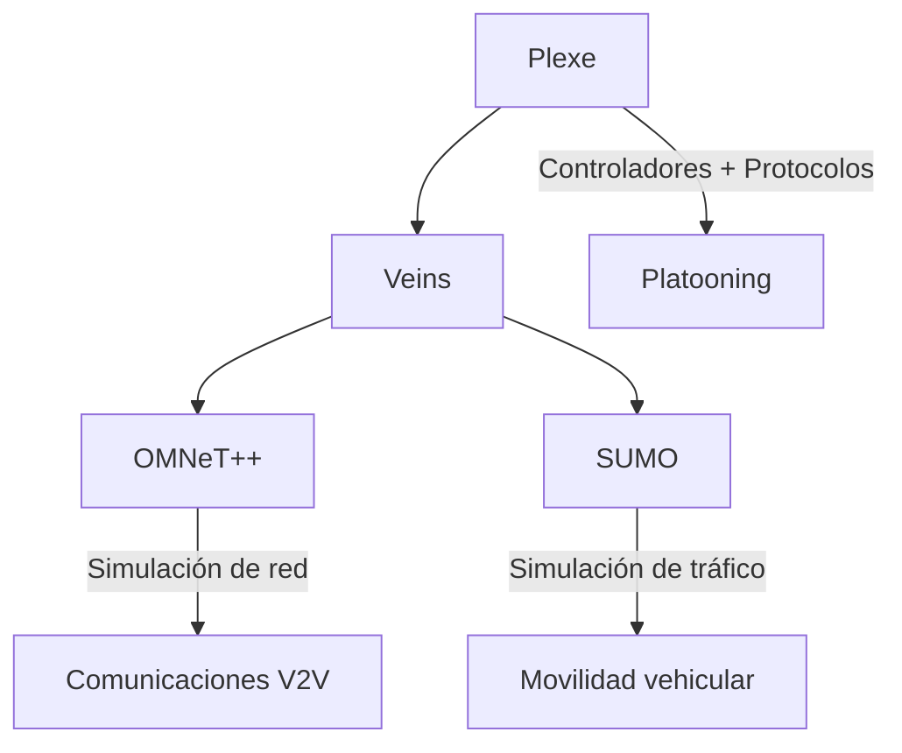
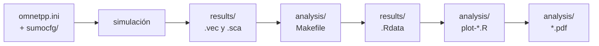

# Arquitectura

Plexe no funciona solo: se apoya en tres capas de software que trabajan en conjunto.

## Diagrama general

## Componentes

- **OMNeT++**: simulador de eventos discretos que modela la red de comunicaciones.
- **SUMO**: simulador de tráfico microscópico que modela el movimiento de los vehículos.
- **Veins**: puente que sincroniza OMNeT++ y SUMO.
- **Plexe**: capa superior que añade controladores de platooning, protocolos cooperativos y aplicaciones específicas.

---

## Estructura de archivos

Saber dónde vive cada cosa es la mitad del trabajo al empezar a usar Plexe. La documentación oficial no incluye un mapa de la estructura de carpetas, así que el que sigue se levantó directamente a partir del código de Plexe 3.2.

### La raíz del proyecto

<svg viewBox="0 0 760 452" xmlns="http://www.w3.org/2000/svg" role="img" aria-label="Estructura de la carpeta raíz de Plexe" style="width:100%;height:auto;font-family:var(--md-text-font-family,sans-serif)">
  
  <defs>
    <path id="plxFolder" d="M0.8 2.2h4.4l1.4 1.9h6.6a.8.8 0 0 1 .8.8v7.1a.8.8 0 0 1-.8.8H0.8a.8.8 0 0 1-.8-.8V3a.8.8 0 0 1 .8-.8z"/>
    <g id="plxFile">
      <path class="plx-icof" d="M2 0.8h5.6L12 5.2v8a.8.8 0 0 1-.8.8H2a.8.8 0 0 1-.8-.8V1.6A.8.8 0 0 1 2 .8z"/>
      <path class="plx-icof" d="M7.4 1v4.2h4.3"/>
    </g>
  </defs>
  <rect class="plx-root" x="16" y="10" width="112" height="38" rx="8"/>
  <use href="#plxFolder" class="plx-ico" x="32" y="17"/>
  <text class="plx-name" x="56" y="34" font-size="14">plexe/</text>
  <path class="plx-line" d="M48 48 V 424"/>
  <path class="plx-line" d="M48 82 h22"/>
  <rect class="plx-card" x="70" y="64" width="164" height="36" rx="8"/>
  <rect class="plx-bar" x="70" y="64" width="3" height="36" rx="1.5"/>
  <use href="#plxFolder" class="plx-ico" x="86" y="75"/>
  <text class="plx-name" x="110" y="87">src/</text>
  <text class="plx-desc" x="252" y="87">Código fuente de Plexe. Es lo que se compila.</text>
  <path class="plx-line" d="M48 134 h22"/>
  <rect class="plx-card" x="70" y="116" width="164" height="36" rx="8"/>
  <rect class="plx-bar" x="70" y="116" width="3" height="36" rx="1.5"/>
  <use href="#plxFolder" class="plx-ico" x="86" y="127"/>
  <text class="plx-name" x="110" y="139">examples/</text>
  <text class="plx-desc" x="252" y="139">Escenarios listos para correr.</text>
  <path class="plx-line" d="M48 186 h22"/>
  <rect class="plx-card" x="70" y="168" width="164" height="36" rx="8"/>
  <rect class="plx-bar" x="70" y="168" width="3" height="36" rx="1.5"/>
  <use href="#plxFolder" class="plx-ico" x="86" y="179"/>
  <text class="plx-name" x="110" y="191">bin/</text>
  <text class="plx-desc" x="252" y="191">Scripts de ejecución y de procesamiento de resultados.</text>
  <path class="plx-line" d="M48 238 h22"/>
  <rect class="plx-card" x="70" y="220" width="164" height="36" rx="8"/>
  <rect class="plx-bar" x="70" y="220" width="3" height="36" rx="1.5"/>
  <use href="#plxFolder" class="plx-ico" x="86" y="231"/>
  <text class="plx-name" x="110" y="243">subprojects/</text>
  <text class="plx-desc" x="252" y="243">Integraciones opcionales (Simu5G, VLC, entre otras).</text>
  <path class="plx-line" d="M48 290 h22"/>
  <rect class="plx-card" x="70" y="272" width="164" height="36" rx="8"/>
  <rect class="plx-bar" x="70" y="272" width="3" height="36" rx="1.5"/>
  <use href="#plxFolder" class="plx-ico" x="86" y="283"/>
  <text class="plx-name" x="110" y="295">doc/</text>
  <text class="plx-desc" x="252" y="295">Documentación generada.</text>
  <text class="plx-kick" x="70" y="337">ARCHIVOS SUELTOS</text>
  <path class="plx-line" d="M48 372 h22"/>
  <rect class="plx-file" x="70" y="354" width="164" height="36" rx="8"/>
  <use href="#plxFile" x="87" y="365"/>
  <text class="plx-name" x="110" y="377">setenv</text>
  <text class="plx-desc" x="252" y="377">Carga el entorno de Plexe en la terminal.</text>
  <path class="plx-line" d="M48 424 h22"/>
  <rect class="plx-file" x="70" y="406" width="164" height="36" rx="8"/>
  <use href="#plxFile" x="87" y="417"/>
  <text class="plx-name" x="110" y="429">configure</text>
  <text class="plx-desc" x="252" y="429">Configuración previa a la compilación.</text>
</svg>

### Los ejemplos incluidos

Plexe trae cinco escenarios de ejemplo, y todos comparten la misma estructura interna:

| Ejemplo | Qué demuestra |
|---------|---------------|
| `platooning` | Comparación entre ACC y CACC. Es el más completo, y el que usa el tutorial oficial. |
| `joinManeuver` | Maniobra de incorporación de un vehículo a un pelotón en marcha. |
| `autolanechange` | Cambio de carril autónomo. |
| `engine` | Modelo de motor realista aplicado a la dinámica del vehículo. |
| `human` | Convivencia de conductores humanos con vehículos automatizados. |

### Anatomía de un escenario

Tomando `platooning` como referencia, así se organiza cualquiera de los ejemplos. En el primer nivel hay cuatro archivos de configuración y tres carpetas:

<svg viewBox="0 0 760 480" xmlns="http://www.w3.org/2000/svg" role="img" aria-label="Primer nivel de un escenario de ejemplo de Plexe" style="width:100%;height:auto;font-family:var(--md-text-font-family,sans-serif)">
  
  <defs>
    <path id="plxFolder2" d="M0.8 2.2h4.4l1.4 1.9h6.6a.8.8 0 0 1 .8.8v7.1a.8.8 0 0 1-.8.8H0.8a.8.8 0 0 1-.8-.8V3a.8.8 0 0 1 .8-.8z"/>
    <g id="plxFile2">
      <path class="plx-icof" d="M2 0.8h5.6L12 5.2v8a.8.8 0 0 1-.8.8H2a.8.8 0 0 1-.8-.8V1.6A.8.8 0 0 1 2 .8z"/>
      <path class="plx-icof" d="M7.4 1v4.2h4.3"/>
    </g>
  </defs>
  <rect class="plx-root" x="16" y="10" width="200" height="38" rx="8"/>
  <use href="#plxFolder2" class="plx-ico" x="32" y="17"/>
  <text class="plx-name" x="56" y="34" font-size="14">examples/platooning/</text>
  <path class="plx-line" d="M48 48 V 448"/>
  <text class="plx-kick" x="70" y="74">ARCHIVOS DE CONFIGURACIÓN</text>
  <path class="plx-line" d="M48 108 h22"/>
  <rect class="plx-file" x="70" y="90" width="170" height="36" rx="8"/>
  <use href="#plxFile2" x="87" y="101"/>
  <text class="plx-name" x="110" y="113">omnetpp.ini</text>
  <text class="plx-desc" x="258" y="113">Configuración del escenario. El archivo más importante.</text>
  <path class="plx-line" d="M48 160 h22"/>
  <rect class="plx-file" x="70" y="142" width="170" height="36" rx="8"/>
  <use href="#plxFile2" x="87" y="153"/>
  <text class="plx-name" x="110" y="165">Platooning.ned</text>
  <text class="plx-desc" x="258" y="165">Define la red: qué módulos la componen y cómo se conectan.</text>
  <path class="plx-line" d="M48 212 h22"/>
  <rect class="plx-file" x="70" y="194" width="170" height="36" rx="8"/>
  <use href="#plxFile2" x="87" y="205"/>
  <text class="plx-name" x="110" y="217">config.xml</text>
  <text class="plx-desc" x="258" y="217">Configuración de la capa física de radio.</text>
  <path class="plx-line" d="M48 264 h22"/>
  <rect class="plx-file" x="70" y="246" width="170" height="36" rx="8"/>
  <use href="#plxFile2" x="87" y="257"/>
  <text class="plx-name" x="110" y="269">run</text>
  <text class="plx-desc" x="258" y="269">Lanza la simulación.</text>
  <text class="plx-kick" x="70" y="310">CARPETAS</text>
  <path class="plx-line" d="M48 344 h22"/>
  <rect class="plx-card" x="70" y="326" width="170" height="36" rx="8"/>
  <rect class="plx-bar" x="70" y="326" width="3" height="36" rx="1.5"/>
  <use href="#plxFolder2" class="plx-ico" x="86" y="337"/>
  <text class="plx-name" x="110" y="349">sumocfg/</text>
  <text class="plx-desc" x="258" y="349">El escenario visto por SUMO. Es la entrada.</text>
  <path class="plx-line" d="M48 396 h22"/>
  <rect class="plx-card" x="70" y="378" width="170" height="36" rx="8"/>
  <rect class="plx-bar" x="70" y="378" width="3" height="36" rx="1.5"/>
  <use href="#plxFolder2" class="plx-ico" x="86" y="389"/>
  <text class="plx-name" x="110" y="401">results/</text>
  <text class="plx-desc" x="258" y="401">Salida de la simulación. Se llena al correr.</text>
  <path class="plx-line" d="M48 448 h22"/>
  <rect class="plx-card" x="70" y="430" width="170" height="36" rx="8"/>
  <rect class="plx-bar" x="70" y="430" width="3" height="36" rx="1.5"/>
  <use href="#plxFolder2" class="plx-ico" x="86" y="441"/>
  <text class="plx-name" x="110" y="453">analysis/</text>
  <text class="plx-desc" x="258" y="453">Procesamiento y gráficos.</text>
</svg>

Y dentro de cada una de esas tres carpetas:

<svg viewBox="0 0 760 516" xmlns="http://www.w3.org/2000/svg" role="img" aria-label="Contenido de las carpetas sumocfg, results y analysis" style="width:100%;height:auto;font-family:var(--md-text-font-family,sans-serif)">
  
  <rect class="plx-panel" x="8" y="8" width="744" height="184" rx="10"/>
  <text class="plx-name" x="28" y="34" font-size="14">sumocfg/</text>
  <text class="plx-kick" x="732" y="34" text-anchor="end">ENTRADA</text>
  <path class="plx-line" d="M8 46 H752"/>
  <text class="plx-name" x="32" y="66">freeway.net.xml</text>
  <text class="plx-desc" x="210" y="66">La carretera: geometría, carriles, longitud.</text>
  <text class="plx-name" x="32" y="94">freeway.rou.xml</text>
  <text class="plx-desc" x="210" y="94">Las rutas que siguen los vehículos.</text>
  <text class="plx-name" x="32" y="122">freeway.sumo.cfg</text>
  <text class="plx-desc" x="210" y="122">Configuración de SUMO para este escenario.</text>
  <text class="plx-name" x="32" y="150">freeway.gui.xml</text>
  <text class="plx-desc" x="210" y="150">Apariencia de la simulación en sumo-gui.</text>
  <text class="plx-name" x="32" y="178">freeway.launchd.xml</text>
  <text class="plx-desc" x="210" y="178">Cómo Veins arranca y controla a SUMO.</text>
  <rect class="plx-panel" x="8" y="208" width="744" height="156" rx="10"/>
  <text class="plx-name" x="28" y="234" font-size="14">results/</text>
  <text class="plx-kick" x="732" y="234" text-anchor="end">SALIDA</text>
  <path class="plx-line" d="M8 246 H752"/>
  <text class="plx-name" x="32" y="266">*.vec</text>
  <text class="plx-desc" x="210" y="266">Series temporales: posición, velocidad, distancia.</text>
  <text class="plx-name" x="32" y="294">*.sca</text>
  <text class="plx-desc" x="210" y="294">Valores escalares: un número por simulación.</text>
  <text class="plx-name" x="32" y="322">*.vci</text>
  <text class="plx-desc" x="210" y="322">Índice del archivo .vec correspondiente.</text>
  <text class="plx-name" x="32" y="350">*.Rdata</text>
  <text class="plx-desc" x="210" y="350">Datos ya procesados, listos para cargar en R.</text>
  <rect class="plx-panel" x="8" y="380" width="744" height="128" rx="10"/>
  <text class="plx-name" x="28" y="406" font-size="14">analysis/</text>
  <text class="plx-kick" x="732" y="406" text-anchor="end">PROCESAMIENTO</text>
  <path class="plx-line" d="M8 418 H752"/>
  <text class="plx-name" x="32" y="438">Makefile</text>
  <text class="plx-desc" x="210" y="438">Orquesta el procesamiento de los resultados.</text>
  <text class="plx-name" x="32" y="466">plot-*.R</text>
  <text class="plx-desc" x="210" y="466">Scripts de R que generan los gráficos.</text>
  <text class="plx-name" x="32" y="494">*.pdf</text>
  <text class="plx-desc" x="210" y="494">Los gráficos generados.</text>
</svg>

!!! note "Cómo se reparten el trabajo results/ y analysis/"
    `results/` guarda datos y `analysis/` guarda scripts y gráficos. La única excepción son los archivos `.Rdata`: aunque los genera el `Makefile` de `analysis/`, quedan depositados en `results/`, porque son datos y no gráficos.

### El flujo de datos de una simulación

El recorrido tiene cuatro etapas:

1. **Configurar.** `omnetpp.ini` describe el experimento y `sumocfg/` describe la carretera por la que circulan los vehículos.
2. **Simular.** Al correr el escenario, OMNeT++ y SUMO trabajan en conjunto y la salida cruda se deposita en `results/`.
3. **Procesar.** Desde `analysis/`, el `Makefile` recorre los archivos `.vec` y los convierte en archivos `.Rdata`, mucho más cómodos de cargar.
4. **Graficar.** Los scripts de R leen esos `.Rdata` y producen los gráficos en `analysis/`.
