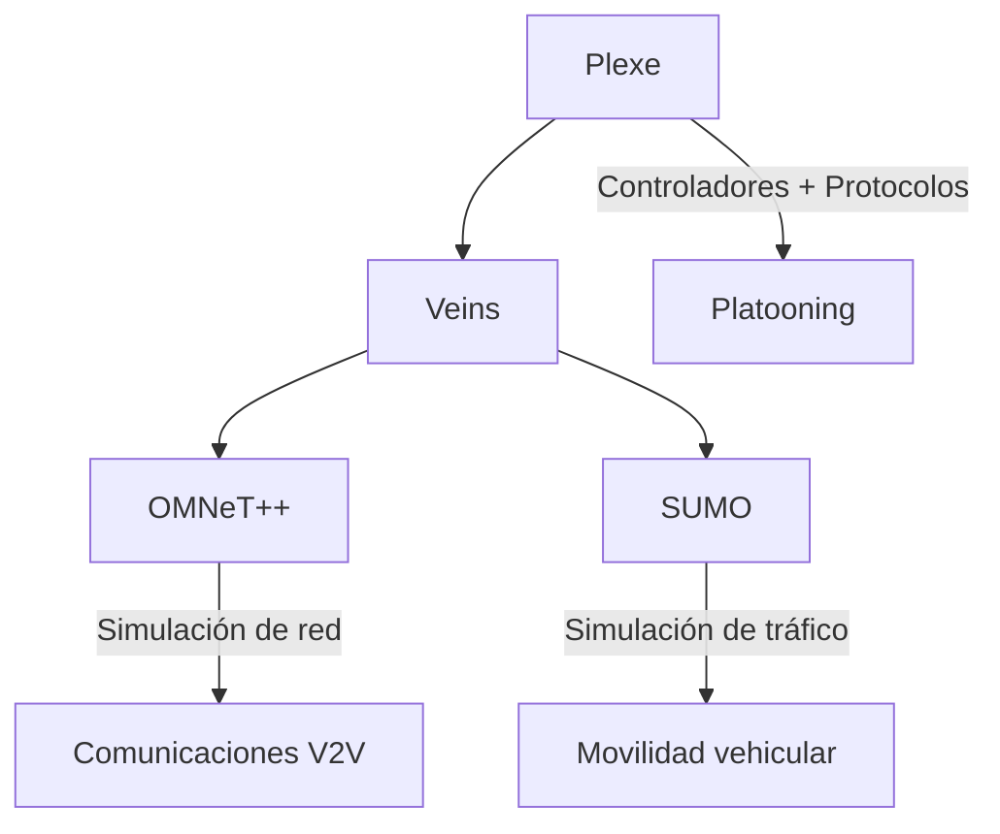

# Arquitectura

Plexe no funciona solo: se apoya en tres capas de software que trabajan en conjunto.

## Diagrama general

## Componentes

- **OMNeT++**: simulador de eventos discretos que modela la red de comunicaciones.
- **SUMO**: simulador de tráfico microscópico que modela el movimiento de los vehículos.
- **Veins**: puente que sincroniza OMNeT++ y SUMO.
- **Plexe**: capa superior que añade controladores de platooning, protocolos cooperativos y aplicaciones específicas.

*Sección en construcción — se agregarán más diagramas y descripciones detalladas.*
