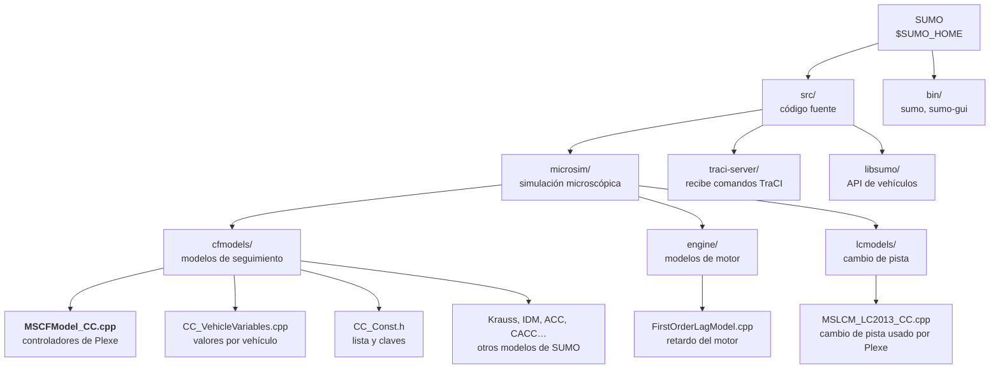
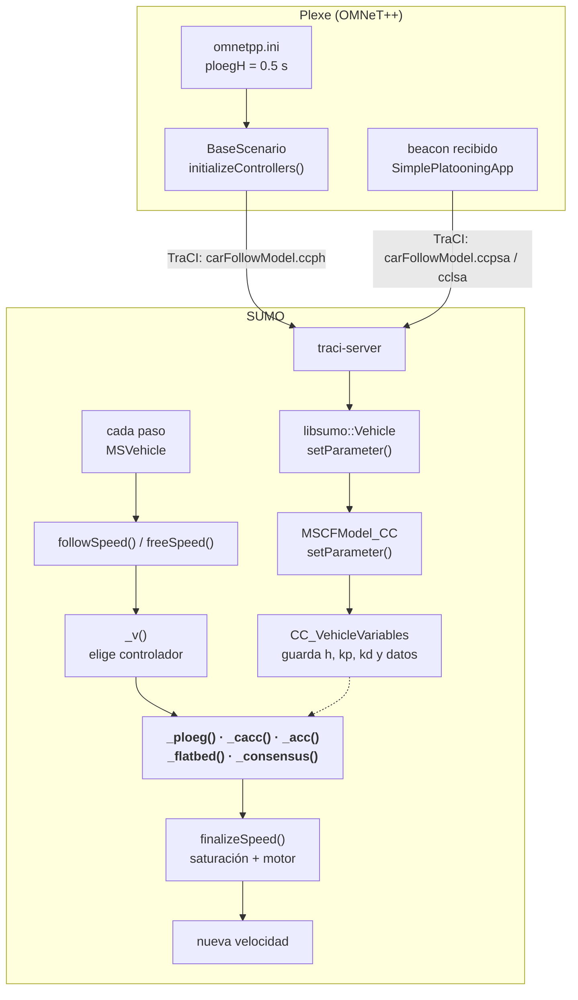

# Controladores

Los controladores de Plexe son leyes de control longitudinal: en cada paso de simulación calculan la aceleración de cada vehículo del pelotón.

!!! note "Notación de rutas"
    Cada usuario tiene SUMO y Plexe en carpetas distintas. Las rutas de esta página son relativas a:

    - `$SUMO_HOME`: carpeta raíz de SUMO (contiene `src/` y `bin/`).
    - `<PLEXE>`: carpeta raíz de Plexe (contiene `src/`, `examples/` y `Makefile`).

## 1. Dónde viven los controladores

Las fórmulas **viven en SUMO, no en Plexe**. Todos los controladores están dentro de un único modelo de seguimiento de SUMO, `CC` (`carFollowModel="CC"` en el `vType`), y se elige uno u otro con un número.

### En SUMO: el cálculo



| Archivo (en `$SUMO_HOME`) | Qué contiene |
|---|---|
| `src/microsim/cfmodels/MSCFModel_CC.cpp` | Fórmulas de todos los controladores: `_ploeg()`, `_cacc()`, `_acc()`, `_cc()`, `_flatbed()`, `_consensus()`. La función `_v()` elige cuál se usa. |
| `src/microsim/cfmodels/MSCFModel_CC.h` | Declaración de la clase. |
| `src/microsim/cfmodels/CC_VehicleVariables.cpp` | Valores iniciales de cada vehículo y matrices del controlador Consensus. |
| `src/microsim/cfmodels/CC_Const.h` | Lista de controladores (`enum ACTIVE_CONTROLLER`) y claves TraCI de los parámetros (`ccph`, `ccpkp`, …). |
| `src/microsim/engine/FirstOrderLagModel.cpp` | Retardo del motor, común a todos los controladores. |

### En Plexe: configuración y comunicación

Plexe no calcula aceleraciones. Elige el controlador, envía sus parámetros a SUMO por TraCI y le entrega los datos recibidos por beacons.

| Archivo (en `<PLEXE>`) | Qué hace |
|---|---|
| `src/plexe/scenarios/BBaseScenario.ned` | Parámetros de los controladores y sus valores por defecto. |
| `src/plexe/scenarios/BaseScenario.cc` | `initializeControllers()`: envía esos parámetros a SUMO al crear cada vehículo. |
| `src/plexe/mobility/TraCIBaseTrafficManager.cc` | `strToController()`: convierte el texto del `.ini` (`"PLOEG"`) en el número del controlador. |
| `src/plexe/apps/SimplePlatooningApp.cc` | Al recibir un beacon, entrega a SUMO los datos del vehículo de adelante y del líder. |
| `src/plexe/CC_Const.h` | Copia de las constantes de SUMO. Debe coincidir con la de SUMO. |

Cómo llega un parámetro o un beacon desde Plexe hasta el controlador, y cómo se calcula la velocidad en cada paso:



### Lista de controladores

| Número | Nombre | Función en `MSCFModel_CC.cpp` | ¿Se elige desde el `.ini`? |
|---|---|---|---|
| 0 | `DRIVER` | Modelo humano de SUMO (Krauss) | No |
| 1 | `ACC` | `_cc()` + `_acc()` | Sí |
| 2 | `CACC` | `_cacc()` | Sí |
| 3 | `FAKED_CACC` | `_cc()` + `_cacc()` | No (lo usa la maniobra de unión) |
| 4 | `PLOEG` | `_ploeg()` | Sí |
| 5 | `CONSENSUS` | `_consensus()` | Sí |
| 6 | `FLATBED` | `_flatbed()` | Sí |

## 2. Cómo se elige el controlador en `omnetpp.ini`

El controlador se asigna con `**.traffic.controller`. Sus parámetros van en `*.node[*].scenario.*`. Los valores de estos ejemplos son los por defecto de Plexe.

=== "PLOEG"

    ```ini
    **.traffic.controller = "PLOEG"
    *.node[*].scenario.ploegH = 0.5 s
    *.node[*].scenario.ploegKp = 0.2
    *.node[*].scenario.ploegKd = 0.7
    ```

=== "CACC"

    ```ini
    **.traffic.controller = "CACC"
    *.node[*].scenario.caccC1 = 0.5
    *.node[*].scenario.caccXi = 1
    *.node[*].scenario.caccOmegaN = 0.2 Hz
    *.node[*].scenario.caccSpacing = 5 m
    ```

=== "ACC"

    ```ini
    **.traffic.controller = "ACC"
    *.node[*].scenario.accHeadway = 1.2 s
    ```

=== "FLATBED"

    ```ini
    **.traffic.controller = "FLATBED"
    *.node[*].scenario.flatbedKa = 2.4
    *.node[*].scenario.flatbedKv = 0.6
    *.node[*].scenario.flatbedKp = 12
    *.node[*].scenario.flatbedH = 4
    *.node[*].scenario.flatbedD = 5
    ```

=== "CONSENSUS"

    ```ini
    **.traffic.controller = "CONSENSUS"
    ```

    Sus ganancias no se configuran desde el `.ini` (ver [Consensus](#9-consensus)).

- `controller` define el controlador de los **miembros** del pelotón. Con `PlatoonsTrafficManager` (el del ejemplo `platooning`), el **líder siempre usa ACC**, con tiempo de separación `leaderHeadway`.
- En `<PLEXE>/examples/platooning/omnetpp.ini` el controlador no es un texto fijo: se recorre con la variable `${controller}`, que también ajusta la distancia y el tiempo de separación al insertar los vehículos. Sus valores son 0 = ACC (0.3 s), 1 = ACC (1.2 s), 2 = CACC, 3 = PLOEG, 4 = CONSENSUS y 5 = FLATBED.

### Qué valor manda

Un mismo parámetro puede aparecer en tres lugares. Gana el primero de esta lista:

1. **`.ini`**, o si no está, el valor por defecto de `BBaseScenario.ned`. Plexe lo envía a SUMO al crear cada vehículo.
2. **Atributo del `vType`** en el `.rou.xml` (por ejemplo `ploegH="0.5"`).
3. **Valor por defecto de SUMO**, en el constructor de `MSCFModel_CC.cpp`.

Plexe **no envía** `lambda`, `kp` (del CC), `ccAccel`, `ccDecel` ni `lanesCount`, así que estos solo se definen en el `vType`. `lanesCount` es obligatorio: sin él, SUMO se detiene con error.

## 3. Cadena común: saturación y motor

Todos los controladores, salvo `DRIVER`, terminan igual (función `finalizeSpeed()`):

```text
1. El controlador calcula u (aceleración deseada).
2. u se recorta a [uMin, uMax].
3. Motor (retardo de primer orden):
     a_real = α·u + (1 − α)·a_anterior,   con α = Δt / (τ + Δt)
   a_real se recorta a [−decel, accel] del vType.
```

`Δt` es el paso de simulación de SUMO.

| Parámetro `.ini` | Qué es | Por defecto |
|---|---|---|
| `engineTau` | Constante de tiempo τ del motor | 0.5 s |
| `uMin`, `uMax` | Saturación de u | −10⁶ / 10⁶ m/s² (sin límite práctico) |
| `useControllerAcceleration` | Por beacon se envía la aceleración pedida por el controlador (`true`) o la real (`false`) | `true` |
| `usePrediction` | Extrapola las velocidades recibidas entre beacons (CACC y Flatbed) | `true` |

## 4. Qué hacer cuando modificas algo

| Qué cambias | Dónde | ¿Recompilar? |
|---|---|---|
| Valor de un parámetro (`ploegH`, `caccC1`, …) | `omnetpp.ini` | **No.** Basta con volver a correr la simulación. |
| Atributo del `vType` (`lambda`, `ccAccel`, …) | `.rou.xml` del escenario | **No.** |
| Una fórmula o una constante fija en el código | `$SUMO_HOME/src/microsim/cfmodels/` | **Sí: SUMO.** |
| Lógica de Plexe (apps, escenarios, maniobras) | `<PLEXE>/src/plexe/` | **Sí: Plexe.** |
| Nueva clave TraCI o nuevo controlador | Ambos `CC_Const.h`, entre otros (ver abajo) | **Sí: SUMO y Plexe.** |

!!! warning "Requisito para modificar controladores"
    Solo se puede si SUMO fue **compilado desde el código fuente**. Un SUMO instalado con `apt` no trae los archivos `.cpp`.

### Recompilar SUMO

Desde la carpeta donde se corrió `cmake` al instalar SUMO (por ejemplo, `$SUMO_HOME/build`):

```bash
cd $SUMO_HOME/build
cmake --build . -j "$(nproc)"
```

Los ejecutables nuevos quedan en `$SUMO_HOME/bin`.

### Recompilar Plexe

Con el entorno de OMNeT++ cargado:

```bash
cd <PLEXE>
make
```

### Agregar un controlador nuevo (aún no implementado)

Hay que tocar, como mínimo:

- `enum ACTIVE_CONTROLLER` en **los dos** `CC_Const.h` (SUMO y Plexe).
- En `MSCFModel_CC.cpp`: un `case` en `_v()` y otro en `getSecureGap()`. Si falta este último, SUMO lanza error.
- En Plexe: `strToController()` en `TraCIBaseTrafficManager.cc`, y `getStandstillDistance()` y `getHeadway()` en `BaseScenario.cc`. Si faltan, lanzan error.
- Si tiene parámetros nuevos:
    - una clave en ambos `CC_Const.h`;
    - su lectura en `setParameter()` de `MSCFModel_CC.cpp`;
    - el parámetro en `BaseScenario.ned` y `BBaseScenario.ned`;
    - su envío en `initializeControllers()`.

Después, recompilar SUMO y Plexe.

## 5. Controlador Ploeg

Referencia: J. Ploeg, B. T. M. Scheepers, E. van Nunen, N. van de Wouw y H. Nijmeijer, *Design and Experimental Evaluation of Cooperative Adaptive Cruise Control*, IEEE ITSC 2011, pp. 260–265.

CACC que sigue **solo al vehículo de adelante**, con espaciamiento de **tiempo constante**. Combina el radar (distancia y velocidad del vehículo de adelante) con la comunicación (aceleración deseada del vehículo de adelante). No usa datos del líder.

### Espaciamiento deseado

```text
d_ref = 2 + h·v
```

La distancia deseada crece con la velocidad propia. Por ejemplo, a 100 km/h con `h = 0.5 s`, `d_ref ≈ 15.9 m`.

### Ley de control

```text
e  = d − (2 + h·v)                  error de espaciamiento
ė  = v_(i−1) − v − h·a              derivada de e (porque ḋ = v_(i−1) − v)
h·u̇ + u = kp·e + kd·ė + u_(i−1)
```

- `u` es un **estado** del controlador: Ploeg no calcula `u` directamente, sino su derivada `u̇`.
- La ecuación es un filtro de primer orden con constante de tiempo `h`: `u` sigue a `kp·e + kd·ė + u_(i−1)`, donde:
    - `kp·e + kd·ė` es la parte proporcional-derivativa sobre el error de espaciamiento;
    - `u_(i−1)` es la prealimentación con la aceleración deseada del vehículo de adelante (la parte cooperativa).
- En régimen (velocidad constante): `u = u_(i−1) = 0` y `e = 0`, es decir, `d = d_ref`.

### Implementación en SUMO

En cada paso, `_v()` (caso `PLOEG`) integra `u̇` con Euler explícito:

```text
u_k = u_(k−1) + Δt·u̇
    = (1 − Δt/h)·u_(k−1) + (Δt/h)·(kp·e + kd·ė + u_(i−1))
```

- `Δt` es el paso de SUMO (0.01 s en el ejemplo `platooning`). Con `h = 0.5 s`, cada paso pesa `Δt/h = 0.02`.
- `u_(k−1)` es lo que `finalizeSpeed()` registró en el paso anterior: `(vPos − v)/Δt`, recortado a `[uMin, uMax]`, donde `vPos` es la velocidad que SUMO eligió en ese paso. Si SUMO limitó la velocidad, el estado lo refleja.
- `h` debe ser mayor que 0, porque el código divide por `h`.
- Después, `u` pasa por la [cadena común](#3-cadena-comun-saturacion-y-motor) de saturación y motor.

### Datos que usa

| Variable | Fuente | Actualización |
|---|---|---|
| `d` | Radar de SUMO: distancia de parachoques a parachoques menos `minGap` (0 en el `vType` de Plexe). Alcance: 250 m. | Cada paso |
| `v_(i−1)` | Radar de SUMO: velocidad real del vehículo de adelante. | Cada paso |
| `u_(i−1)` | Beacon del vehículo de adelante: su `u` si `useControllerAcceleration = true`, o su aceleración real si es `false`. | Cada beacon (`beaconingInterval`, 0.1 s por defecto). Entre beacons, o si se pierden, se usa el último recibido. No se extrapola ni se corrige por retardo. |
| `v`, `a` | Vehículo propio (`a` es la aceleración real del último paso). | Cada paso |
| `u_(k−1)` | Estado del controlador. | Cada paso |

- La comunicación solo afecta a `u_(i−1)`: `d` y `v_(i−1)` no dependen de la red.
- Antes del primer beacon del vehículo de adelante, `u = 0`.
- Con `enableAutoFeed()`, `u_(i−1)` se lee directamente de SUMO en cada paso, sin pasar por la red. Lo usa `AutoLaneChangeScenario`.

### Parámetros

| Parámetro `.ini` | Clave TraCI | Atributo `vType` | Por defecto | Unidad | Qué es |
|---|---|---|---|---|---|
| `ploegH` | `ccph` | `ploegH` | 0.5 | s | Tiempo de separación `h`; también es la constante de tiempo del filtro |
| `ploegKp` | `ccpkp` | `ploegKp` | 0.2 | 1/s² | Ganancia sobre `e` |
| `ploegKd` | `ccpkd` | `ploegKd` | 0.7 | 1/s | Ganancia sobre `ė` |

- Los parámetros son **por vehículo**. Para dar a un vehículo valores distintos, su línea va **antes** de la línea con `*`, porque en OMNeT++ gana la primera coincidencia:

    ```ini
    *.node[3].scenario.ploegH = 0.8 s
    *.node[*].scenario.ploegH = 0.5 s
    ```

- Se pueden cambiar durante la simulación desde Plexe con `setPloegCACCParameters(kp, kd, h)`. Si un valor es negativo, ese parámetro queda sin cambio.

### Seguridad y consistencia con Plexe

- `getSecureGap()`: SUMO considera segura una brecha de `0.8·(2 + h·v)` y la usa al evaluar cambios de pista y cruces.
- La distancia de 2 m está fija en `MSCFModel_CC.cpp`, en `_ploeg()` y en `getSecureGap()`. Para cambiarla hay que editar los dos lugares y recompilar SUMO.
- En Plexe, `BaseScenario::getHeadway(PLOEG)` devuelve `ploegH` y `getStandstillDistance(PLOEG)` devuelve 2 m. Las maniobras, como `JoinAtBack`, calculan con ellos la distancia objetivo.
- El ejemplo `platooning` inserta los vehículos con `platoonInsertDistance = 2 m` y `platoonInsertHeadway = 0.5 s`. Si cambias `ploegH`, cambia también `platoonInsertHeadway`; si no, el pelotón parte fuera del equilibrio.

## 6. CACC (PATH)

Referencias: R. Rajamani, H.-S. Tan, B. K. Law y W.-B. Zhang, IEEE Transactions on Control Systems Technology, 2000; y la ecuación 7.39 de Rajamani, *Vehicle Dynamics and Control*.

Usa datos del **líder** (`0`) y del **vehículo de adelante** (`i−1`). El espaciamiento es **constante**: `d_ref = spacing`, sin importar la velocidad.

```text
ε  = spacing − d
ε̇  = v − v_(i−1)
u  = α1·a_(i−1) + α2·a_0 + α3·ε̇ + α4·(v − v_0) + α5·ε

α1 = 1 − C1
α2 = C1
α3 = −(2ξ − C1·(ξ + √(ξ² − 1)))·ωn
α4 = −C1·(ξ + √(ξ² − 1))·ωn
α5 = −ωn²
```

- `α1·a_(i−1) + α2·a_0` es la prealimentación con las aceleraciones del vehículo de adelante y del líder. Como `α1 + α2 = 1`, `C1` reparte el peso entre ambos.
- `α3·ε̇ + α5·ε` corrige el error de velocidad y de distancia respecto del vehículo de adelante.
- `α4·(v − v_0)` corrige el error de velocidad respecto del líder.
- Con los valores por defecto (`C1 = 0.5`, `ξ = 1`, `ωn = 0.2`) quedan `α1 = 0.5`, `α2 = 0.5`, `α3 = −0.3`, `α4 = −0.1` y `α5 = −0.04`.
- Al cambiar `C1`, `ξ` o `ωn`, SUMO recalcula los `α` automáticamente (`recomputeParameters()`).
- `ξ` debe ser ≥ 1; si no, la raíz queda negativa.

| Variable | Fuente |
|---|---|
| `d` | Radar de SUMO |
| `v_(i−1)`, `v_0` | Beacons, no el radar. Con `usePrediction` se extrapolan: `v + (t − t_beacon)·a` |
| `a_(i−1)`, `a_0` | Beacons: `u` o aceleración real, según `useControllerAcceleration` |

- Mientras no lleguen beacons del líder y del vehículo de adelante, `u = 0`.
- `getSecureGap()`: la brecha segura es `0.8·spacing`.

| Parámetro `.ini` | Clave TraCI | Atributo `vType` | Por defecto | Qué es |
|---|---|---|---|---|
| `caccC1` | `ccc1` | `c1` | 0.5 | Peso de la aceleración del líder frente a la del vehículo de adelante |
| `caccXi` | `ccxi` | `xi` | 1 | Amortiguamiento `ξ` |
| `caccOmegaN` | `ccon` | `omegaN` | 0.2 Hz | Ancho de banda `ωn` |
| `caccSpacing` | `ccsp` | `constSpacing` | 5 m | Distancia deseada |

## 7. ACC y CC

Referencia: ecuaciones 5.5 (CC) y 6.18 (ACC) de Rajamani, *Vehicle Dynamics and Control*.

No usa comunicación, solo el radar. El espaciamiento es de tiempo constante: `d_ref = 2 + T·v`. Es el controlador del líder.

```text
CC:   u_cc  = −kp·(v − v_des), recortado a [−ccDecel, ccAccel]
ACC:  u_acc = −(1/T)·( v − v_(i−1) + λ·(T·v + 2 − d) )
u = min(u_cc, u_acc)    (si d > 250 m, u = u_cc)
```

- CC es un control proporcional hacia la velocidad deseada `v_des` (clave TraCI `ccds`).
- En el ACC, `λ` pondera el error de distancia `(T·v + 2 − d)` frente a la diferencia de velocidad `(v − v_(i−1))`.
- Se aplica la menor de las dos aceleraciones.
- `d` y `v_(i−1)` salen del radar, que tiene 250 m de alcance. Si no hay vehículo adelante, actúa solo el CC.
- El código advierte posibles inestabilidades según el valor de `T`. El ejemplo `platooning` compara `T = 0.3 s` con `T = 1.2 s`.
- `getSecureGap()`: la brecha segura es `0.8·(T·v + 2)`.

| Parámetro `.ini` | Clave TraCI | Atributo `vType` | Por defecto | Qué es |
|---|---|---|---|---|
| `accHeadway` | `ccaht` | — | 1.2 s | Tiempo de separación `T` de los miembros con ACC |
| `leaderHeadway` | `ccaht` | — | 1.2 s | Tiempo de separación `T` del líder |
| — | — | `lambda` | 0.1 | Ganancia `λ` |
| — | — | `kp` | 1 | Ganancia del CC |
| — | — | `ccAccel` / `ccDecel` | 1.5 / 1.5 m/s² | Límites del CC |

## 8. Flatbed

Referencia: A. Ali, G. Garcia y P. Martinet, *The Flatbed Platoon Towing Model for Safe and Dense Platooning on Highways*, IEEE Intelligent Transportation Systems Magazine, 2015.

```text
d_ref = D + H·(v − v_0)
u     = −ka·a + kv·(v_(i−1) − v) + kp·(d − d_ref)
```

- En régimen (`v = v_0`), `d_ref = D`, una distancia constante. Si el vehículo va más rápido que el líder, la distancia deseada aumenta.
- `−ka·a` amortigua con la aceleración propia; `kv·(v_(i−1) − v)` iguala la velocidad del vehículo de adelante; `kp·(d − d_ref)` corrige la distancia.
- No usa las aceleraciones de otros vehículos.

| Variable | Fuente |
|---|---|
| `d` | Radar de SUMO |
| `v_(i−1)`, `v_0` | Beacons (con `usePrediction`, extrapoladas) |
| `a` | Aceleración real propia |

- Mientras no lleguen beacons del líder y del vehículo de adelante, `u = 0`.
- `getSecureGap()`: la brecha segura es `0.8·(D − H·(v − v_0))`.
- En Plexe, `getStandstillDistance(FLATBED)` devuelve `caccSpacing`, no `flatbedD`, y `getHeadway(FLATBED)` devuelve 0. Si cambias `flatbedD`, ajusta también `caccSpacing` y `platoonInsertDistance`.

| Parámetro `.ini` | Clave TraCI | Atributo `vType` | Por defecto | Qué es |
|---|---|---|---|---|
| `flatbedKa` | `ccfka` | `flatbedKa` | 2.4 | Ganancia sobre la aceleración propia |
| `flatbedKv` | `ccfkv` | `flatbedKv` | 0.6 | Ganancia sobre la diferencia de velocidad con el vehículo de adelante |
| `flatbedKp` | `ccfkp` | `flatbedKp` | 12 | Ganancia del error de distancia |
| `flatbedH` | `ccfh` | `flatbedH` | 4 | Factor sobre la diferencia de velocidad con el líder |
| `flatbedD` | `ccfd` | `flatbedD` | 5 | Distancia deseada (m) |

## 9. Consensus

Referencia: S. Santini, A. Salvi, A. S. Valente, A. Pescapè, M. Segata y R. Lo Cigno, *A Consensus-based Approach for Platooning with Inter-Vehicular Communications and its Validation in Realistic Scenarios*, IEEE Transactions on Vehicular Technology, 2017.

```text
u_i   = [ −b_i·(v_i − v_0) + (1/d_i)·Σ_j k_ij·l_ij·(s_ij − s*_ij) ] / 1000
d_i   = Σ_j l_ij
s*_ij = Σ_k ( h_k·v_0 + largo_k + 15 )     (k recorre los vehículos entre i y j)
```

- **No usa el radar**: todos los datos llegan por beacon.
- `s_ij` es la distancia real entre `i` y `j`, calculada con posiciones GPS. Es positiva si `j` va adelante. La posición de `j` se extrapola al instante actual (`x_j + (t − t_j)·vx_j`) y la propia se predice un paso adelante.
- `l_ij` vale 1 si `i` usa datos de `j`. Por defecto, cada vehículo usa los del líder y los del vehículo de adelante.
- `k_ij`, `b_i` y `h_k` son ganancias fijas. Los 15 m de distancia en detención están fijos en `d_i_j()`.
- `getSecureGap()`: la brecha segura es `0.8·s*_(1,0)`.

Valores por defecto, en `CC_VehicleVariables.cpp`:

- `b = 1800` y `h = 0.8 s` para todos los vehículos.
- `k`: 460 para el vehículo 1 respecto del líder. Para los demás, 80 respecto del líder y 860 respecto del vehículo de adelante.

Limitaciones:

- **No tiene parámetros en el `.ini`.** Cambiar `K`, `L`, `b` o `h` obliga a recompilar SUMO.
- Admite como máximo 8 vehículos (`MAX_N_CARS`).
- Espera datos de todos los vehículos antes de actuar; mientras tanto, `u = 0`.
- Según un comentario del código, solo funciona con vehículos que avanzan en línea recta de oeste a este (eje X).

## 10. Faked CACC

```text
u = min(u_cc, u_cacc con datos entregados por TraCI)
```

Los datos del líder y del vehículo de adelante no salen del radar ni de los beacons: se entregan por TraCI (claves `cclfd` y `ccffd`). Lo usa la maniobra de unión (`JoinAtBack.cc`) para acercarse a un pelotón sin superar la velocidad del control de crucero. No se elige desde el `.ini`.
