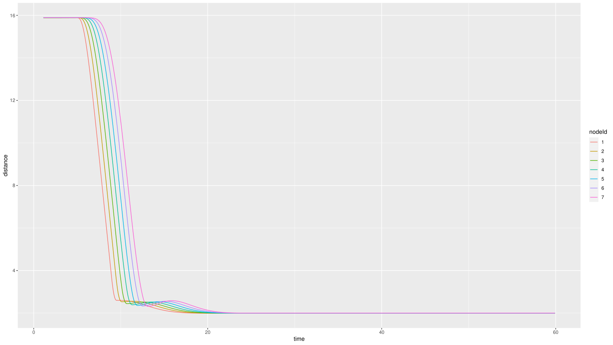
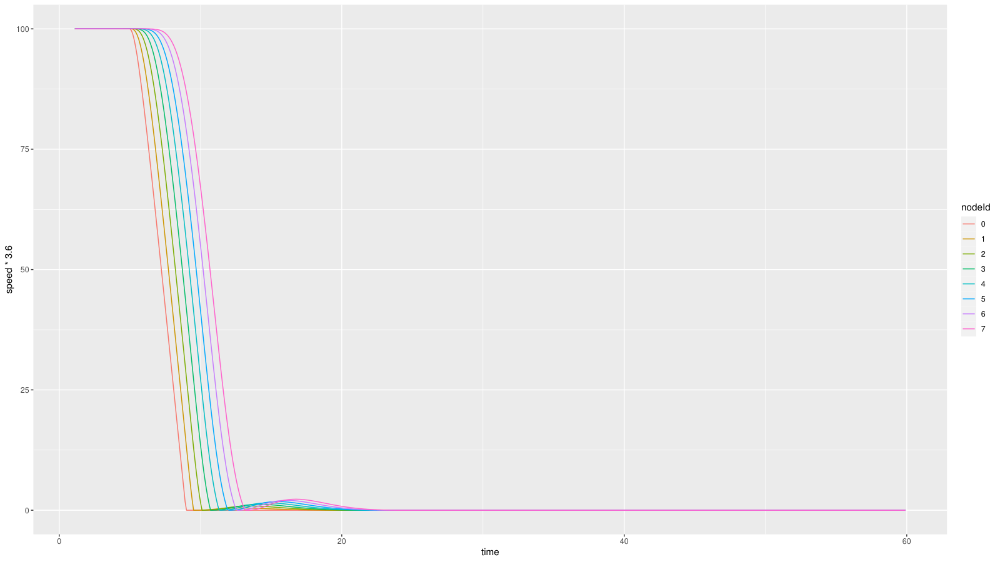
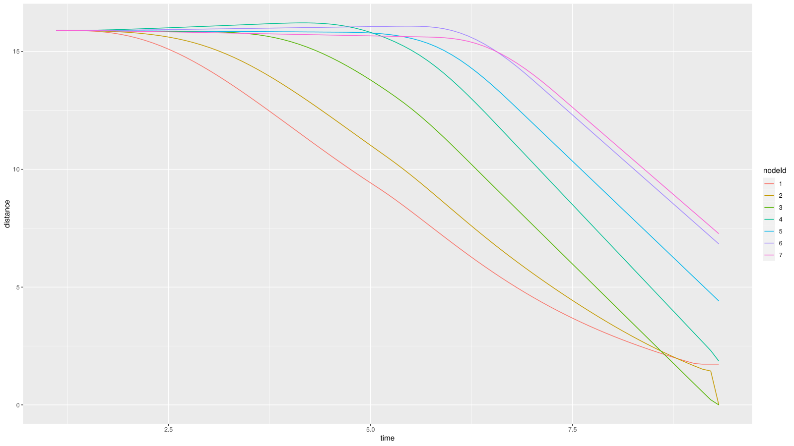
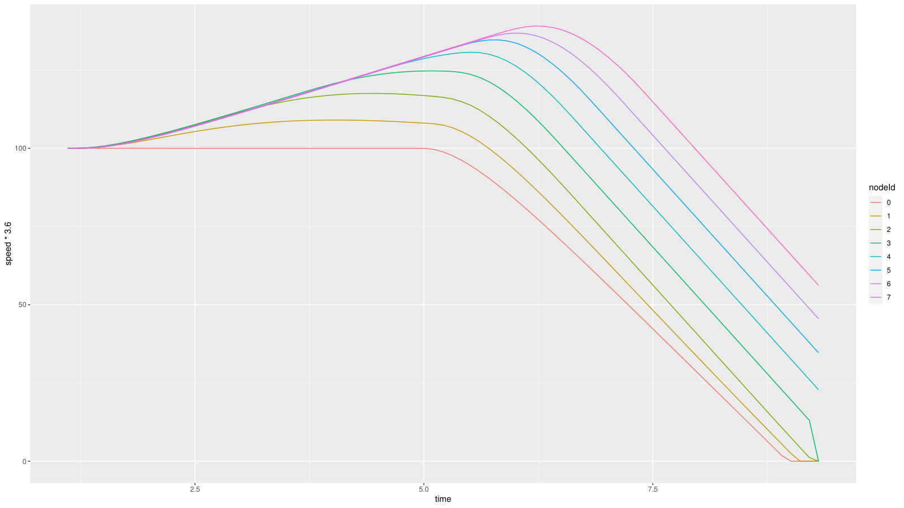
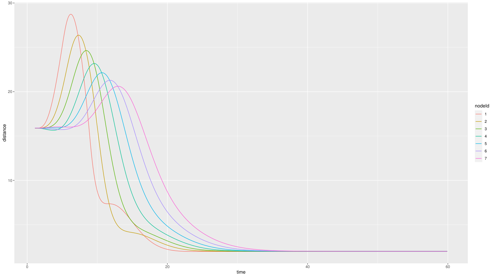
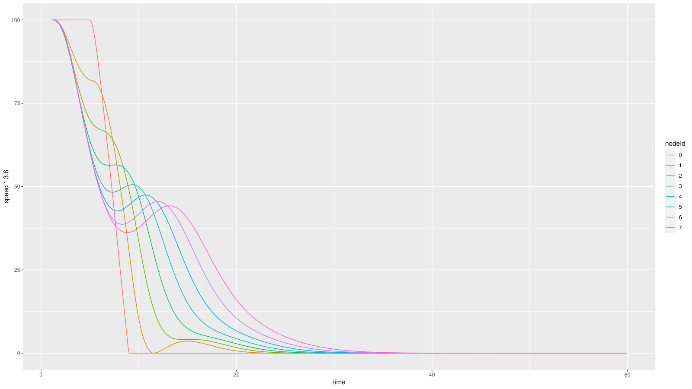

# Caso 1 · Variar el tiempo de separación h de Ploeg

Este es el caso guía del manual. Si es tu primera vez con Plexe, empieza aquí. Se cambia un solo número, pero en el camino aparece todo lo que se repite en los demás casos: ubicar un parámetro, correr la simulación correcta, procesar los resultados, graficarlos y compararlos contra un caso base.

!!! abstract "Resumen"
    - **Pregunta:** ¿qué le pasa al pelotón si los autos se siguen más cerca o más lejos?
    - **Escenario:** `Braking`, del ejemplo `platooning`. Ocho autos avanzan a 100 km/h y, en `t = 5 s`, el líder frena a 8 m/s².
    - **Controlador:** Ploeg.
    - **Parámetro:** `ploegH`, el tiempo de separación `h`.
    - **Valores:** 0.1 s, 0.5 s y 1.5 s. El de 0.5 s es el valor por defecto y sirve de caso base.
    - **Qué se toca:** `omnetpp.ini` y un script de R nuevo. No hay que recompilar.

## 1 · Antes de empezar

Plexe tiene que estar instalado (ver [Instalación](../instalacion.md)). Además, **en cada terminal nueva** hay que cargar los entornos, en este orden:

```bash
# OMNeT++
source ~/src/omnetpp-6.2.0/setenv

# Plexe y Veins
cd ~/src/plexe
. ./setenv

# SUMO, solo si no lo dejaste fijo en ~/.bashrc (ajusta la ruta a tu instalación)
export SUMO_HOME="$HOME/src/sumo-1.22.0"
export PATH="$SUMO_HOME/bin:$PATH"
```

`source`, o su forma corta `.`, ejecuta el archivo dentro de la terminal actual. Por eso las rutas y variables que define quedan disponibles para los comandos siguientes, pero solo en esa terminal.

## 2 · Fundamentos

### Qué es `h`

Ploeg usa una política de espaciamiento de **tiempo constante**: la distancia que cada auto quiere mantener con el de adelante crece con su propia velocidad.

```text
d_ref = 2 + h·v
```

- `2` es la distancia en reposo, en metros. Está fija en el código de SUMO.
- `v` es la velocidad del propio auto, en m/s.
- `h` es el tiempo de separación, en segundos: `h·v` es lo que el auto recorre en `h` segundos a su velocidad actual.

A 100 km/h (27.8 m/s), la distancia deseada queda así:

| `h` | Distancia deseada |
|---|---|
| 0.1 s | ≈ 4.8 m |
| 0.5 s (por defecto) | ≈ 15.9 m |
| 1.5 s | ≈ 43.7 m |

### Qué hace Ploeg

Ploeg es un CACC (control de crucero adaptativo cooperativo). Cada auto combina lo que mide su radar, que es la distancia y la velocidad del auto de adelante, con lo que ese auto le envía por radio: su aceleración deseada. Según el paper de Ploeg, esa anticipación es la que permite usar valores de `h` bajos sin que las perturbaciones crezcan de un auto al siguiente. A esa propiedad se le llama *estabilidad de cuerda* (*string stability*).

`h` aparece dos veces en el controlador: en la distancia deseada y como constante de tiempo de la ley de control. Con `h` bajo el controlador reacciona más rápido, y con `h` alto, más lento. La ley completa está en [Controladores › Controlador Ploeg](../controladores.md#5-controlador-ploeg).

!!! note "El líder no usa Ploeg"
    En el ejemplo `platooning`, el líder (auto 0) siempre usa ACC. Cambiar `h` solo afecta a los autos 1 a 7.

### Qué esperamos ver

- **`h` bajo:** un pelotón compacto, que ocupa menos espacio en la vía, pero con menos margen para reaccionar.
- **`h` alto:** más distancia y reacciones más suaves, a cambio de ocupar más espacio.

## 3 · Dónde vive cada cosa

| Qué | Dónde | En este caso |
|---|---|---|
| El valor de `h` | `~/src/plexe/examples/platooning/omnetpp.ini`, línea `*.node[*].scenario.ploegH` | Se cambia |
| Qué controlador usa cada corrida | El mismo archivo, líneas `**.numericController` y `**.traffic.controller` | Solo se lee |
| La distancia con que se insertan los autos | El mismo archivo, línea `**.traffic.platoonInsertHeadway` | Se ajusta en la [sección 6](#6-partir-del-equilibrio) |
| La fórmula de Ploeg | SUMO, `src/microsim/cfmodels/MSCFModel_CC.cpp`, función `_ploeg()` | No se toca |

!!! tip "La idea clave: ¿parámetro o código?"
    Cambiar un **valor**, como `h`, se hace en `omnetpp.ini`, y basta con volver a correr la simulación. Cambiar la **ecuación** obliga a editar C++ y recompilar. Este caso solo cambia un valor. Más detalle en [Qué hacer cuando modificas algo](../controladores.md#4-que-hacer-cuando-modificas-algo). El recorrido del valor, desde el `.ini` hasta SUMO, está en [Dónde viven los controladores](../controladores.md#1-donde-viven-los-controladores).

## 4 · Implementación paso a paso

### Paso 1 · Identificar la corrida de Ploeg

El escenario `Braking` no prueba un controlador, sino seis, uno por corrida. Abre la configuración del ejemplo:

```bash
cd ~/src/plexe/examples/platooning
code omnetpp.ini    # o cualquier editor, por ejemplo: nano omnetpp.ini
```

Y busca estas líneas:

```ini
**.numericController = ${controller = 0, 0, 1, 2, 3, 4}
**.headway = ${headway = 0.3, 1.2, 0.1, 0.1, 0.1, 0.1 ! controller}s
**.traffic.controller = ${sController = "ACC", "ACC", "CACC", "PLOEG", "CONSENSUS", "FLATBED" ! controller}
```

- `${nombre = a, b, c}` es una **variable de iteración**: OMNeT++ crea una corrida por cada valor.
- `! controller` hace que la variable avance **junto con** `controller`, en vez de combinarse con ella. Por eso son 6 corridas y no 36.
- Las corridas se numeran desde 0. Ese número es el que se pasa con `-r`.

| Corrida (`-r`) | Controlador | Archivo de resultados |
|---|---|---|
| 0 | ACC (0.3 s) | `Braking_0_0.3_0.vec` |
| 1 | ACC (1.2 s) | `Braking_0_1.2_0.vec` |
| 2 | CACC | `Braking_1_0.1_0.vec` |
| **3** | **PLOEG** | **`Braking_2_0.1_0.vec`** |
| 4 | CONSENSUS | `Braking_3_0.1_0.vec` |
| 5 | FLATBED | `Braking_4_0.1_0.vec` |

!!! warning "El número de corrida no es el número del controlador"
    Ploeg es la corrida `-r 3`, pero su archivo se llama `Braking_2_...`. El nombre sale de `output-vector-file = ${resultdir}/Braking_${controller}_${headway}_${repetition}.vec`, que usa el **valor** de `${controller}` (2), no el número de corrida (3). El `0.1` es el valor de `headway` de esa corrida, pensado para los ACC.

### Paso 2 · Correr el caso base

Sin cambiar nada (`h = 0.5 s`):

```bash
cd ~/src/plexe/examples/platooning

# Con la ventana de SUMO, para mirar
./run -u Cmdenv -c Braking -r 3

# Sin ventanas, más rápido
./run -u Cmdenv -c BrakingNoGui -r 3
```

- `-u Cmdenv` corre OMNeT++ en la terminal, sin su interfaz gráfica.
- `-c` elige la sección del `.ini`. `Braking` abre `sumo-gui` para ver a los autos; `BrakingNoGui` usa `sumo`, sin ventanas.
- `-r 3` elige la corrida de Ploeg.

Las dos opciones escriben el mismo archivo, `results/Braking_2_0.1_0.vec`.

### Paso 3 · Procesar los resultados

```bash
cd ~/src/plexe/examples/platooning/analysis
genmakefile.py parse-config > Makefile    # solo la primera vez
make Braking.Rdata
Rscript plot-braking.R
```

- `genmakefile.py` genera el `Makefile` a partir de `parse-config`, que dice qué resultados leer y cómo nombrar las columnas.
- `make Braking.Rdata` convierte los `.vec` de `Braking` en un solo archivo, `results/Braking.Rdata`, más cómodo de cargar en R. `make` sin argumentos procesa también `Sinusoidal`.
- `Rscript plot-braking.R` genera los cuatro PDF estándar en `analysis/`: `braking-speed.pdf`, `braking-distance.pdf`, `braking-acceleration.pdf` y `braking-controller-acceleration.pdf`.

El recorrido completo de los datos está en [Arquitectura › El flujo de datos de una simulación](../arquitectura.md#el-flujo-de-datos-de-una-simulacion).

!!! tip "Ver los PDF desde Windows"
    Si usas WSL, `explorer.exe .` abre la carpeta actual en el explorador de Windows.

### Paso 4 · Graficar solo Ploeg

`plot-braking.R` grafica todos los controladores que encuentra en `results/`. Si antes corriste las seis corridas, Ploeg queda mezclado con los demás. La solución es un script propio: se copia el original, para no modificarlo, y la copia se deja solo con Ploeg.

```bash
cd ~/src/plexe/examples/platooning/analysis
cp plot-braking.R plot-braking-ploeg.R
code plot-braking-ploeg.R
```

Reemplaza su contenido por este:

??? example "plot-braking-ploeg.R"

    ```r
    #load ggplot for quick and dirty plotting
    library(ggplot2)

    cntr = c(
       "ACC (0.3 s)",
       "ACC (1.2 s)",
       "CACC",
       "PLOEG",
       "CONSENSUS",
       "FLATBED"
    )

    #map controller id to name
    controller <- function(id, headway) {
        ifelse(id == 0,
            ifelse(headway < 1, cntr[1], cntr[2]),
            cntr[id+2]
        )
    }

    load('../results/Braking.Rdata')
    allData$controllerName <- controller(allData$controller, allData$headway)

    # --- QUEDARSE SOLO CON PLOEG ---
    ploegData <- subset(allData, controllerName == "PLOEG")
    ploegData$nodeId <- factor(ploegData$nodeId)

    # --- ARMAR LOS 4 GRAFICOS (SIN 6 PANELES) ---
    p.speed <- ggplot(ploegData, aes(x=time, y=speed*3.6, col=nodeId)) +
      geom_line()

    p.distance <- ggplot(subset(ploegData, distance != -1), aes(x=time, y=distance, col=nodeId)) +
      geom_line()

    p.accel <- ggplot(ploegData, aes(x=time, y=acceleration, col=nodeId)) +
      geom_line()

    p.caccel <- ggplot(ploegData, aes(x=time, y=controllerAcceleration, col=nodeId)) +
      geom_line()

    # --- UN SOLO PDF, 4 PAGINAS ---
    pdf("braking-ploeg.pdf", width=16, height=9)
    print(p.speed)
    print(p.distance)
    print(p.accel)
    print(p.caccel)
    dev.off()
    ```

Qué hace, por partes:

1. **Nombres.** `cntr` y `controller()` vienen del script original. Traducen el número del controlador a su nombre, y usan el `headway` para distinguir los dos ACC.
2. **Datos.** `load(...)` carga la tabla `allData` desde `results/Braking.Rdata`.
3. **Filtro.** `subset(...)` se queda solo con las filas de Ploeg.
4. **Gráficos.** Cuatro gráficos contra el tiempo, con una línea por auto (`nodeId`): velocidad en km/h, distancia al auto de adelante, aceleración real y aceleración pedida por el controlador. En la distancia se descarta el valor `-1`, que corresponde al líder, porque no tiene auto adelante.
5. **Salida.** Un solo archivo, `braking-ploeg.pdf`, con los cuatro gráficos en cuatro páginas.

Genera el PDF y guárdalo con otro nombre, porque es tu caso base:

```bash
Rscript plot-braking-ploeg.R
cp braking-ploeg.pdf braking-ploeg-0.5.pdf
```

### Paso 5 · Cambiar `h`

En `omnetpp.ini`, cambia el valor de `ploegH`:

```ini
# Antes (por defecto)
*.node[*].scenario.ploegH = ${ploegH = 0.5}s

# Después
*.node[*].scenario.ploegH = ${ploegH = 0.1}s
```

Luego repite la simulación y el gráfico:

```bash
cd ~/src/plexe/examples/platooning
./run -u Cmdenv -c BrakingNoGui -r 3

cd analysis
make Braking.Rdata
Rscript plot-braking-ploeg.R
cp braking-ploeg.pdf braking-ploeg-0.1.pdf
```

Haz lo mismo con `1.5` y, al terminar, deja otra vez `0.5`.

!!! warning "Cada corrida reemplaza a la anterior"
    El nombre del archivo de resultados no incluye `ploegH`, así que Ploeg escribe siempre en `Braking_2_0.1_0.vec`. Genera y guarda el PDF **antes** de cambiar `h` otra vez.

## 5 · Resultados

Estos gráficos son las dos primeras páginas de cada PDF. En el eje vertical, `speed * 3.6` es la velocidad en km/h y `distance` es la distancia al auto de adelante en metros. El eje horizontal es el tiempo en segundos, y cada color es un auto (`nodeId`).

=== "h = 0.5 s · caso base"

    

    

    - Hasta `t = 5 s` no pasa nada: las distancias se mantienen en 15.9 m, la distancia deseada a 100 km/h.
    - Cuando el líder frena, cada auto frena un poco después que el de adelante.
    - Hacia `t ≈ 12 s` están todos detenidos, a unos 2 m entre sí: la distancia en reposo.

=== "h = 0.1 s"

    

    

    - **Los autos se mueven antes del frenado.** Parten a 15.9 m, pero ahora quieren estar a unos 4.8 m, así que aceleran para acercarse. Cada uno acelera más que el de adelante: llegan a entre 110 y 140 km/h, más rápido mientras más atrás van.
    - Cuando el líder frena, los de atrás van más rápido que él y cada vez más cerca. Las distancias se desploman.
    - Cerca de `t = 9.3 s`, la distancia de los autos 2 y 3 llega a 0 y la simulación termina antes de tiempo: **hubo un choque**.

=== "h = 1.5 s"

    

    

    - **Los autos también se mueven antes del frenado**, pero al revés: parten a 15.9 m y quieren estar a unos 43.7 m, así que frenan. En `t = 5 s` ya van a entre 70 y 82 km/h, mientras el líder sigue a 100.
    - Cuando el líder frena, cada distancia sube hasta un máximo y después baja. Los máximos disminuyen hacia la cola: unos 29 m en el auto 1 y unos 21 m en el auto 7.
    - El pelotón queda detenido recién hacia `t ≈ 30 s`, contra `t ≈ 12 s` en el caso base.

!!! warning "Lo que de verdad muestran estos gráficos"
    Con `h = 0.1 s` y `h = 1.5 s`, los autos se mueven **antes** de que el líder frene. La razón es que el ejemplo inserta los autos ya separados para `h = 0.5 s`. Al cambiar solo `ploegH`, el pelotón parte fuera del equilibrio y dedica los primeros segundos a reacomodarse. Por eso estos gráficos mezclan dos efectos: el reacomodo y la respuesta al frenado. El choque con `h = 0.1 s` ocurre cuando el frenado sorprende a los autos acelerando para acercarse, y no prueba por sí solo que ese valor sea inseguro.

## 6 · Partir del equilibrio

Para medir solo el efecto de `h`, los autos tienen que insertarse ya a la distancia que corresponde al nuevo valor. Eso lo define esta línea de `omnetpp.ini`, que tiene un valor por controlador. El cuarto es el de Ploeg:

```ini
# Por defecto, preparado para h = 0.5 s
**.traffic.platoonInsertHeadway = ${0.3, 1.2, 0, 0.5, 0.8, 0 ! controller}s

# Para h = 0.1 s
**.traffic.platoonInsertHeadway = ${0.3, 1.2, 0, 0.1, 0.8, 0 ! controller}s
```

La distancia en reposo de la inserción (`platoonInsertDistance`) ya es de 2 m para Ploeg, la misma del controlador, así que no hay que cambiarla. Con este ajuste, las curvas deberían quedar planas hasta `t = 5 s`, como en el caso base, y la diferencia entre valores de `h` aparecería solo en el frenado.

```text
# PENDIENTE: repetir las corridas con la inserción ajustada y agregar los gráficos
```

!!! note "Pendiente: los tres valores en una sola ejecución"
    Editar `ploegH` a mano sirve para aprender, pero obliga a correr tres veces y a guardar cada PDF entre corridas. La alternativa es una sección propia en `omnetpp.ini` que fije Ploeg, recorra `${ploegH = 0.1, 0.5, 1.5}`, ajuste la inserción e incluya `ploegH` en el nombre de los archivos. Se documentará cuando esté probada.

## 7 · La receta general

Todos los casos siguientes repiten estos pasos:

1. **Ubicar** el parámetro: en qué archivo y en qué línea vive.
2. **Identificar** la configuración (`-c`) y la corrida (`-r`) que interesan.
3. **Correr el caso base** y guardar sus gráficos.
4. **Cambiar el valor**, volver a correr, procesar y guardar los gráficos con otro nombre.
5. **Revisar el punto de partida**: que el cambio no deje la simulación fuera del equilibrio.
6. **Comparar** contra el caso base.

### Errores frecuentes

| Síntoma | Causa | Solución |
|---|---|---|
| `command not found` al usar `opp_run` o `genmakefile.py` | No se cargaron los entornos en esa terminal | Repite los comandos de [Antes de empezar](#1-antes-de-empezar) |
| `make` dice que el `Makefile` se generó para otra versión de OMNeT++ | El `Makefile` viene de otra instalación | Vuelve a generarlo con `genmakefile.py parse-config > Makefile` |
| En los gráficos aparecen otros controladores | Hay resultados de otras corridas en `results/` | Usa `plot-braking-ploeg.R`, que filtra Ploeg |
| Los resultados de un `h` borraron los del anterior | El nombre del `.vec` no incluye `ploegH` | Guarda el PDF antes de cambiar `h` |
| Los autos aceleran o frenan antes de `t = 5 s` | La inserción corresponde a otro `h` | Ajusta `platoonInsertHeadway` ([sección 6](#6-partir-del-equilibrio)) |

## 8 · Siguiente paso

El [Caso 2](caso-2.md) aplica la misma receta a un parámetro que ya no es del controlador, sino de la radio: la potencia de transmisión.
