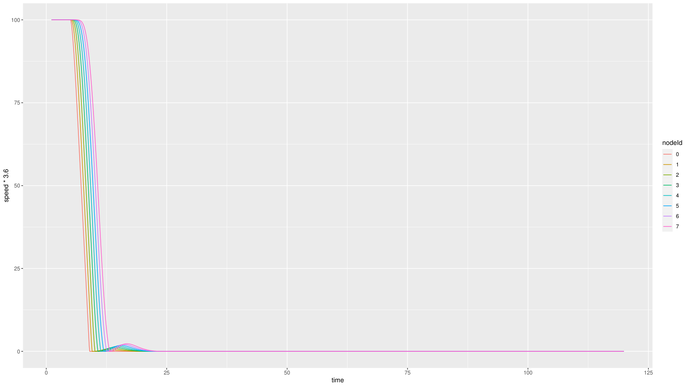
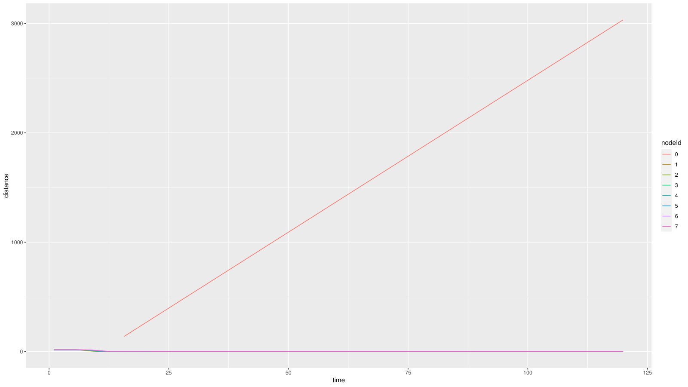
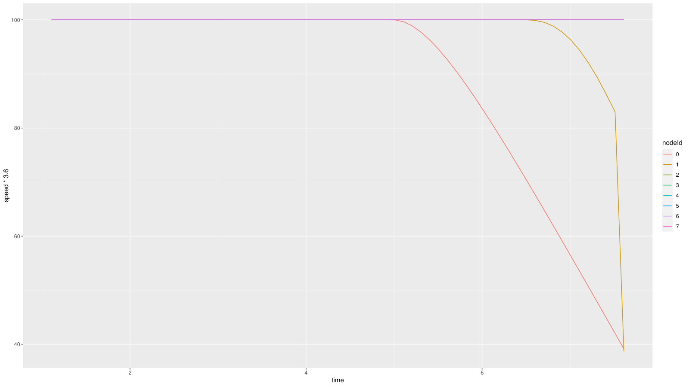
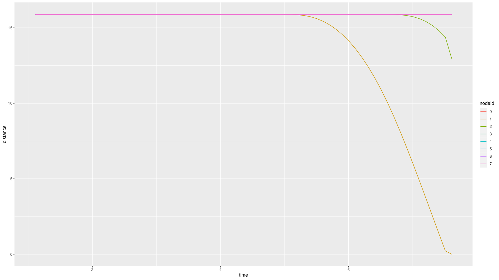
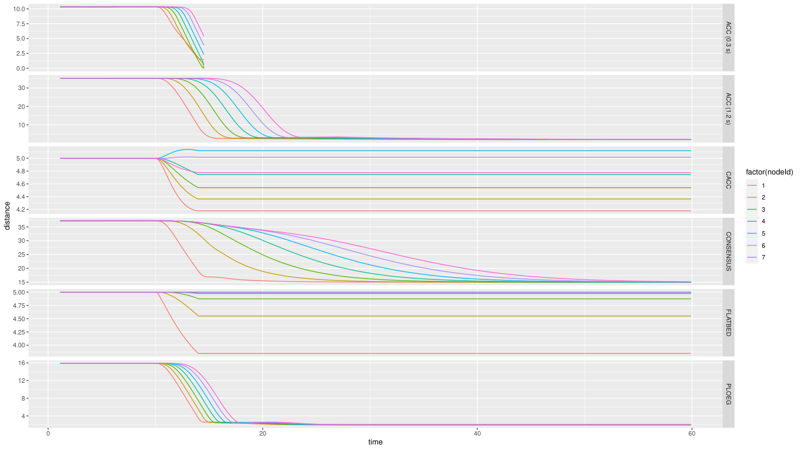
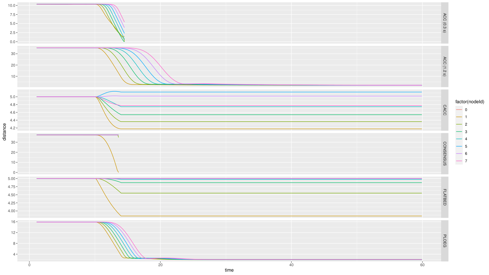
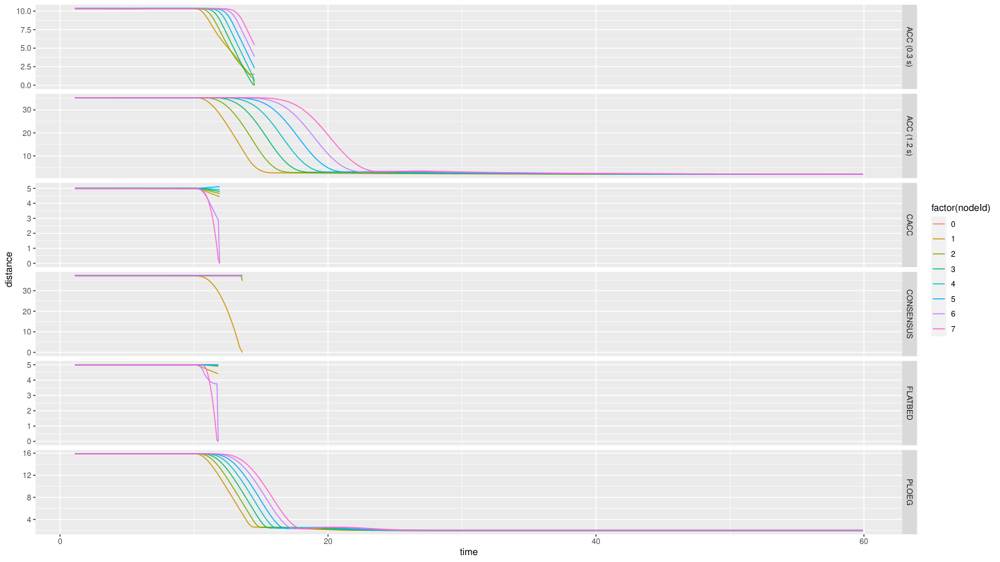
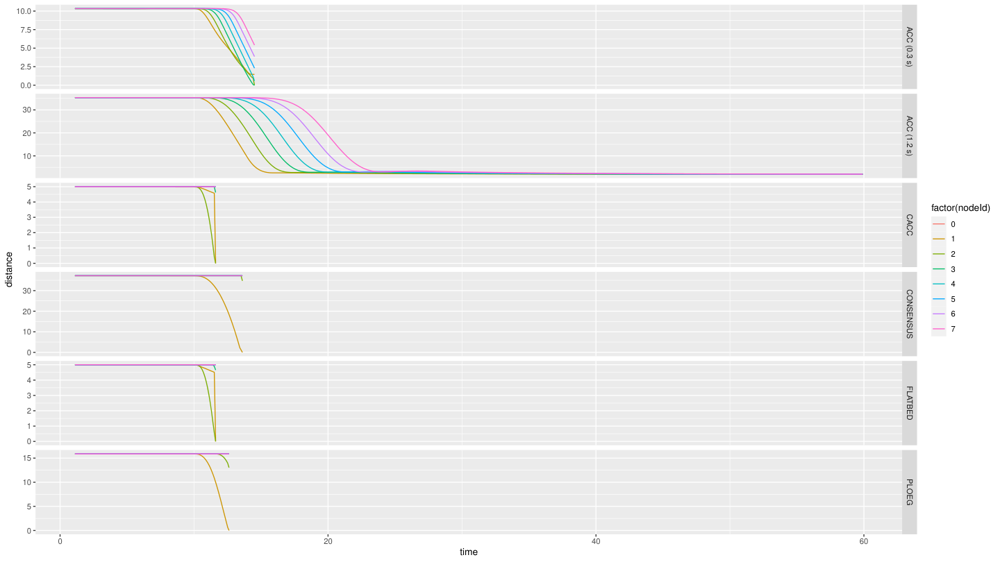

# Caso 2 · Variar la potencia de transmisión

En el [Caso 1](caso-1.md) se cambió un parámetro del controlador. Aquí se cambia uno de la radio: la potencia con que cada auto transmite sus mensajes. Si todavía no hiciste el Caso 1, empieza por ahí, porque este caso usa su script de gráficos y su receta.

!!! abstract "Resumen"
    - **Pregunta:** ¿cuánta potencia necesita la radio para que el pelotón siga funcionando?
    - **Escenario:** `Braking`, del ejemplo `human` (el Ejemplo 5 de Plexe). Es el mismo pelotón de 8 autos, más un auto humano que interfiere en la red.
    - **Controlador:** Ploeg (`-r 3`).
    - **Parámetros:** la potencia de transmisión, el bitrate y, al final, el tiempo de separación `h`.
    - **Resultado principal:** con la separación por defecto (unos 16 m), el pelotón choca al bajar de 0.02 a 0.01 mW. Con más separación, hace falta más potencia.
    - **Además:** el mismo barrido con los 6 controladores, en el ejemplo `platooning`.
    - **Qué se toca:** solo `omnetpp.ini`. No hay que recompilar.

## 1 · Antes de empezar

Carga los entornos como en el [Caso 1](caso-1.md#1-antes-de-empezar).

El ejemplo `human` no trae carpeta `analysis/`. Cópiala desde `platooning`, que ya incluye el script `plot-braking-ploeg.R` del Caso 1:

```bash
cp -r ~/src/plexe/examples/platooning/analysis ~/src/plexe/examples/human/
```

La copia también trae los PDF que hayas generado en `platooning`. Por eso, más adelante se revisa la hora del PDF antes de mirarlo.

## 2 · Fundamentos

### Qué es la potencia de transmisión

Es la fuerza con que la radio emite cada mensaje, en milivatios (mW). Con más potencia, la señal llega más lejos. Un mensaje se recibe solo si llega con fuerza suficiente por sobre el ruido y la interferencia, así que el resultado depende de la potencia **y** de la distancia entre los autos.

Los valores de este caso cubren cuatro órdenes de magnitud, así que conviene verlos también en dBm, que es la potencia en decibeles respecto de 1 mW (`dBm = 10·log10(mW)`):

| mW | dBm |
|---|---|
| 100 (por defecto) | 20 |
| 10 | 10 |
| 1 | 0 |
| 0.1 | −10 |
| 0.02 | −17 |
| 0.01 | −20 |

### Bitrate y beacons

- **Bitrate:** qué tan rápido la radio emite los bits de un mensaje. No es cada cuánto envía. 802.11p solo acepta tasas fijas: 3, 4.5, 6, 9, 12, 18, 24 y 27 Mbps. Por defecto se usan 6 Mbps.
- **Beacons:** los mensajes periódicos con que cada auto informa su estado. En este ejemplo se envían cada 0.1 s y pesan 200 bytes.

### Por qué la radio le importa a Ploeg

Ploeg usa el radar para medir la distancia y la velocidad del auto de adelante, pero la aceleración de ese auto le llega **por radio**, en los beacons. Si los beacons dejan de llegar:

- entre beacons, o si se pierden, Ploeg usa el último que recibió;
- si nunca recibió uno, pide aceleración cero (`u = 0`).

El detalle está en [Controladores › Datos que usa](../controladores.md#datos-que-usa).

### Qué esperamos ver

Con menos potencia, los mensajes alcanzan menos distancia. En algún punto dejarán de llegar al auto de atrás, Ploeg perderá la información de la radio y el pelotón dejará de frenar de forma coordinada.

## 3 · Dónde vive cada cosa

Todo está en `~/src/plexe/examples/human/omnetpp.ini`:

| Línea | Qué controla | Por defecto |
|---|---|---|
| `*.**.nic.mac1609_4.txPower` | La potencia de la radio de **todos** los autos | 100 mW |
| `*.**.nic.mac1609_4.bitrate` | El bitrate de todos los autos | 6 Mbps |
| `*.human[*].prot.txPower` | La potencia de los mensajes del auto humano | 100 mW |
| `*.human[*].prot.bitrate` | El bitrate de los mensajes del auto humano | 3 Mbps |
| `*.node[*].scenario.ploegH` | El tiempo de separación `h` | 0.5 s |
| `*.node[*].scenario.startBraking` | El instante en que frena el líder | 5 s |

- `*.**.nic.mac1609_4` apunta a la tarjeta de red (`nic`) de cada vehículo y, dentro de ella, a la capa MAC de 802.11p, el módulo `Mac1609_4`. Ese módulo es de Veins, así que la potencia y el bitrate son parámetros de Veins, no de Plexe.
- El auto humano tiene sus propias líneas, las de `*.human[*].prot`. Este caso no las cambia.

!!! tip "También se puede desde C++"
    La potencia también se puede cambiar desde el código, por ejemplo con `setTxPower()` de la MAC, para un auto en particular o mensaje por mensaje. Este caso no lo necesita: basta con el `.ini`.

## 4 · Cómo se hizo, paso a paso

### Paso 1 · Correr el caso base

Sin cambiar nada (100 mW y 6 Mbps):

```bash
cd ~/src/plexe/examples/human
./run -u Cmdenv -c BrakingNoGui -r 3

cd analysis
genmakefile.py parse-config > Makefile    # solo la primera vez
make Braking.Rdata
Rscript plot-braking-ploeg.R
cp braking-ploeg.pdf braking-ploeg-100mW.pdf
```

El ejemplo `human` tiene cinco controladores, porque no incluye FLATBED, pero Ploeg sigue siendo la corrida `-r 3`. Para mirar la simulación, usa `-c Braking`, que abre `sumo-gui`.

### Paso 2 · Primer intento: bajar a 10 mW

En `omnetpp.ini`:

```ini
*.**.nic.mac1609_4.txPower = 10mW
```

Al correr y graficar como en el paso 1, los gráficos salen **idénticos** a los del caso base.

!!! note "Por qué no cambió nada"
    Bajar la potencia solo importa si la señal deja de alcanzar. Con 10 mW, los mensajes siguen llegando entre autos separados por 16 m, así que Ploeg recibe la misma información. Para ver un efecto hay que forzar el escenario.

### Paso 3 · Forzar el escenario: barrido de potencia

Primero, baja el bitrate al mínimo que acepta 802.11p:

```ini
*.**.nic.mac1609_4.bitrate = 3Mbps
```

Con un valor menor, por ejemplo 0.5 Mbps, la simulación se detiene con este error:

```text
Chosen Bitrate is not valid for 802.11p: Valid rates are: 3Mbps, 4.5Mbps, 6Mbps, 9Mbps, 12Mbps, 18Mbps, 24Mbps and 27Mbps.
```

Después, baja la potencia paso a paso: 100, 50, 10, 1, 0.1 y 0.01 mW. Como el choque aparece en 0.01 mW, se afina entre 0.1 y 0.01 con 0.05, 0.03 y 0.02 mW. Por ejemplo:

```ini
*.**.nic.mac1609_4.txPower = 0.01mW
```

En cada valor, limpia los resultados, corre, grafica y guarda el PDF con su nombre:

```bash
cd ~/src/plexe/examples/human
rm -rf results
mkdir -p results
./run -u Cmdenv -c BrakingNoGui -r 3

cd analysis
make Braking.Rdata
Rscript plot-braking-ploeg.R
ls -lht braking-ploeg.pdf    # la hora debe ser la de recién
cp braking-ploeg.pdf braking-ploeg-0.01mW.pdf
```

!!! warning "Por qué limpiar `results/`"
    Si una corrida falla, `results/` conserva los archivos de la corrida anterior y el script grafica esos datos viejos sin avisar. Con el PDF pasa lo mismo: si el script falla, queda el de antes. Borrar `results/` y revisar la hora del PDF evita confundir una corrida con otra. `rm -rf results` borra todos los resultados, así que copia antes los que quieras guardar.

### Paso 4 · Separar más los autos

La hipótesis del profesor fue que con 0.02 o 0.03 mW quizás no había choque solo porque los autos iban muy cerca, a unos 16 m. Si se separan más, la señal podría no alcanzar. Para probarlo se cambian dos líneas más:

```ini
*.node[*].scenario.ploegH = ${ploegH = 1.5}s
*.node[*].scenario.startBraking = 20 s
```

- Con `h = 1.5 s`, la distancia deseada a 100 km/h es de unos 44 m (ver [Caso 1](caso-1.md#que-es-h)).
- Frenar en `t = 20 s`, en vez de 5 s, deja más tiempo para que el pelotón se reacomode a la nueva separación. Como se vio en el [Caso 1](caso-1.md#6-partir-del-equilibrio), los autos se insertan preparados para `h = 0.5 s`.

Con eso se prueban varias combinaciones de `h` y potencia, mirando cada corrida en `sumo-gui`.

### Paso 5 · Los 6 controladores, en el ejemplo `platooning`

El barrido se repitió en el ejemplo `platooning`, ahora con los 6 controladores. En su `omnetpp.ini` la línea es la misma:

```ini
*.**.nic.mac1609_4.txPower = 0.1mW
```

Las potencias fueron 100, 50, 5, 1, 0.5, 0.1 y 0.01 mW. Para cada una, corre las 6 corridas y grafica con `plot-braking.R`, el script original del ejemplo, que dibuja un panel por controlador:

```bash
cd ~/src/plexe/examples/platooning
for r in 0 1 2 3 4 5; do ./run -u Cmdenv -c BrakingNoGui -r $r; done

cd analysis
make Braking.Rdata
Rscript plot-braking.R
```

!!! note "Instante del frenado"
    Las notas de esta prueba no registran en qué instante frenó el líder. En los gráficos se ve que fue cerca de `t = 10 s`, no en `t = 5 s` como en el ejemplo original.

## 5 · Resultados

### Barrido de potencia (`h = 0.5 s`)

| Potencia (mW) | dBm | Resultado |
|---|---|---|
| 100 (con 6 y con 3 Mbps) | 20 | Sin choque |
| 50 | 17 | Sin choque |
| 10 | 10 | Sin choque |
| 1 | 0 | Sin choque |
| 0.1 | −10 | Sin choque |
| 0.05 | −13 | Sin choque |
| 0.03 | −15 | Sin choque |
| 0.02 | −17 | Sin choque |
| **0.01** | **−20** | **Choque** |
| 0.001 | −30 | Choque |

**El umbral está entre 0.02 y 0.01 mW.** Además, los gráficos con 0.02 mW son idénticos, píxel a píxel, a los de 100 mW. Todo indica que, hasta 0.02 mW, llegan todos los mensajes y que en 0.01 mW dejan de llegar. En este ejemplo no se ve una degradación gradual.

Los gráficos se leen como en el [Caso 1](caso-1.md#5-resultados).

=== "100 mW · caso base"

    

    

    - El pelotón frena de forma ordenada, como en el caso base del Caso 1.
    - **Ojo con el gráfico de distancia.** La línea que sube hasta 3000 m es la del líder (auto 0). En este ejemplo, el líder sí tiene un vehículo adelante, el auto humano, que sigue avanzando mientras el pelotón se detiene. Esa línea aplasta a las demás. Para ver solo el pelotón, excluye al líder en `plot-braking-ploeg.R`:

        ```r
        p.distance <- ggplot(subset(ploegData, distance != -1 & nodeId != "0"), aes(x=time, y=distance, col=nodeId)) +
          geom_line()
        ```

=== "0.01 mW · choque"

    

    

    - Los seguidores no reaccionan cuando el líder frena en `t = 5 s`: siguen a 100 km/h.
    - El auto 1 recién empieza a frenar cerca de `t = 6.7 s`, ya encima del líder. Su distancia llega a 0 y la simulación termina en `t ≈ 7.7 s`: **hubo un choque**.
    - Es lo que se espera si no llega ningún beacon: sin la información de la radio, Ploeg pide aceleración cero (ver [Fundamentos](#por-que-la-radio-le-importa-a-ploeg)).

### Potencia y separación (frenado en `t = 20 s`)

| `h` | Potencia (mW) | Resultado |
|---|---|---|
| 0.5 s | 0.02 | Sin choque |
| 1.5 s | 0.01 | Choque. El pelotón ni siquiera se separa |
| 1.5 s | 0.02 | El pelotón se separa, pero choca |
| 1.5 s | 0.05 | Choca, aunque se nota mejor conexión |
| 1.5 s | 0.1 | Sin choque |

Con `h = 0.5 s` (unos 16 m entre autos), el umbral estaba entre 0.02 y 0.01 mW. Con `h = 1.5 s` (unos 44 m) sube a entre 0.05 y 0.1 mW: **más distancia exige más potencia**. Que con 0.01 mW el pelotón ni siquiera se separe es coherente con lo anterior: sin beacons, Ploeg no ajusta la distancia.

!!! warning "Límites de estos resultados"
    - Los umbrales valen para el modelo de radio de este ejemplo, no para cualquier escenario.
    - "Choca o no choca" es una medida gruesa: no dice cuántos mensajes se perdieron.
    - Los resultados de la última tabla se observaron en `sumo-gui`. Hay videos de esas corridas, pero no gráficos.

### Los 6 controladores (ejemplo `platooning`)

| Potencia (mW) | Chocan | No chocan |
|---|---|---|
| 100, 50 y 5 | ACC (0.3 s) | ACC (1.2 s), CACC, Consensus, Flatbed, Ploeg |
| 1 y 0.5 | ACC (0.3 s), Consensus | ACC (1.2 s), CACC, Flatbed, Ploeg |
| 0.1 | ACC (0.3 s), Consensus, CACC, Flatbed | ACC (1.2 s), Ploeg |
| 0.01 | Todos menos ACC (1.2 s) | ACC (1.2 s) |

- Los gráficos de 100, 50 y 5 mW son idénticos, y también los de 1 y 0.5 mW.
- **ACC (0.3 s) choca con todas las potencias**, incluso con 100 mW.
- Al bajar la potencia, el primero en chocar es Consensus (1 mW), después CACC y Flatbed (0.1 mW) y al final Ploeg (0.01 mW). ACC (1.2 s) no choca con ninguna.

En cada gráfico, cada panel es un controlador. Si un panel termina antes de `t = 60 s`, esa corrida chocó (ver [Caso 1](caso-1.md#5-resultados)).

=== "100 mW (igual con 50 y 5)"

    

    - Solo el panel de ACC (0.3 s) termina antes de tiempo.

=== "1 mW (igual con 0.5)"

    

    - Terminan antes de tiempo ACC (0.3 s) y Consensus.

=== "0.1 mW"

    

    - Terminan antes de tiempo ACC (0.3 s), CACC, Consensus y Flatbed.

=== "0.01 mW"

    

    - Solo ACC (1.2 s) llega a `t = 60 s`.

## 6 · Errores frecuentes

| Síntoma | Causa | Solución |
|---|---|---|
| `Chosen Bitrate is not valid for 802.11p` | El bitrate no está en la lista de 802.11p | Usa una tasa válida. La mínima es 3 Mbps |
| Bajas la potencia y nada cambia | La señal todavía alcanza | Sigue bajando o separa más los autos |
| El gráfico no cambia entre corridas | Se graficaron resultados o un PDF viejos | Limpia `results/` y revisa la hora del PDF |
| Cambias la potencia y no pasa nada, aunque la bajaste mucho | Editaste la línea del auto humano | La potencia de todos es `*.**.nic.mac1609_4.txPower` |
| En la distancia, una línea sube hasta miles de metros | Es el líder midiendo la distancia al auto humano | Excluye al auto 0 del gráfico de distancia |

## 7 · Pendientes

```text
# PENDIENTE: medir la tasa de recepción de beacons de cada auto, para pasar de "choca o no choca" a una curva
# PENDIENTE: gráficos de las corridas con h = 1.5 s (hoy solo hay videos)
# PENDIENTE: anotar en qué instante frenó el líder en el barrido con los 6 controladores (en los gráficos, cerca de t = 10 s)
```

## 8 · Siguiente paso

El [Caso 3](caso-3.md) deja la potencia en 100 mW y cambia otra cosa de la comunicación: cada cuánto se envían los beacons.
