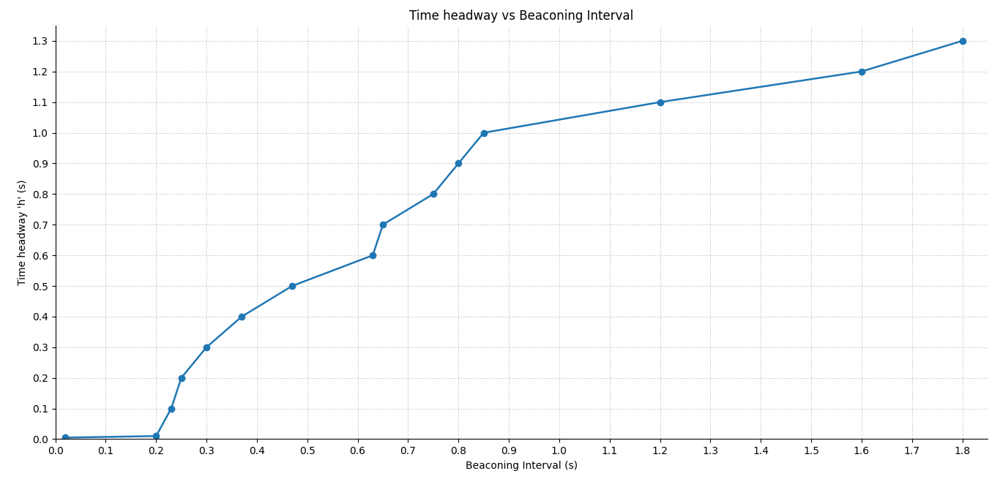

# Caso 3 · Variar el intervalo de envío de beacons

En el [Caso 2](caso-2.md) se debilitó la señal hasta que los beacons dejaron de llegar. Aquí la radio queda como viene, con 100 mW, y se cambia otra cosa: cada cuánto se envían los beacons. El caso vuelve al ejemplo `platooning` del [Caso 1](caso-1.md) y sigue su receta.

!!! abstract "Resumen"
    - **Pregunta:** ¿cada cuánto tiene que enviar beacons cada auto para que el pelotón frene sin chocar?
    - **Escenario:** `Braking`, del ejemplo `platooning`, el mismo del Caso 1.
    - **Controlador:** Ploeg (`-r 3`).
    - **Parámetros:** el intervalo de envío de beacons y, después, el tiempo de separación `h`.
    - **Resultado principal:** con `h = 0.5 s`, el pelotón choca al pasar de 0.3 a 0.5 s entre beacons. Con más `h`, tolera intervalos más largos.
    - **Qué se toca:** solo `omnetpp.ini`. No hay que recompilar.

## 1 · Antes de empezar

Carga los entornos como en el [Caso 1](caso-1.md#1-antes-de-empezar).

Si hiciste el Caso 1, revisa que `ploegH` haya quedado otra vez en `0.5`, porque este caso parte de los valores por defecto.

## 2 · Fundamentos

### Qué es un beacon

Es el mensaje periódico con que cada auto informa su estado: velocidad, aceleración y posición, entre otros datos. En Plexe se llama `PlatooningBeacon` y, en este ejemplo, pesa 200 bytes.

Los beacons se envían en *broadcast*, a todos los que estén al alcance. Por eso no llevan confirmación de recepción (ACK) ni se reenvían: un beacon que se pierde no se recupera, y el dato vuelve a llegar recién con el siguiente.

### Qué es el intervalo de envío de beacons

Es el tiempo entre dos beacons del mismo auto, en segundos. Por defecto es 0.1 s, o sea, 10 beacons por segundo.

- No es lo mismo que el bitrate. El bitrate dice qué tan rápido se emiten los bits de **un** mensaje; el intervalo, cada cuánto se envía un mensaje nuevo (ver [Caso 2 › Bitrate y beacons](caso-2.md#bitrate-y-beacons)).
- Cada auto envía su primer beacon con un desfase al azar, para que no transmitan todos al mismo tiempo. Desde ahí mantiene el intervalo fijo.

### Por qué el intervalo le importa a Ploeg

Ploeg mide con el radar, en cada paso, la distancia y la velocidad del auto de adelante. La aceleración de ese auto, en cambio, le llega por beacon, y entre un beacon y el siguiente usa la última que recibió (ver [Controladores › Datos que usa](../controladores.md#datos-que-usa)).

Con un intervalo más largo, ese dato se actualiza menos seguido: si el auto de adelante cambia su aceleración, el de atrás lo sabe recién con el siguiente beacon. Mientras tanto, el radar sigue midiendo la distancia y la velocidad en cada paso.

### Qué esperamos ver

- Con intervalos cortos, nada cambia respecto del caso base.
- Al alargar el intervalo, en algún punto el aviso del frenado llega demasiado tarde y el pelotón choca.
- Con `h` más alto hay más distancia entre los autos y más margen para reaccionar, así que el pelotón debería tolerar intervalos más largos.

## 3 · Dónde vive cada cosa

| Qué | Dónde | En este caso |
|---|---|---|
| El intervalo de envío de beacons | `~/src/plexe/examples/platooning/omnetpp.ini`, línea `*.node[*].prot.beaconingInterval` | Se cambia |
| El tiempo de separación `h` | El mismo archivo, línea `*.node[*].scenario.ploegH` | Se cambia en la grilla |
| El instante en que frena el líder | El mismo archivo, sección `[Config Braking]`, línea `*.node[*].scenario.startBraking` | Se cambia en la grilla |
| La declaración del parámetro, con su valor por defecto de 0.1 s | `~/src/plexe/src/plexe/protocols/BBaseProtocol.ned` | No se toca |
| La lectura del valor desde el `.ini` | `~/src/plexe/src/plexe/protocols/BaseProtocol.cc`, función `initialize()` | No se toca |
| El envío periódico | `~/src/plexe/src/plexe/protocols/SimplePlatooningBeaconing.cc`, funciones `initialize()` y `handleSelfMsg()` | No se toca |

- `*.node[*].prot` apunta al protocolo de comunicación de cada auto. En el ejemplo `platooning` es `SimplePlatooningBeaconing`, que hereda de `BBaseProtocol`: todos los autos envían beacons a intervalo fijo.
- `BaseProtocol.ned` también declara `beaconingInterval`, pero sin valor por defecto: es la interfaz que deben cumplir todos los protocolos.
- En el mismo bloque del `.ini` están `priority` y `packetSize`, la prioridad y el tamaño de los beacons. Este caso no los cambia.
- La potencia y el bitrate no viven aquí, sino en la capa MAC de Veins (ver [Caso 2](caso-2.md#3-donde-vive-cada-cosa)).

!!! tip "Cómo usa el código el intervalo"
    `SimplePlatooningBeaconing.cc` programa el primer beacon de cada auto un intervalo después de que el auto aparece, más un desfase al azar de entre 0.001 s y un intervalo. Desde ahí, después de cada envío programa el siguiente:

    ```cpp
    scheduleAt(simTime() + beaconingInterval, sendBeacon);
    ```

    Con intervalo 0 no se programa ningún beacon, así que el auto no envía nada.

## 4 · Cómo se hizo, paso a paso

### Paso 1 · Correr el caso base

Sin cambiar nada (0.1 s entre beacons y `h = 0.5 s`), con la ventana de SUMO para mirar el frenado:

```bash
cd ~/src/plexe/examples/platooning
./run -u Cmdenv -c Braking -r 3
```

Es la misma corrida del caso base del [Caso 1](caso-1.md#paso-2-correr-el-caso-base): el pelotón frena sin chocar. Para correr sin ventanas, usa `-c BrakingNoGui`.

### Paso 2 · Barrido del intervalo

En `omnetpp.ini`, cambia el valor del intervalo:

```ini
# Antes (por defecto)
*.node[*].prot.beaconingInterval = ${beaconInterval = 0.1}s

# Después, por ejemplo
*.node[*].prot.beaconingInterval = ${beaconInterval = 0.5}s
```

- `beaconingInterval` es el parámetro de Plexe; `beaconInterval` es solo el nombre de la variable de iteración en el `.ini`.
- La línea está en `[General]`, así que vale para todas las configuraciones, incluida `Braking`.

Repite el paso 1 con cada valor y mira el frenado en `sumo-gui`: 0.01, 0.1, 0.3, 0.5, 0.8 y 1 s. Al terminar, deja otra vez `0.1`.

!!! warning "Un valor a la vez"
    `${beaconInterval = ...}` es una variable de iteración, como las del [Caso 1](caso-1.md#paso-1-identificar-la-corrida-de-ploeg). Si escribes varios valores, OMNeT++ crea una corrida por cada combinación con los controladores, la numeración cambia y `-r 3` deja de ser la corrida que buscas. Además, el nombre del archivo de resultados no incluye el intervalo: si graficas con `plot-braking-ploeg.R`, guarda el PDF antes de cambiar de valor.

### Paso 3 · Grilla de `h` e intervalo

Para ver cómo cambia el umbral con la separación, se cambian dos líneas más:

```ini
# El h de turno, por ejemplo 0.1 s
*.node[*].scenario.ploegH = ${ploegH = 0.1}s

# En [Config Braking]: frenar en t = 20 s, en vez de 5 s
*.node[*].scenario.startBraking = 20 s
```

- Frenar en `t = 20 s` da tiempo para que el pelotón se reacomode al nuevo `h` antes del frenado, igual que en el [Caso 2](caso-2.md#paso-4-separar-mas-los-autos). Los autos se insertan preparados para `h = 0.5 s` (ver [Caso 1](caso-1.md#6-partir-del-equilibrio)).
- Para cada `h`, se sube el intervalo hasta encontrar el menor que produce choque.
- El resto queda en sus valores por defecto: 100 mW, 6 Mbps, beacons de 200 bytes, prioridad 4 y el líder a 100 km/h.

En total se hicieron más de 70 simulaciones, que dejaron 15 umbrales: uno por cada `h`.

### Paso 4 · Graficar la curva

Los umbrales se graficaron con un script de Python. No lee los resultados de la simulación: los 15 pares de valores van escritos en el propio script.

??? example "graficoBI.py"

    ```python
    import pandas as pd
    import matplotlib.pyplot as plt
    import numpy as np
    from matplotlib.ticker import FormatStrFormatter

    # =========================
    # 1) Datos actualizados
    # =========================
    df = pd.DataFrame({
        "Time headway (h)": [
            0.005, 0.01, 0.1, 0.2, 0.3, 0.4, 0.5, 0.6,
            0.7, 0.8, 0.9, 1.0, 1.1, 1.2, 1.3
        ],
        "Beaconing Interval": [
            0.02, 0.2, 0.23, 0.25, 0.3, 0.37, 0.47, 0.63,
            0.65, 0.75, 0.8, 0.85, 1.2, 1.6, 1.8
        ]
    })

    # =========================
    # 2) Ordenar por eje X
    # =========================
    df = df.sort_values(
        by=["Beaconing Interval", "Time headway (h)"],
        ascending=[True, True]
    ).reset_index(drop=True)

    x = df["Beaconing Interval"]
    y = df["Time headway (h)"]

    # =========================
    # 3) Crear gráfico
    # =========================
    fig, ax = plt.subplots(figsize=(12, 7))

    ax.plot(x, y, marker="o", linewidth=1.8, markersize=6)

    # =========================
    # 4) Límites
    # =========================
    ax.set_xlim(0, 1.85)
    ax.set_ylim(0, 1.35)

    # =========================
    # 5) Eje X cada 0.1
    # =========================
    ax.set_xticks(np.arange(0, 1.81, 0.1))
    ax.xaxis.set_major_formatter(FormatStrFormatter('%.1f'))

    # =========================
    # 6) Eje Y
    # =========================
    ax.set_yticks(np.arange(0, 1.31, 0.1))
    ax.yaxis.set_major_formatter(FormatStrFormatter('%.1f'))

    # =========================
    # 7) Cuadrícula
    # =========================
    ax.grid(True, which='major', linestyle="--", linewidth=0.6, alpha=0.6)

    # =========================
    # 8) Solo abajo e izquierda
    # =========================
    ax.tick_params(
        axis='both',
        which='both',
        top=False,
        right=False,
        labeltop=False,
        labelright=False,
        labelsize=10
    )

    ax.spines["top"].set_visible(False)
    ax.spines["right"].set_visible(False)

    # =========================
    # 9) Etiquetas y título
    # =========================
    ax.set_xlabel("Beaconing Interval (s)")
    ax.set_ylabel("Time headway 'h' (s)")
    ax.set_title("Time headway vs Beaconing Interval")

    plt.tight_layout()
    plt.show()
    ```

Qué hace, por partes:

1. **Datos.** Los 15 pares de `h` y umbral, en una tabla de `pandas`.
2. **Orden.** Ordena los puntos por intervalo, para que la línea los una de izquierda a derecha.
3. **Gráfico.** Una línea con un punto por par: el intervalo en el eje horizontal y `h` en el vertical.
4. **Formato.** Marcas cada 0.1 s en ambos ejes, cuadrícula punteada y solo los bordes de abajo y de la izquierda.
5. **Salida.** `plt.show()` abre el gráfico en una ventana, desde donde se puede guardar como imagen.

Para correrlo hace falta Python con `pandas` y `matplotlib`:

```bash
python3 graficoBI.py
```

## 5 · Resultados

### Barrido del intervalo (`h = 0.5 s`)

Con el frenado en `t = 5 s`, como viene el ejemplo:

| Intervalo (s) | Beacons por segundo | Resultado |
|---|---|---|
| 0.01 | 100 | Sin choque, pero la simulación corre muy lento |
| 0.1 (por defecto) | 10 | Sin choque |
| 0.3 | ≈ 3.3 | Sin choque |
| **0.5** | **2** | **Choque** |
| 0.8 | 1.25 | Choque |
| 1 | 1 | Choque, aunque tarda más en producirse |

**El umbral está entre 0.3 y 0.5 s.**

### Grilla de `h` e intervalo (frenado en `t = 20 s`)



Cada punto es un valor de `h` (eje vertical) y el menor intervalo con que ese `h` chocó (eje horizontal).

| `h` (s) | Menor intervalo con choque (s) |
|---|---|
| 0.005 | 0.02 |
| 0.01 | 0.2 |
| 0.1 | 0.23 |
| 0.2 | 0.25 |
| 0.3 | 0.3 |
| 0.4 | 0.37 |
| 0.5 | 0.47 |
| 0.6 | 0.63 |
| 0.7 | 0.65 |
| 0.8 | 0.75 |
| 0.9 | 0.8 |
| 1.0 | 0.85 |
| 1.1 | 1.2 |
| 1.2 | 1.6 |
| 1.3 | 1.8 |

- **Mientras mayor es `h`, más largo es el intervalo que se tolera.** Con `h` entre 0.01 y 0.3 s, el choque aparece con 0.2 a 0.3 s entre beacons. Con `h = 1 s`, recién con 0.85 s, y con `h = 1.3 s`, con 1.8 s.
- Con el intervalo por defecto, 0.1 s, Ploeg frena sin chocar hasta con `h = 0.006 s`. Con `h = 0.005 s` choca (el auto 5 contra el 4), y basta un intervalo de 0.02 s.
!!! warning "Límites de estos resultados"
    - "Choca o no choca" es una medida gruesa: no dice cuánto se acercaron los autos.
    - Los umbrales valen para estas condiciones: 100 mW, 6 Mbps, beacons de 200 bytes, prioridad 4, FER 0 y el líder a 100 km/h.

## 6 · Errores frecuentes

| Síntoma | Causa | Solución |
|---|---|---|
| `-r 3` no corre lo que esperabas | Escribiste varios valores en `${beaconInterval = ...}` | Deja un solo valor y cámbialo a mano |
| Los resultados de un intervalo borraron los del anterior | El nombre del `.vec` no incluye el intervalo | Guarda el PDF antes de cambiar de valor |
| Los autos aceleran o frenan antes de que frene el líder | Cambiaste `ploegH` sin ajustar la inserción | Frena en `t = 20 s` o ajusta `platoonInsertHeadway` ([Caso 1](caso-1.md#6-partir-del-equilibrio)) |

## 7 · Pendientes

```text
# PENDIENTE: gráficos de velocidad y distancia de algunas corridas (hoy solo está la curva de umbrales)
# PENDIENTE: revisar h = 0.5 s: el registro de corridas marca choque con 0.4 s, pero la curva usa 0.47 s
```

## 8 · Siguiente paso

El [Caso 4](caso-4.md) provoca pérdidas de otra forma: en vez de debilitar la señal o espaciar los beacons, descarta mensajes con una probabilidad fija, el frame error rate (FER), sin importar la distancia.
