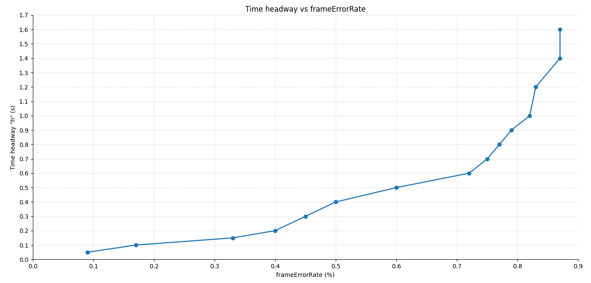

# Caso 4 · Pérdida artificial de paquetes con frame error rate (FER)

En el [Caso 2](caso-2.md) los beacons se perdían porque la señal no alcanzaba, y eso dependía de la distancia entre los autos. Aquí se pierden a propósito: cada frame que llega se descarta con una probabilidad fija, el *frame error rate* (FER), igual para todos los autos y sin importar la distancia. El caso usa el escenario `Braking` del ejemplo `platooning`, con Ploeg.

!!! abstract "Resumen"
    - **Pregunta:** ¿qué fracción de los beacons se puede perder sin que el pelotón choque?
    - **Escenario:** `Braking`, del ejemplo `platooning`.
    - **Controlador:** Ploeg (`-r 3`).
    - **Parámetros:** el FER y el tiempo de separación `h`.
    - **Resultado principal:** con `h = 0.5 s`, el pelotón choca desde un FER de 0.6. Con más `h` aguanta más pérdida: con `h = 1.4` y `1.6 s`, desde 0.87.
    - **Qué se toca:** solo `omnetpp.ini`. El descarte ya viene en Veins: no hay que programar ni recompilar.

## 1 · Antes de empezar

Carga los entornos como en el [Caso 1](caso-1.md#1-antes-de-empezar).

Si vienes del [Caso 3](caso-3.md), deja otra vez el intervalo de envío de beacons en 0.1 s, el valor que usan estas corridas.

## 2 · Fundamentos

### Qué es el FER

El *frame error rate*, o tasa de error de trama, es la fracción de frames que se pierden. El frame es la unidad que transmite la capa MAC de 802.11p, y el beacon de Plexe viaja dentro de uno: perder el frame es perder el beacon.

- Se escribe como fracción entre 0 y 1, no como porcentaje: 0.6 significa 60 %. Con 0, el valor por defecto, no se descarta nada, y con 1 se descarta todo.
- En Veins es un parámetro de la MAC, `frameErrorRate`. Su declaración lo describe como una tasa de descarte artificial, pensada para pruebas.

### Cómo decide Veins qué frame descartar

Cada vez que un frame llega a la MAC de un auto, Veins saca un número al azar entre 0 y 1 y descarta el frame si es menor que el FER:

```cpp
if (dblrand() < frameErrorRate) frameReceived = false;
```

- `dblrand()` entrega un número al azar, uniforme entre 0 y 1. Por eso, con un FER entre 0 y 1, la probabilidad de descartar cada frame es exactamente el FER. Con un FER de 1 o más se descartan todos.
- El sorteo se hace en cada receptor y para cada frame, por separado. Un mismo beacon puede llegarle a un auto y perderse para otro.
- Actúa después de la capa física: el frame ya llegó con potencia suficiente y se decodificó bien, y aun así se descarta.

### Por qué el FER le importa a Ploeg

Ploeg recibe por beacon la aceleración del auto de adelante y, si un beacon se pierde, sigue usando el último que recibió (ver [Controladores › Datos que usa](../controladores.md#datos-que-usa)). Con FER, cada beacon perdido deja a Ploeg usando un dato más viejo.

### Qué esperamos ver

- Con un FER bajo, nada cambia respecto del caso base.
- Al subirlo, el dato del auto de adelante envejece y, en algún punto, el pelotón choca.
- Con `h` más alto hay más margen, así que el pelotón debería tolerar más pérdida, como en el Caso 3.

!!! note "FER frente a potencia"
    Con potencia ([Caso 2](caso-2.md)), la pérdida depende de la distancia entre los autos: con más distancia hizo falta más potencia. Con FER, la pérdida es un número fijo, igual para todos los autos y sin importar la distancia.

## 3 · Dónde vive cada cosa

| Qué | Dónde | En este caso |
|---|---|---|
| El FER | `~/src/plexe/examples/platooning/omnetpp.ini`, línea `*.**.nic.mac1609_4.frameErrorRate` | Se cambia |
| El tiempo de separación `h` | El mismo archivo, línea `*.node[*].scenario.ploegH` | Se cambia en la grilla |
| El intervalo de envío de beacons | El mismo archivo, línea `*.node[*].prot.beaconingInterval` | Se deja en 0.1 s |
| La declaración del parámetro, con su valor por defecto (0) | Veins, `src/veins/modules/mac/ieee80211p/Mac1609_4.ned` | No se toca |
| La lectura y el descarte | Veins, `src/veins/modules/mac/ieee80211p/Mac1609_4.cc`: se lee en `initialize()` y se aplica en `handleLowerMsg()` | No se toca |

- `*.**.nic.mac1609_4` es la capa MAC de 802.11p de todos los autos, la misma de la potencia y el bitrate del [Caso 2](caso-2.md#3-donde-vive-cada-cosa). Por eso el FER es un parámetro de Veins, no de Plexe.
- Al lado está `ackErrorRate`, que hace lo mismo con las confirmaciones de recepción (ACK). Los beacons van en broadcast y no llevan ACK, así que este caso no lo usa.

## 4 · Cómo se hizo, paso a paso

### Paso 1 · Elegir `h`

En cada corrida de la grilla, `h` toma un valor distinto:

```ini
# El h de turno, por ejemplo 0.5 s
*.node[*].scenario.ploegH = ${ploegH = 0.5}s
```

!!! note "Instante del frenado"
    Las notas de esta grilla no registran en qué instante frenó el líder.

### Paso 2 · Cambiar el FER

En el mismo archivo:

```ini
# Antes (por defecto)
*.**.nic.mac1609_4.frameErrorRate = 0.0

# Después, por ejemplo
*.**.nic.mac1609_4.frameErrorRate = 0.6
```

Y corre Ploeg como en los casos anteriores:

```bash
cd ~/src/plexe/examples/platooning
./run -u Cmdenv -c Braking -r 3
```

Con `-c BrakingNoGui` corre sin ventanas.

Se probó con un FER de 1.2 y el pelotón chocó: con un valor de 1 o más se descartan todos los frames.

### Paso 3 · Recorrer la grilla

- Para cada `h`, se sube el FER hasta encontrar el menor que produce choque.
- El resto queda en sus valores por defecto: 100 mW, 6 Mbps, beacons de 200 bytes cada 0.1 s, prioridad 4 y el líder a 100 km/h.

Así se obtuvieron 15 umbrales, con `h` entre 0.05 y 1.6 s.

### Paso 4 · Graficar la curva

Igual que en el Caso 3, con un script de Python que trae los datos escritos a mano:

??? example "graficoFER.py"

    ```python
    import pandas as pd
    import matplotlib.pyplot as plt
    import numpy as np
    from matplotlib.ticker import FormatStrFormatter

    # =========================
    # 1) Datos actualizados
    # =========================
    df = pd.DataFrame({
        'Time headway "h" (s)': [
            0.05, 0.1, 0.15, 0.2, 0.3, 0.4, 0.5, 0.6,
            0.7, 0.8, 0.9, 1.0, 1.2, 1.4, 1.6
        ],
        'frameErrorRate (%)': [
            0.09, 0.17, 0.33, 0.4, 0.45, 0.5, 0.6, 0.72,
            0.75, 0.77, 0.79, 0.82, 0.83, 0.87, 0.87
        ]
    })

    # =========================
    # 2) Ordenar por eje X
    # =========================
    df = df.sort_values(
        by=['frameErrorRate (%)', 'Time headway "h" (s)'],
        ascending=[True, True]
    ).reset_index(drop=True)

    x = df['frameErrorRate (%)']
    y = df['Time headway "h" (s)']

    # =========================
    # 3) Crear gráfico
    # =========================
    fig, ax = plt.subplots(figsize=(12, 7))

    ax.plot(x, y, marker="o", linewidth=1.8, markersize=6)

    # =========================
    # 4) Límites
    # =========================
    ax.set_xlim(0, 0.9)
    ax.set_ylim(0, 1.7)

    # =========================
    # 5) Eje X cada 0.1
    # =========================
    ax.set_xticks(np.arange(0, 0.91, 0.1))
    ax.xaxis.set_major_formatter(FormatStrFormatter('%.1f'))

    # =========================
    # 6) Eje Y cada 0.1
    # =========================
    ax.set_yticks(np.arange(0, 1.71, 0.1))
    ax.yaxis.set_major_formatter(FormatStrFormatter('%.1f'))

    # =========================
    # 7) Cuadrícula
    # =========================
    ax.grid(True, which='major', linestyle="--", linewidth=0.6, alpha=0.6)

    # =========================
    # 8) Solo abajo e izquierda
    # =========================
    ax.tick_params(
        axis='both',
        which='both',
        top=False,
        right=False,
        labeltop=False,
        labelright=False,
        labelsize=10
    )

    ax.spines["top"].set_visible(False)
    ax.spines["right"].set_visible(False)

    # =========================
    # 9) Etiquetas y título
    # =========================
    ax.set_xlabel("frameErrorRate (%)")
    ax.set_ylabel('Time headway "h" (s)')
    ax.set_title("Time headway vs frameErrorRate")

    plt.tight_layout()
    plt.show()
    ```

Es el mismo script del [Caso 3](caso-3.md#paso-4-graficar-la-curva), con otros datos y otras etiquetas. Se corre igual:

```bash
python3 graficoFER.py
```

!!! warning "El eje dice %, pero los valores son fracciones"
    La etiqueta del eje horizontal, `frameErrorRate (%)`, quedó mal: los valores van de 0 a 1, como el parámetro. Un 0.6 en el gráfico significa 60 %, no 0.6 %.

## 5 · Resultados

### Grilla de `h` y FER



Cada punto es un valor de `h` (eje vertical) y el menor FER con que ese `h` chocó (eje horizontal).

| `h` (s) | Menor FER con choque | En porcentaje |
|---|---|---|
| 0.05 | 0.09 | 9 % |
| 0.1 | 0.17 | 17 % |
| 0.15 | 0.33 | 33 % |
| 0.2 | 0.4 | 40 % |
| 0.3 | 0.45 | 45 % |
| 0.4 | 0.5 | 50 % |
| 0.5 | 0.6 | 60 % |
| 0.6 | 0.72 | 72 % |
| 0.7 | 0.75 | 75 % |
| 0.8 | 0.77 | 77 % |
| 0.9 | 0.79 | 79 % |
| 1.0 | 0.82 | 82 % |
| 1.2 | 0.83 | 83 % |
| 1.4 | 0.87 | 87 % |
| 1.6 | 0.87 | 87 % |

- **Mientras mayor es `h`, más pérdida tolera el pelotón.** Con `h = 0.05 s` choca desde un FER de 0.09; con el valor por defecto, 0.5 s, desde 0.6.
- **La curva se aplana.** Hasta `h = 0.6 s` el umbral sube rápido, de 0.09 a 0.72. Después casi no se mueve: entre `h = 0.6` y `1.6 s` solo pasa de 0.72 a 0.87, y con 1.4 y 1.6 s es el mismo.

!!! warning "Límites de estos resultados"
    - "Choca o no choca" es una medida gruesa: no dice cuánto se acercaron los autos.
    - Los umbrales valen para estas condiciones: 100 mW, 6 Mbps, beacons de 200 bytes cada 0.1 s, prioridad 4 y el líder a 100 km/h.

## 6 · Errores frecuentes

| Síntoma | Causa | Solución |
|---|---|---|
| El pelotón choca con cualquier valor | Escribiste el FER como porcentaje, por ejemplo `60`: todo valor de 1 o más descarta todos los frames | Escríbelo como fracción: `0.6` |
| Los resultados de un FER borraron los del anterior | El nombre del `.vec` no incluye el FER | Guarda el PDF antes de cambiar de valor |
| Los autos aceleran o frenan antes de que frene el líder | Cambiaste `ploegH` sin ajustar la inserción | Frena en `t = 20 s` o ajusta `platoonInsertHeadway` ([Caso 1](caso-1.md#6-partir-del-equilibrio)) |

## 7 · Pendientes

```text
# PENDIENTE: anotar en qué instante frenó el líder en estas corridas (no quedó registrado)
# PENDIENTE: gráficos de velocidad y distancia de algunas corridas (hoy solo está la curva de umbrales)
# PENDIENTE: medir el error de espaciamiento en función del FER, no solo si choca o no
# PENDIENTE: contrastar con el Caso 2, traduciendo la potencia a pérdida efectiva de beacons
```

## 8 · Siguiente paso

El [Caso 5](caso-5.md) deja de lado la comunicación y cambia lo que hace el líder: un perfil propio de aceleración y velocidad.
