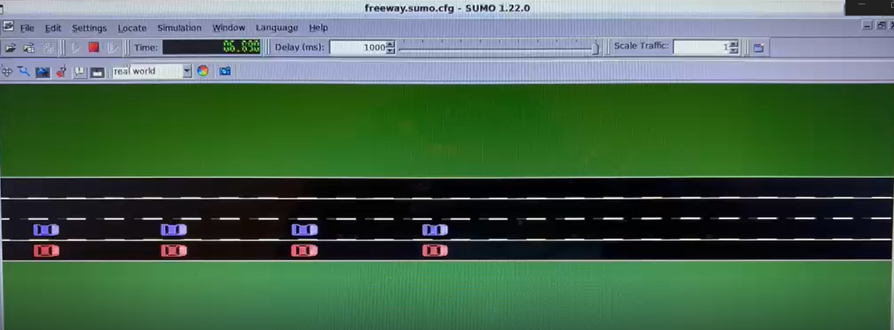

# Caso 4 · Más de un pelotón

**Qué se hizo.** Simular dos pelotones de 8 vehículos al mismo tiempo, uno al lado del otro en carriles adyacentes. Se parte del escenario MultiPhase del [caso 3](caso-3.md), así que ambos líderes siguen el mismo perfil.

**Para qué.** El canal inalámbrico es compartido. Con un solo pelotón, la ocupación del canal es baja y la comunicación casi nunca es el cuello de botella. Al agregar un segundo pelotón, ambos compiten por el medio: aumentan las colisiones de paquetes y los tiempos de espera, y aparece un efecto que no existe en el caso aislado. Es la situación que se dará en una carretera real.

**Cómo se implementa.** Sin modificar el código base de Plexe, en tres pasos: una configuración nueva en `omnetpp.ini`, un traffic manager que alinea los pelotones y un script que separa los gráficos por pelotón.

### Cómo reparte Plexe los vehículos

El traffic manager inserta los vehículos alternando carriles. Con 16 vehículos y 2 carriles queda así:

| `nodeId` | Carril | Pelotón | Rol |
|---|---|---|---|
| 0 | 0 | A | Líder (usa ACC) |
| 1 | 1 | B | Líder (usa ACC) |
| 2, 4, …, 14 | 0 | A | Seguidores |
| 3, 5, …, 15 | 1 | B | Seguidores |

- **Pares = pelotón A** (carril 0); **impares = pelotón B** (carril 1).
- Cada vehículo usa solo los beacons de su propio pelotón (`SimplePlatooningApp` descarta los del otro), pero todos comparten el mismo canal.
- `MultiPhaseScenario` trata como líder a todo vehículo con `nodeId < nLanes`. Por eso `scenario.nLanes = 2` es necesario: así el nodo 1 también sigue el perfil MultiPhase.
- Ambos pelotones usan el mismo controlador, porque `**.traffic.controller` se aplica a todos los seguidores. Los parámetros sí pueden variar por vehículo en el `.ini` (por ejemplo `*.node[1].scenario.…` o `*.node[1].nic.mac1609_4.txPower`).

### Paso 1 · Configuración en `omnetpp.ini`

Se agregan dos configuraciones al final de `~/src/plexe/examples/platooning/omnetpp.ini`:

```ini
[Config MultiPhaseTwoPlatoons]
extends = MultiPhase

**.numberOfCars = 16
**.numberOfLanes = 2
**.traffic.nCars = 16
**.traffic.nLanes = 2
*.node[*].scenario.nLanes = 2
**.traffic_type = "AlignedPlatoonsTrafficManager"

[Config MultiPhaseTwoPlatoonsNoGui]
extends = MultiPhaseTwoPlatoons

*.manager.command = "sumo"
*.manager.ignoreGuiCommands = true
output-vector-file = ${resultdir}/MultiPhaseTwoPlatoons_${controller}_${headway}_${repetition}.vec
output-scalar-file = ${resultdir}/MultiPhaseTwoPlatoons_${controller}_${headway}_${repetition}.sca
```

- 16 vehículos, 8 por pelotón (`platoonSize` sigue en 8) y 2 carriles: un pelotón por carril.
- `nCars` y `nLanes` son variables de iteración ya definidas en `[General]` (`${nCars = 8}`, `${nLanes = 1}`). OMNeT++ no permite redefinirlas, por eso se asignan valores literales.
- `MultiPhaseTwoPlatoonsNoGui` corre con `sumo`, sin ventana, y guarda los resultados con el mismo nombre que la versión con GUI, para que los scripts de análisis los encuentren.
- Sin la línea `**.traffic_type`, se usa el traffic manager de serie y no hace falta el paso 2.

### Paso 2 · Alinear los pelotones

El `PlatoonsTrafficManager` de serie desplaza cada carril al azar entre 0 y 20 m, así que los pelotones no parten lado a lado. Para alinearlos se creó `AlignedPlatoonsTrafficManager`, una copia con una sola línea distinta:

```cpp
// PlatoonsTrafficManager.cc (original)
for (int l = 0; l < nLanes; l++) laneOffset[l] = uniform(0, 20);

// AlignedPlatoonsTrafficManager.cc (nuevo)
for (int l = 0; l < nLanes; l++) laneOffset[l] = 0;
```

Archivos nuevos en `~/src/plexe/src/plexe/traffic/`: `AlignedPlatoonsTrafficManager.h`, `.cc` y `.ned`. Son copias de `PlatoonsTrafficManager.*` con el nombre de la clase cambiado y la línea anterior. No se modifica ningún archivo existente.

Como son archivos C++ y NED nuevos, hay que recompilar Plexe (con el entorno cargado, ver [Cómo ejecutar](#como-ejecutar)):

```bash
cd ~/src/plexe
make makefiles
make -j$(nproc)
```

### Paso 3 · Gráficos por pelotón

Se agrega este bloque al final de `analysis/parse-config`:

```ini
[config]
config = MultiPhaseTwoPlatoons
out = MultiPhaseTwoPlatoons
map    = %(defaultMap)s
mapFile = %(file)s
prefix = m2p
merge = 1
```

El script nuevo `analysis/plot-multiphase-two-platoons.R` separa los datos por paridad de `nodeId`:

```r
platoonA <- subset(allData, nodeId %% 2 == 0)
platoonB <- subset(allData, nodeId %% 2 == 1)
```

Genera 8 PDFs en `analysis/`, 4 por pelotón, con un panel por controlador:

| Pelotón A | Pelotón B |
|---|---|
| `multiphase-two-platoons-A-speed.pdf` | `multiphase-two-platoons-B-speed.pdf` |
| `multiphase-two-platoons-A-distance.pdf` | `multiphase-two-platoons-B-distance.pdf` |
| `multiphase-two-platoons-A-acceleration.pdf` | `multiphase-two-platoons-B-acceleration.pdf` |
| `multiphase-two-platoons-A-controller-acceleration.pdf` | `multiphase-two-platoons-B-controller-acceleration.pdf` |

### Cómo ejecutar

Preparar la terminal (una vez por terminal):

```bash
source ~/src/omnetpp-6.2.0/setenv
cd ~/src/plexe
. ./setenv
export SUMO_HOME="$HOME/src/sumo-1.22.0"   # solo si SUMO se compiló desde el código fuente
export PATH="$SUMO_HOME/bin:$PATH"
cd ~/src/plexe/examples/platooning
```

Con GUI, un controlador a la vez. Por ejemplo, PLOEG:

```bash
./run -u Cmdenv -c MultiPhaseTwoPlatoons -r 3
```

| `-r` | 0 | 1 | 2 | 3 | 4 | 5 |
|---|---|---|---|---|---|---|
| Controlador | ACC (0.3 s) | ACC (1.2 s) | CACC | PLOEG | CONSENSUS | FLATBED |

Sin GUI, los 6 controladores:

```bash
plexe_run -u Cmdenv -c MultiPhaseTwoPlatoonsNoGui -r 0
plexe_run -u Cmdenv -c MultiPhaseTwoPlatoonsNoGui -r 1
plexe_run -u Cmdenv -c MultiPhaseTwoPlatoonsNoGui -r 2
plexe_run -u Cmdenv -c MultiPhaseTwoPlatoonsNoGui -r 3
plexe_run -u Cmdenv -c MultiPhaseTwoPlatoonsNoGui -r 4
plexe_run -u Cmdenv -c MultiPhaseTwoPlatoonsNoGui -r 5
```

Procesar los resultados y generar los 8 PDFs:

```bash
cd ~/src/plexe/examples/platooning/analysis
genmakefile.py parse-config > Makefile
make
Rscript plot-multiphase-two-platoons.R
```

### Lo que deberías observar



Se abre `sumo-gui` con los dos pelotones lado a lado y alineados: el pelotón A en rojo (carril 0) y el pelotón B en morado (carril 1). Plexe colorea cada vehículo según su pelotón. Con el traffic manager de serie, en cambio, los pelotones aparecen desfasados hasta 20 m.

**Cómo se mide.** Ocupación del canal y tasa de colisiones de paquetes como indicadores de red, y estabilidad de cada pelotón por separado como indicador de control. La comparación relevante es contra la misma configuración con un solo pelotón.
