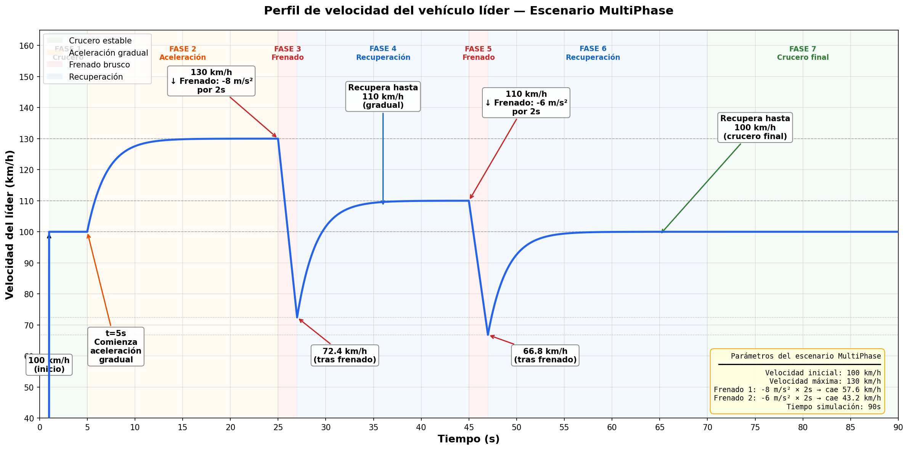
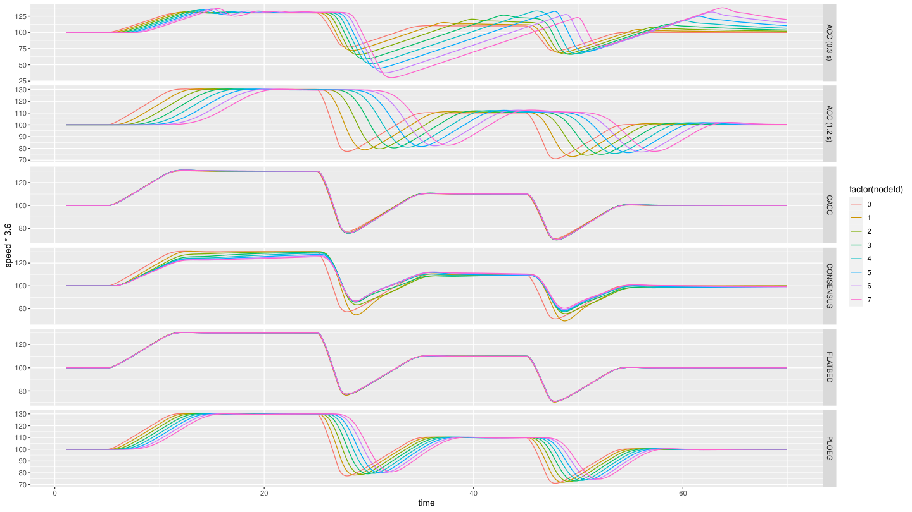
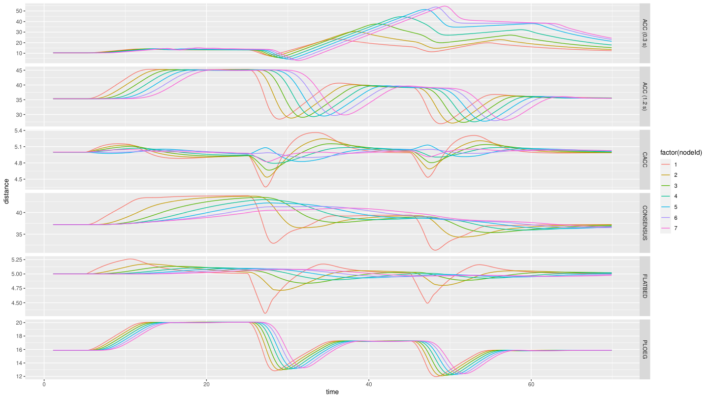
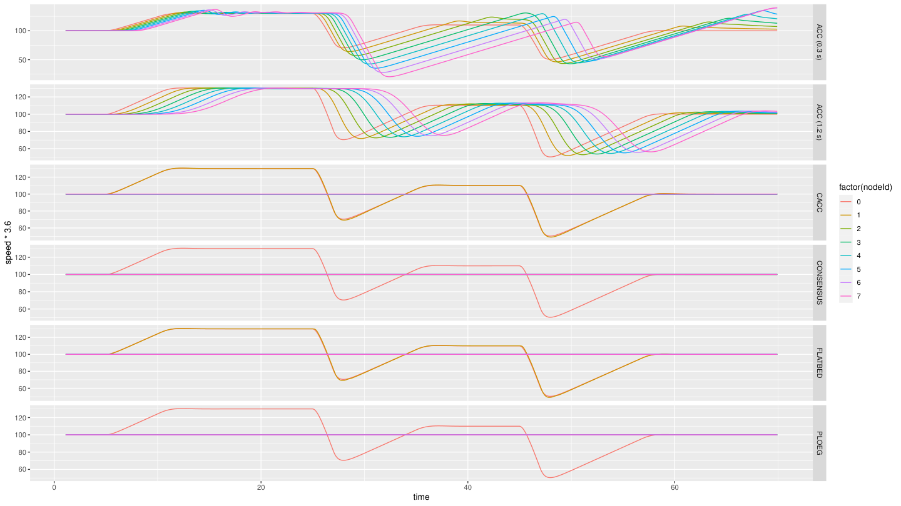
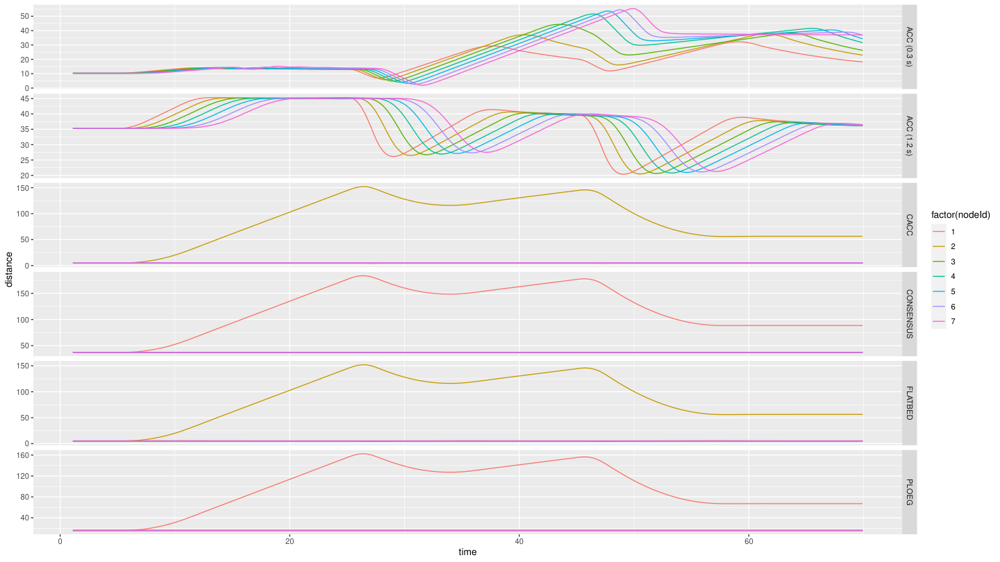
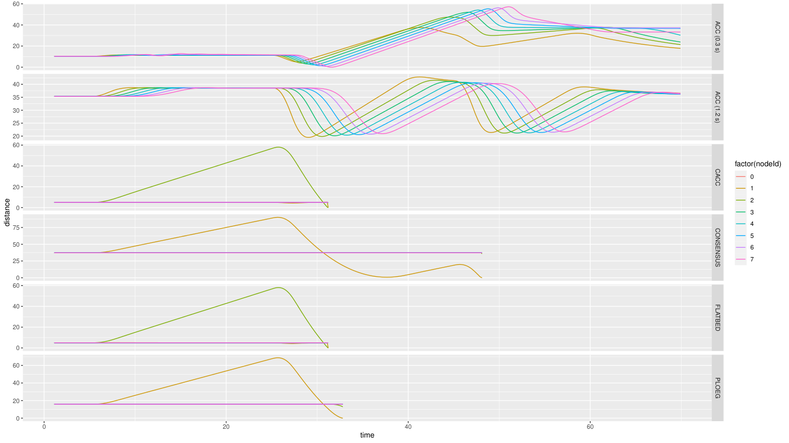
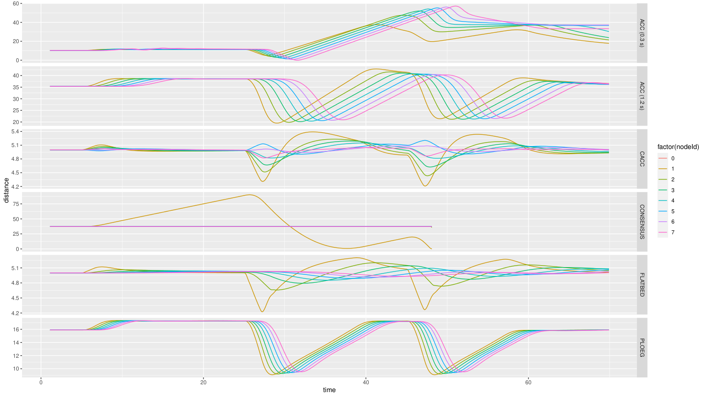

# Caso 5 · Nuevo perfil de aceleración y velocidad del líder

En los casos 1 a 4, el líder hace siempre lo mismo: va a 100 km/h y frena una sola vez. Aquí se le da un perfil nuevo, `MultiPhase`, con dos aceleraciones y dos frenados. A diferencia de los casos anteriores, no basta con cambiar `omnetpp.ini`: el escenario nuevo se programa en C++. Al final, el perfil se combina con la potencia de transmisión del [Caso 2](caso-2.md).

!!! abstract "Resumen"
    - **Pregunta:** ¿cómo responde el pelotón a un líder más exigente, que acelera y frena varias veces?
    - **Escenario:** `MultiPhase`, nuevo, en el ejemplo `platooning`. Ocho autos; el líder acelera hasta 130 km/h, frena dos veces y termina a 100 km/h.
    - **Controladores:** los 6 del ejemplo, uno por corrida (`-r 0` a `-r 5`).
    - **Parámetros:** las velocidades, los instantes y los frenados del líder; después, la potencia de transmisión.
    - **Resultado principal:** con 100 mW nadie choca, ni siquiera con frenados de 10 m/s². Con 0.01 mW, el líder se escapa del pelotón; si además acelera solo hasta 110 km/h, chocan CACC, Consensus, Flatbed y Ploeg.
    - **Qué se toca:** tres archivos nuevos de C++, `omnetpp.ini` y un script de R nuevo. Hay que compilar Plexe.

## 1 · Antes de empezar

Carga los entornos como en el [Caso 1](caso-1.md#1-antes-de-empezar).

## 2 · Fundamentos

### Qué es un escenario

El escenario decide qué hace el líder y en qué momento. Los escenarios que trae Plexe por defecto mueven al líder con una velocidad sinusoidal o con un único frenado brusco, como en los casos 1 a 4. `MultiPhase` busca un perfil más realista y exigente.

El escenario solo cambia lo que hace el líder. Los seguidores reaccionan con sus controladores (ACC, CACC, Ploeg, Consensus y Flatbed), sin ningún cambio.

### El perfil MultiPhase

| Fase | Tiempo | Qué hace el líder |
|---|---|---|
| 1 · Crucero | Hasta 5 s | Va a 100 km/h |
| 2 · Aceleración | 5 a 25 s | Acelera de forma gradual hasta 130 km/h |
| 3 · Frenado | 25 a 27 s | Frena a 8 m/s² durante 2 s |
| 4 · Recuperación | 27 a 45 s | Acelera de forma gradual hasta 110 km/h |
| 5 · Frenado | 45 a 47 s | Frena a 6 m/s² durante 2 s |
| 6 · Recuperación | 47 a 70 s | Acelera hasta 100 km/h |
| 7 · Crucero final | 70 a 90 s | Sigue a 100 km/h |



Un frenado de 8 m/s² baja la velocidad en 8 m/s por cada segundo. Por eso, lo que cae la velocidad en un frenado es la intensidad por la duración: 8 m/s² × 2 s = 16 m/s (57.6 km/h) en el primero y 6 m/s² × 2 s = 12 m/s (43.2 km/h) en el segundo.

!!! note "Lo que muestran las simulaciones"
    En las corridas de la [prueba 1](#5-resultados), el líder baja a 77 km/h en el primer frenado y a 71 km/h en el segundo, no a 72.4 y 66.8 km/h como en el gráfico del perfil. Además, los gráficos de esas corridas llegan hasta `t ≈ 70 s`.

### Qué esperamos ver

- Con 100 mW, que los seguidores repitan las aceleraciones y los frenados del líder sin chocar.
- Con frenados más fuertes o menos potencia, que en algún punto el pelotón deje de seguir al líder.

## 3 · Dónde vive cada cosa

| Qué | Dónde | En este caso |
|---|---|---|
| Los parámetros del escenario que se fijan desde el `.ini` | `~/src/plexe/src/plexe/scenarios/MultiPhaseScenario.ned` | Se crea |
| La clase del escenario y sus variables | `~/src/plexe/src/plexe/scenarios/MultiPhaseScenario.h` | Se crea |
| Qué hace el líder y en qué momento | `~/src/plexe/src/plexe/scenarios/MultiPhaseScenario.cc` | Se crea |
| Los valores del perfil | `~/src/plexe/examples/platooning/omnetpp.ini`, secciones `[Config MultiPhase]` y `[Config MultiPhaseNoGui]` | Se agregan |
| La velocidad inicial del líder | El mismo archivo, sección `[General]`, línea `*.node[*].scenario.leaderSpeed` | Solo se lee |
| La potencia y el bitrate | El mismo archivo, líneas `*.**.nic.mac1609_4.txPower` y `*.**.nic.mac1609_4.bitrate` | Se cambian |
| Los gráficos | `~/src/plexe/examples/platooning/analysis/plot-multiphase.R` | Se crea |

- Son tres archivos porque así lo pide la arquitectura de OMNeT++ y Plexe: el `.ned` declara los parámetros que OMNeT++ lee desde `omnetpp.ini`, el `.h` declara la clase y el `.cc` tiene la lógica.
- Van en `src/plexe/scenarios/`, junto a los escenarios que ya trae Plexe, porque el sistema de compilación de Plexe compila todo lo que hay en esa carpeta. Así se integran sin modificar ningún archivo existente.

!!! warning "Falta el código"
    El material de esta reunión no trae el código de los tres archivos ni el de `plot-multiphase.R`.

## 4 · Cómo se hizo, paso a paso

### Paso 1 · Crear el escenario

Crea estos tres archivos en `~/src/plexe/src/plexe/scenarios/`: `MultiPhaseScenario.ned`, `MultiPhaseScenario.h` y `MultiPhaseScenario.cc`.

```text
# PENDIENTE: código de los tres archivos
```

Como son archivos nuevos de C++, compila Plexe antes de correr la simulación.

```text
# PENDIENTE: comando con que se compiló Plexe
```

### Paso 2 · Configurar el perfil

En la terminal donde cargaste los entornos, ejecuta los siguientes comandos:

```bash
cd ~/src/plexe/examples/platooning
code omnetpp.ini
```

Al final del archivo, en la sección `[Config MultiPhase]`, van los parámetros del perfil:

```ini
[Config MultiPhase]
# Velocidad hasta la que acelera el líder en la primera fase
*.node[*].scenario.accelerateSpeed = 130 kmph
# Velocidad crucero después del primer frenado
*.node[*].scenario.cruiseSpeed = 110 kmph
# Velocidad final después del segundo frenado
*.node[*].scenario.finalSpeed = 100 kmph
# Segundo en que el líder empieza a acelerar
*.node[*].scenario.startAccelerating = 5 s
# Primer frenado: cuándo empieza, cuánto dura y con qué intensidad
*.node[*].scenario.firstBrakeTime = 25 s
*.node[*].scenario.firstBrakeDuration = 2 s
*.node[*].scenario.firstBrakeDeceleration = 8 mpsps
# Segundo frenado
*.node[*].scenario.secondBrakeTime = 45 s
*.node[*].scenario.secondBrakeDuration = 2 s
*.node[*].scenario.secondBrakeDeceleration = 6 mpsps
```

- `mpsps` son metros por segundo por segundo, es decir, m/s².
- La velocidad inicial, 100 km/h, no está en esta sección: viene de `*.node[*].scenario.leaderSpeed`, en `[General]`. Para cambiarla solo en `MultiPhase`, agrégala aquí.
- El material de la reunión registra estas líneas, pero no la sección `[Config MultiPhaseNoGui]`, la versión sin ventanas.

Para diseñar otro frenado, elige la intensidad y la duración según cuánto debe caer la velocidad. Por ejemplo, para frenar de 130 a unos 20 km/h hay que bajar 30.5 m/s: sirve 10 m/s² durante 3 s (baja 30 m/s) u 8 m/s² durante 4 s (baja 32 m/s).

### Paso 3 · Correr el caso base (prueba 1)

La prueba 1 usó 100 mW y un bitrate de 3 Mbps. En `omnetpp.ini`, en las líneas del [Caso 2](caso-2.md#3-donde-vive-cada-cosa):

```ini
*.**.nic.mac1609_4.txPower = 100mW
*.**.nic.mac1609_4.bitrate = 3Mbps
```

En la terminal donde cargaste los entornos, ejecuta los siguientes comandos para correr los 6 controladores sin ventanas:

```bash
cd ~/src/plexe/examples/platooning
plexe_run -u Cmdenv -c MultiPhaseNoGui -r 0
plexe_run -u Cmdenv -c MultiPhaseNoGui -r 1
plexe_run -u Cmdenv -c MultiPhaseNoGui -r 2
plexe_run -u Cmdenv -c MultiPhaseNoGui -r 3
plexe_run -u Cmdenv -c MultiPhaseNoGui -r 4
plexe_run -u Cmdenv -c MultiPhaseNoGui -r 5
```

En la misma terminal, ejecuta los siguientes comandos para procesar los resultados y generar los gráficos:

```bash
cd ~/src/plexe/examples/platooning/analysis
genmakefile.py parse-config > Makefile
make
Rscript plot-multiphase.R
```

`plot-multiphase.R` genera cuatro PDF en `analysis/`, con un panel por controlador: `multiphase-speed.pdf`, `multiphase-distance.pdf`, `multiphase-acceleration.pdf` y `multiphase-controller-acceleration.pdf`. Guárdalos con otro nombre antes de cambiar un parámetro, porque la siguiente ejecución del script los reemplaza.

Para ver un controlador en `sumo-gui`, usa `-c MultiPhase` con su número de corrida. Por ejemplo, para Ploeg, en la misma terminal, dentro de `~/src/plexe/examples/platooning`, ejecuta el siguiente comando:

```bash
./run -u Cmdenv -c MultiPhase -r 3
```

| `-r` | 0 | 1 | 2 | 3 | 4 | 5 |
|---|---|---|---|---|---|---|
| Controlador | ACC (0.3 s) | ACC (1.2 s) | CACC | PLOEG | CONSENSUS | FLATBED |

### Paso 4 · Frenados más fuertes (prueba 2)

Sube los dos frenados a 10 m/s². El informe de la reunión lo toma como el máximo realista, el de un frenado de emergencia; 11 m/s² ya no lo es.

```ini
*.node[*].scenario.firstBrakeDeceleration = 10 mpsps
*.node[*].scenario.secondBrakeDeceleration = 10 mpsps
```

Corre y grafica como en el paso 3.

### Paso 5 · Barrido de potencia (pruebas 3 a 6)

Con los frenados en 10 m/s², baja la potencia: 50, 5, 1 y 0.01 mW. Por ejemplo:

```ini
*.**.nic.mac1609_4.txPower = 1mW
```

En cada valor, corre y grafica como en el paso 3.

### Paso 6 · Líder hasta 110 km/h (pruebas 7 y 8)

Con 0.01 mW, el líder se escapa del pelotón (ver [Resultados](#5-resultados)). Después, cambia la velocidad hasta la que acelera el líder a 110 km/h, en vez de 130:

```ini
*.node[*].scenario.accelerateSpeed = 110 kmph
```

Se corrió con 0.01 mW y después con 1 mW, para ver si con una potencia un poco más alta también hay choque por el cambio en la aceleración.

## 5 · Resultados

Cada prueba corre los 6 controladores.

| Prueba | Potencia | Frenados | Velocidad máxima del líder | Resultado |
|---|---|---|---|---|
| 1 | 100 mW | 8 y 6 m/s² | 130 km/h | Nadie choca |
| 2 | 100 mW | 10 y 10 m/s² | 130 km/h | Nadie choca |
| 3 | 50 mW | 10 y 10 m/s² | 130 km/h | Nadie choca |
| 4 | 5 mW | 10 y 10 m/s² | 130 km/h | Nadie choca |
| 5 | 1 mW | 10 y 10 m/s² | 130 km/h | Nadie choca |
| 6 | 0.01 mW | 10 y 10 m/s² | 130 km/h | Nadie choca, pero el líder se escapa del pelotón |
| **7** | **0.01 mW** | **10 y 10 m/s²** | **110 km/h** | **Chocan CACC, Consensus, Flatbed y Ploeg** |
| 8 | 1 mW | 10 y 10 m/s² | 110 km/h | Solo choca Consensus |

- Los dos ACC no chocan en ninguna prueba.
- Los gráficos de las pruebas 2 y 3 (100 y 50 mW) son idénticos.
- En la prueba 5 (1 mW), Consensus no choca, pero la distancia del auto 1 al líder sube hasta unos 180 m.

En cada gráfico, cada panel es un controlador y cada color, un auto (`nodeId`). Si un panel termina antes de `t ≈ 70 s`, esa corrida chocó (ver [Caso 1](caso-1.md#5-resultados)).

=== "Prueba 1 · 100 mW"

    

    

    - Ningún panel termina antes de tiempo: nadie choca.
    - En CACC y Flatbed, todos los autos cambian de velocidad casi a la vez que el líder. En ACC (1.2 s) y Ploeg, cada auto lo hace un poco después que el de adelante.
    - En Ploeg, la distancia sube de 16 a 20 m mientras el líder va a 130 km/h, y baja a unos 12 o 13 m en cada frenado.

=== "Prueba 6 · 0.01 mW"

    

    

    - Nadie choca, pero el líder se escapa del pelotón.
    - En Consensus y Ploeg, los 7 seguidores se quedan en 100 km/h todo el tiempo. La distancia del auto 1 al líder llega a unos 180 m en Consensus y a unos 160 m en Ploeg.
    - En CACC y Flatbed, el auto 1 sigue al líder, pero los autos 2 a 7 se quedan en 100 km/h. La distancia del auto 2 al auto 1 llega a unos 150 m.
    - Los dos ACC siguen al líder.

=== "Prueba 7 · 0.01 mW y 110 km/h"

    

    - CACC, Flatbed y Ploeg chocan después del primer frenado; Consensus, en el segundo. Los dos ACC llegan al final.
    - En CACC y Flatbed, la distancia del auto 2 al auto 1 sube a unos 58 m mientras el líder acelera, y llega a 0 después del primer frenado.
    - En Ploeg y Consensus, la que sube es la distancia del auto 1 al líder: a unos 69 m en Ploeg y a unos 90 m en Consensus.

=== "Prueba 8 · 1 mW y 110 km/h"

    

    - Solo choca Consensus, en el segundo frenado: la distancia del auto 1 al líder sube a unos 90 m y llega a 0 cerca de `t = 48 s`.
    - Los otros 5 controladores llegan al final.

!!! warning "Límites de estos resultados"
    - La prueba 1 usó 3 Mbps; el informe no registra el bitrate de las demás.
    - Los gráficos llegan hasta `t ≈ 70 s`, aunque el informe y el gráfico del perfil indican 90 s de simulación.

## 6 · Pendientes

```text
# PENDIENTE: código de MultiPhaseScenario.ned, .h y .cc, y comando con que se compiló Plexe
# PENDIENTE: texto completo de [Config MultiPhase] y [Config MultiPhaseNoGui] en omnetpp.ini
# PENDIENTE: código de plot-multiphase.R
# PENDIENTE: bitrate de las pruebas 2 a 8
# PENDIENTE: revisar por qué los gráficos llegan hasta t ≈ 70 s si el informe indica 90 s
```

## 7 · Siguiente paso

El [Caso 6](caso-6.md) usa este mismo escenario con dos pelotones, uno al lado del otro.
