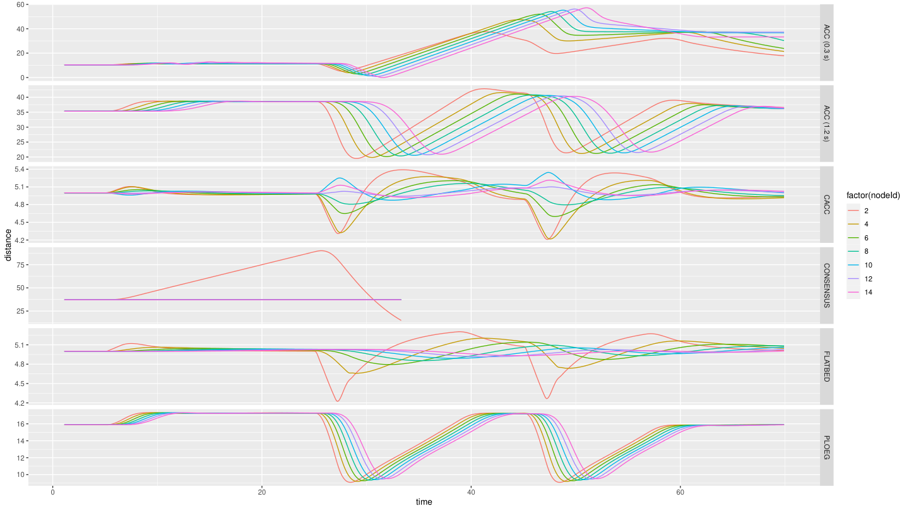
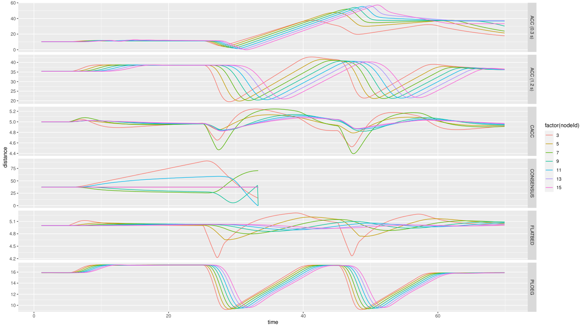
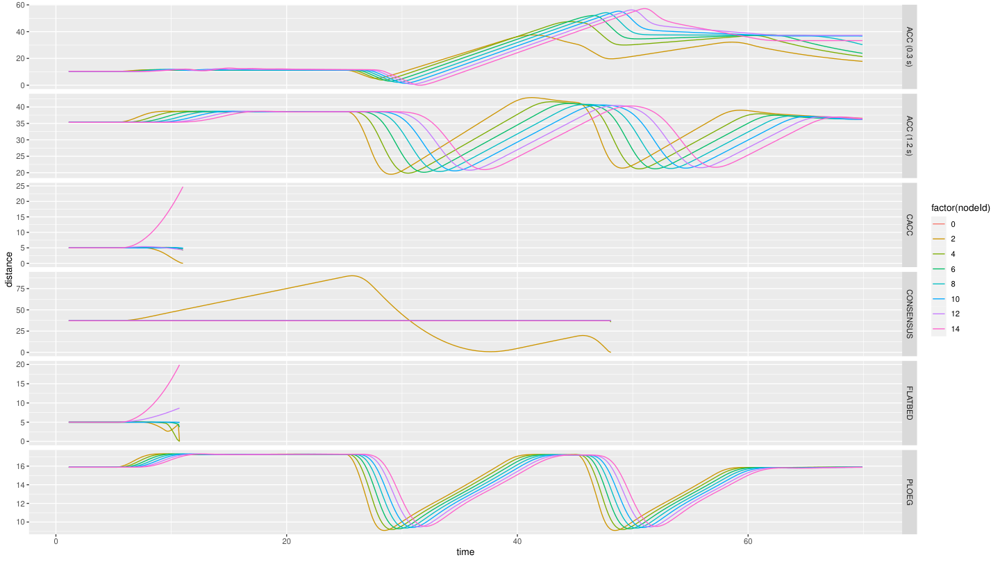
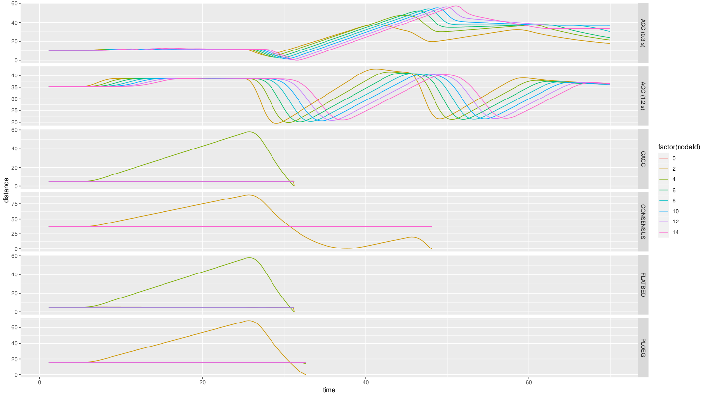
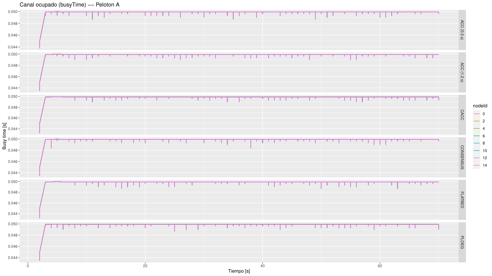
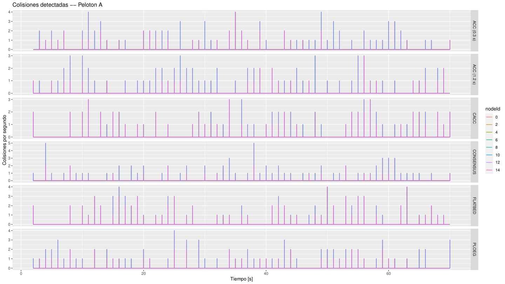
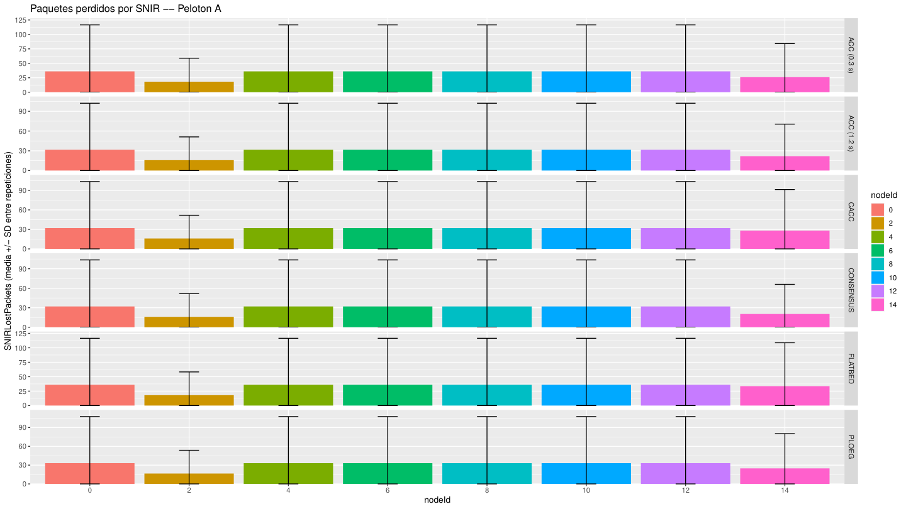
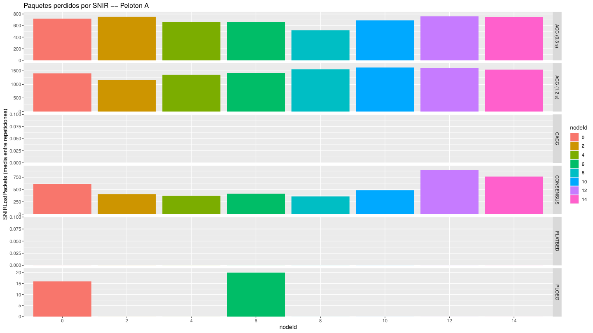

# Caso 6 · Simular más de un pelotón

En los casos 1 a 5 hay un solo pelotón en la vía. Aquí se agrega un segundo pelotón de 8 autos en el carril de al lado, con el perfil `MultiPhase` del [Caso 5](caso-5.md). Los dos pelotones comparten el canal de radio. Además, se mide la comunicación de cada pelotón mientras se baja la potencia.

!!! abstract "Resumen"
    - **Pregunta:** con dos pelotones, ¿hay choques al bajar la potencia y cómo cambian los indicadores de comunicación?
    - **Escenario:** `MultiPhaseTwoPlatoons`, nuevo, en el ejemplo `platooning`: dos pelotones de 8 autos, uno por carril, con los mismos parámetros.
    - **Controladores:** los 6 del ejemplo, uno por corrida (`-r 0` a `-r 5`).
    - **Parámetros:** la potencia de transmisión: 1, 0.1 y 0.01 mW, y 100 mW para las métricas de comunicación.
    - **Resultado principal:** con 1 mW solo choca Consensus; con 0.1 mW, también CACC y Flatbed; con 0.01 mW, también Ploeg. Los dos ACC no chocan.
    - **Qué se toca:** `omnetpp.ini`, un traffic manager nuevo en C++, `parse-config` y tres scripts nuevos (dos de R y uno de Python). Hay que compilar Plexe.

## 1 · Antes de empezar

Carga los entornos como en el [Caso 1](caso-1.md#1-antes-de-empezar). Este caso usa el escenario `MultiPhase` del [Caso 5](caso-5.md).

## 2 · Fundamentos

### Qué se busca

Ver si con dos pelotones hay choques y cómo cambian los indicadores de comunicación al bajar la potencia, por ejemplo por interferencia.

!!! note "Lo que dice la FAQ de Plexe"
    Según la [FAQ de Plexe](https://plexe.car2x.org/faq/), en el ejemplo hay solo 8 autos, que transmiten a 20 dBm y 6 Mbps y envían 10 paquetes por segundo. Con eso, la carga del canal es mínima y no se pierde ningún paquete. Para tener pérdidas, la FAQ sugiere aumentar la cantidad de vehículos.

### Cómo reparte Plexe los vehículos

Con 16 vehículos y 2 carriles, el traffic manager los reparte así:

| `nodeId` | Carril | Pelotón | Rol |
|---|---|---|---|
| 0 | 0 | A | Líder (usa ACC) |
| 1 | 1 | B | Líder (usa ACC) |
| 2, 4, …, 14 | 0 | A | Seguidores |
| 3, 5, …, 15 | 1 | B | Seguidores |

- **Pares = pelotón A** (carril 0); **impares = pelotón B** (carril 1).
- Cada auto solo usa los beacons de su propio pelotón: `SimplePlatooningApp` ignora los del otro. Pero todos comparten el mismo canal.
- Los dos pelotones tienen los mismos parámetros. Se podrían diferenciar en `[Config MultiPhaseTwoPlatoons]`, sin recompilar (potencia, intervalo de beacons, tamaño de los paquetes, `ploegH`, tiempos de `MultiPhase`…), pero no se hizo.

### Las métricas de comunicación

Cada métrica se mide por auto:

| Métrica | Qué mide | Dónde se graba |
|---|---|---|
| `busyTime` | Segundos que el canal estuvo ocupado dentro de cada ventana de 1 s. Va de 0 (libre) a 1 (saturado) | Vector del protocolo de cada auto (`*.node[*].prot`) |
| `collisions` | Colisiones que detecta la capa física en cada ventana de 1 s | Vector del protocolo |
| `leaderDelay` | Tiempo entre dos beacons seguidos recibidos del líder, con una muestra por beacon. Sin pérdidas vale 0.1 s; 0.2 s significa que se perdió uno | Vector del protocolo |
| `frontDelay` | Lo mismo, con los beacons del auto de adelante | Vector del protocolo |
| `SNIRLostPackets` | Paquetes descartados en toda la simulación porque la relación señal/(interferencia + ruido) quedó bajo el umbral del receptor | Escalar de la MAC de cada auto (`*.node[*].nic.mac1609_4`) |

- `collisions` sale siempre en 0 si no se activa `collectCollisionStatistics`, un parámetro de Veins declarado en `PhyLayer80211p.ned` con valor por defecto `false`. Se activa en `omnetpp.ini`, sin tocar C++.
- `SNIRLostPackets` mezcla dos causas: tramas dañadas por señal débil y tramas dañadas por la interferencia de otro transmisor.

### Qué esperamos ver

- Al bajar la potencia, que se pierdan más beacons y que en algún punto los pelotones choquen.

## 3 · Dónde vive cada cosa

| Qué | Dónde | En este caso |
|---|---|---|
| Las dos configuraciones nuevas | `~/src/plexe/examples/platooning/omnetpp.ini`, secciones `[Config MultiPhaseTwoPlatoons]` y `[Config MultiPhaseTwoPlatoonsNoGui]` | Se agregan |
| El traffic manager alineado | `~/src/plexe/src/plexe/traffic/AlignedPlatoonsTrafficManager.h`, `.cc` y `.ned` | Se crean |
| El traffic manager de serie | `~/src/plexe/src/plexe/traffic/PlatoonsTrafficManager.h`, `.cc` y `.ned` | Se copia; no se toca |
| Los gráficos de conducción por pelotón | `~/src/plexe/examples/platooning/analysis/parse-config` y `analysis/plot-multiphase-two-platoons.R` | Se agrega un bloque y se crea el script |
| La extracción de las métricas de comunicación | `analysis/extract-communications.py` | Se crea |
| Los gráficos de comunicación | `analysis/plot-multiphase-two-platoons-communications.R` | Se crea |
| La potencia | `omnetpp.ini`, línea `*.**.nic.mac1609_4.txPower` | Se cambia |

!!! warning "Falta el código"
    El material de la reunión no trae el código de `plot-multiphase-two-platoons.R`, `extract-communications.py` ni `plot-multiphase-two-platoons-communications.R`. Tampoco el de `MultiPhase` (ver [Caso 5](caso-5.md)).

## 4 · Cómo se hizo, paso a paso

### Paso 1 · Configuración en `omnetpp.ini`

Agrega dos configuraciones al final de `~/src/plexe/examples/platooning/omnetpp.ini`:

```ini
[Config MultiPhaseTwoPlatoons]
extends = MultiPhase

**.numberOfCars = 16
**.numberOfLanes = 2
**.traffic.nCars = 16
**.traffic.nLanes = 2
*.node[*].scenario.nLanes = 2
**.traffic_type = "AlignedPlatoonsTrafficManager"

[Config MultiPhaseTwoPlatoonsNoGui]
extends = MultiPhaseTwoPlatoons

*.manager.command = "sumo"
*.manager.ignoreGuiCommands = true
output-vector-file = ${resultdir}/MultiPhaseTwoPlatoons_${controller}_${headway}_${repetition}.vec
output-scalar-file = ${resultdir}/MultiPhaseTwoPlatoons_${controller}_${headway}_${repetition}.sca
```

- 16 vehículos y 2 carriles: un pelotón de 8 por carril.
- `nCars` y `nLanes` son variables de iteración ya definidas en `[General]`. OMNeT++ no permite redefinirlas, por eso se asignan valores literales.
- `MultiPhaseTwoPlatoonsNoGui` corre con `sumo`, sin ventana, y guarda los resultados con el mismo nombre que la versión con ventana.
- La línea `**.traffic_type` usa el traffic manager alineado del paso 2. Sin ella, se usa el de serie y el paso 2 no hace falta.

### Paso 2 · Alinear los pelotones

El `PlatoonsTrafficManager` de serie desplaza cada carril al azar entre 0 y 20 m, así que los pelotones no parten lado a lado. Para alinearlos, crea `AlignedPlatoonsTrafficManager` en `~/src/plexe/src/plexe/traffic/`: una copia de `PlatoonsTrafficManager.h`, `.cc` y `.ned` con el nombre de la clase cambiado y una sola línea distinta:

```cpp
// PlatoonsTrafficManager.cc (original)
for (int l = 0; l < nLanes; l++) laneOffset[l] = uniform(0, 20);

// AlignedPlatoonsTrafficManager.cc (nuevo)
for (int l = 0; l < nLanes; l++) laneOffset[l] = 0;
```

No se modifica ningún archivo existente.

Como son archivos nuevos de C++ y NED, hay que compilar Plexe. En la terminal donde cargaste los entornos, ejecuta los siguientes comandos:

```bash
cd ~/src/plexe
make makefiles
make -j$(nproc)
```

### Paso 3 · Gráficos de conducción por pelotón

Agrega este bloque al final de `analysis/parse-config`:

```ini
[config]
config = MultiPhaseTwoPlatoons
out = MultiPhaseTwoPlatoons
map    = %(defaultMap)s
mapFile = %(file)s
prefix = m2p
merge = 1
```

El script nuevo `analysis/plot-multiphase-two-platoons.R` separa los datos por paridad de `nodeId`:

```r
platoonA <- subset(allData, nodeId %% 2 == 0)
platoonB <- subset(allData, nodeId %% 2 == 1)
```

Genera 8 PDF en `analysis/`, 4 por pelotón, con un panel por controlador:

| Pelotón A | Pelotón B |
|---|---|
| `multiphase-two-platoons-A-speed.pdf` | `multiphase-two-platoons-B-speed.pdf` |
| `multiphase-two-platoons-A-distance.pdf` | `multiphase-two-platoons-B-distance.pdf` |
| `multiphase-two-platoons-A-acceleration.pdf` | `multiphase-two-platoons-B-acceleration.pdf` |
| `multiphase-two-platoons-A-controller-acceleration.pdf` | `multiphase-two-platoons-B-controller-acceleration.pdf` |

### Paso 4 · Registrar las métricas de comunicación

En `[Config MultiPhaseTwoPlatoons]`, agrega esta línea para que la MAC grabe `SNIRLostPackets`:

```ini
*.node[*].nic.mac1609_4.SNIRLostPackets.scalar-recording = true
```

Los vectores del protocolo (`busyTime`, `collisions`, `leaderDelay` y `frontDelay`) ya se graban en todas las configuraciones. Para que `collisions` no salga siempre en 0, activa también `collectCollisionStatistics`:

```text
# PENDIENTE: línea con que se activó collectCollisionStatistics
```

Cada corrida se repitió 5 veces con semillas distintas: la línea `seed-set = ${repetition}` del `.ini` le da a cada repetición su propia semilla. Así se pasa de 6 a 30 corridas. Los gráficos de conducción usan la primera repetición; `SNIRLostPackets` muestra el promedio entre repeticiones.

```text
# PENDIENTE: línea con que se fijaron las 5 repeticiones
```

### Paso 5 · Correr y graficar

En la terminal donde cargaste los entornos, ejecuta los siguientes comandos para correr los 6 controladores sin ventanas:

```bash
cd ~/src/plexe/examples/platooning
plexe_run -u Cmdenv -c MultiPhaseTwoPlatoonsNoGui -r 0
plexe_run -u Cmdenv -c MultiPhaseTwoPlatoonsNoGui -r 1
plexe_run -u Cmdenv -c MultiPhaseTwoPlatoonsNoGui -r 2
plexe_run -u Cmdenv -c MultiPhaseTwoPlatoonsNoGui -r 3
plexe_run -u Cmdenv -c MultiPhaseTwoPlatoonsNoGui -r 4
plexe_run -u Cmdenv -c MultiPhaseTwoPlatoonsNoGui -r 5
```

En la misma terminal, ejecuta los siguientes comandos para generar los gráficos de conducción y de comunicación:

```bash
cd ~/src/plexe/examples/platooning/analysis
genmakefile.py parse-config > Makefile
make
Rscript plot-multiphase-two-platoons.R
python3 extract-communications.py
Rscript plot-multiphase-two-platoons-communications.R
```

- `extract-communications.py` lee los `.vec` y `.sca` de todos los controladores con la API de Python de OMNeT++ 6 (`omnetpp.scave.results`) y escribe un CSV, `communications-results/MultiPhaseTwoPlatoons_communications.csv`, con las columnas `metric`, `controller`, `headway`, `repetition`, `nodeId`, `time` y `value`.
- `plot-multiphase-two-platoons-communications.R` lee ese CSV, separa los pelotones por paridad de `nodeId` y guarda los PDF en `analysis/communications-results/`: líneas para las cuatro métricas que cambian en el tiempo y barras para `SNIRLostPackets`. La última versión agrega boxplots de `leaderDelay` y `frontDelay` y el total de colisiones.

Para ver un controlador en `sumo-gui`, usa `-c MultiPhaseTwoPlatoons`. Por ejemplo, para Ploeg, en la misma terminal, dentro de `~/src/plexe/examples/platooning`, ejecuta el siguiente comando:

```bash
./run -u Cmdenv -c MultiPhaseTwoPlatoons -r 3
```

| `-r` | 0 | 1 | 2 | 3 | 4 | 5 |
|---|---|---|---|---|---|---|
| Controlador | ACC (0.3 s) | ACC (1.2 s) | CACC | PLOEG | CONSENSUS | FLATBED |


Los dos pelotones van lado a lado y alineados, uno en rojo y otro en morado. Con el traffic manager de serie partirían desfasados hasta 20 m.

### Paso 6 · Barrido de potencia

Baja la potencia en la línea del [Caso 2](caso-2.md#3-donde-vive-cada-cosa): 1, 0.1 y 0.01 mW. Por ejemplo:

```ini
*.**.nic.mac1609_4.txPower = 1mW
```

En cada valor, corre y grafica como en el paso 5. La corrida de 100 mW ya tiene `collectCollisionStatistics` activo: es la única con colisiones distintas de 0.

## 5 · Resultados

En estas corridas, el líder acelera hasta 110 km/h y en cada frenado baja a 50 km/h (gráficos de velocidad del pelotón A).

### Choques por potencia

| Potencia | Chocan | No chocan |
|---|---|---|
| 1 mW | Consensus | ACC (0.3 s), ACC (1.2 s), CACC, Flatbed y Ploeg |
| 0.1 mW | CACC, Consensus y Flatbed | ACC (0.3 s), ACC (1.2 s) y Ploeg |
| 0.01 mW | CACC, Consensus, Flatbed y Ploeg | ACC (0.3 s) y ACC (1.2 s) |

- Cuando un auto choca, la corrida se detiene para los dos pelotones. Por eso un panel puede terminar antes de tiempo aunque en ese pelotón nadie choque.
- Con 0.1 mW, CACC y Flatbed chocan en el pelotón A cerca de `t = 11 s`, durante la primera aceleración del líder.
- Con 0.1 y 0.01 mW, Consensus choca cerca de `t = 48 s`, después del segundo frenado.

En cada gráfico, cada panel es un controlador y cada color, un auto del pelotón. Si un panel termina antes de `t ≈ 70 s`, esa corrida se detuvo por un choque (ver [Caso 1](caso-1.md#5-resultados)).

=== "1 mW"

    

    

    - Solo el panel de Consensus termina antes de tiempo, cerca de `t = 33 s`. En el pelotón B la distancia llega a 0; en el A, no.

=== "0.1 mW"

    

    - CACC y Flatbed terminan cerca de `t = 11 s` y Consensus cerca de `t = 48 s`. Ploeg y los dos ACC llegan al final.

=== "0.01 mW"

    

    - CACC y Flatbed terminan cerca de `t = 32 s`, Ploeg cerca de `t = 34 s` y Consensus cerca de `t = 48 s`. Solo los dos ACC llegan al final.

### Métricas de comunicación

Los gráficos de 100 mW son de la última versión de los scripts, con colisiones y con repeticiones.

=== "Ocupación del canal · 100 mW"

    

    - El canal está ocupado unos 0.05 s de cada segundo, cerca del 5 % del tiempo.
    - Las líneas de todos los autos se superponen: todos están al alcance de todos y perciben la misma ocupación.

=== "Colisiones · 100 mW"

    

    - Aparecen colisiones aisladas, de 1 a 5 por segundo, con todos los controladores.

=== "Paquetes perdidos · 100 mW"

    

    - Cada auto pierde en promedio entre unos 15 y 35 paquetes en toda la simulación, con mucha variación entre repeticiones.

=== "Paquetes perdidos · 1 mW"

    

    - Los dos ACC y Consensus pierden cientos de paquetes por auto, hasta unos 1600 en ACC (1.2 s). CACC y Flatbed no pierden ninguno, y en Ploeg solo pierden dos autos, unos 15 a 20 cada uno.

!!! warning "Límites de estos resultados"
    - Las corridas de 1, 0.1 y 0.01 mW se hicieron sin `collectCollisionStatistics`: en ellas, `collisions` vale 0.
    - De 100 mW solo hay gráficos de comunicación, no de conducción.
    - Los gráficos llegan hasta `t ≈ 70 s`.

## 6 · Pendientes

```text
# PENDIENTE: código de plot-multiphase-two-platoons.R, extract-communications.py y plot-multiphase-two-platoons-communications.R
# PENDIENTE: línea con que se activó collectCollisionStatistics en omnetpp.ini
# PENDIENTE: línea con que se fijaron las 5 repeticiones, y comandos para correr las 30 corridas (el informe registra solo -r 0 a -r 5)
# PENDIENTE: gráficos de conducción con 100 mW
```

## 7 · Siguiente paso

El [Caso 7](caso-7.md) agrega un retardo aleatorio a la comunicación.
