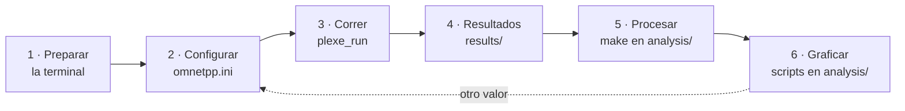

# Cómo fue mi flujo de trabajo

Ahora vamos a ver cómo trabajé con Plexe durante el semestre. Casi todo se hizo sobre el ejemplo `platooning`, el del [tutorial 1 de Plexe](https://plexe.car2x.org/tutorial/) y de la [Primera simulación](primera-simulacion.md), dentro de su carpeta `~/src/plexe/examples/platooning`. Qué hay en esa carpeta está en [Arquitectura › Anatomía de un escenario](arquitectura.md#anatomia-de-un-escenario).

Cada prueba siguió los mismos pasos:



## 1 · Preparar la terminal

Ahora vamos a preparar la terminal, lo primero de cada sesión.

En una terminal de Ubuntu, nueva o la que ya tengas abierta, ejecuta los siguientes comandos:

```bash
cd ~/src/omnetpp-6.2.0
source setenv
cd ~/src/plexe
. ./setenv
cd examples/platooning
```

**Fuente:** guía oficial de Plexe ([*Step 1: Install OMNeT++*](https://plexe.car2x.org/building/#step-1-install-omnet)) y tutorial oficial ([*Step 0*](https://plexe.car2x.org/tutorial/#step-0-building-plexe) y [*Running the example*](https://plexe.car2x.org/tutorial/#running-the-example)). Se explica en [Primera simulación › Antes de empezar](primera-simulacion.md#1-antes-de-empezar).

No hay que levantar a mano un servidor para SUMO: en cada corrida, Plexe abre SUMO como servidor TraCI y se conecta a él. Lo hace `PlexeScenarioManagerForker`, el que [`PlexeScenario.ned`](https://github.com/michele-segata/plexe/blob/plexe-3.2/src/plexe/PlexeScenario.ned) usa por defecto.

## 2 · Configurar: `omnetpp.ini`

Ahora vamos al archivo más importante del ejemplo, `omnetpp.ini`. Define el experimento completo, y casi todo lo que cambia de una prueba a otra se cambia ahí.

- Es un archivo de texto de OMNeT++, en formato INI: secciones como `[General]` o `[Config Braking]`, y líneas `parámetro = valor`.
- Tiene, entre otras cosas, la cantidad de autos, la velocidad, el controlador de cada corrida, la potencia y el bitrate de la radio, el intervalo de beacons y el nombre de los archivos de resultados.
- Una línea con `${...}` crea una corrida por cada valor.
- Cambiar un valor no obliga a recompilar: basta con volver a correr.

Cada línea se puede rastrear hasta el código. Por ejemplo, el `h` de Ploeg:

| Archivo | Línea |
|---|---|
| `omnetpp.ini` | `*.node[*].scenario.ploegH = ${ploegH = 0.5}s` |
| `src/plexe/scenarios/BBaseScenario.ned` | `double ploegH @unit("s") = default(0.5s);` |
| `src/plexe/scenarios/BaseScenario.cc` | `ploegH = par("ploegH").doubleValue();` |
| `src/plexe/scenarios/BaseScenario.cc` | `plexeTraciVehicle->setPloegCACCParameters(ploegKp, ploegKd, ploegH);` |

El `.ned` declara el parámetro y su valor por defecto, `par("ploegH")` lo lee en C++, y la última línea lo manda a SUMO, donde vive el controlador ([Controladores](controladores.md#1-donde-viven-los-controladores)). Lo mismo pasa con los tipos: `*.node[*].scenario_type = "BrakingScenario"` elige la clase de `src/plexe/scenarios/BrakingScenario.*`.

**Fuente:** [`omnetpp.ini`](https://github.com/michele-segata/plexe/blob/plexe-3.2/examples/platooning/omnetpp.ini#L121), [`BBaseScenario.ned`](https://github.com/michele-segata/plexe/blob/plexe-3.2/src/plexe/scenarios/BBaseScenario.ned#L45) y [`BaseScenario.cc`](https://github.com/michele-segata/plexe/blob/plexe-3.2/src/plexe/scenarios/BaseScenario.cc#L49) de Plexe 3.2; [documentación de Plexe](https://plexe.car2x.org/documentation/#scenarios-folder), carpeta `scenarios/`.

## 3 · Correr

Ahora vamos a correr las simulaciones, una por cada corrida que interesa.

En la misma terminal, dentro de `~/src/plexe/examples/platooning`, ejecuta el siguiente comando:

```bash
plexe_run -u Cmdenv -c BrakingNoGui -r 3
```

**Fuente:** tutorial oficial, [*Running the example*](https://plexe.car2x.org/tutorial/#running-the-example).

- `-c` elige la configuración: `Braking` abre la ventana de SUMO y `BrakingNoGui` no.
- `-r` elige la corrida: aquí, la 3, que usa Ploeg.
- `./run` hace lo mismo que `plexe_run`.

El detalle está en [Primera simulación › Correr la simulación](primera-simulacion.md#3-correr-la-simulacion).

## 4 · Resultados: `results/`

Ahora vamos a ver dónde quedan los resultados. Cada corrida deja dos archivos en `results/`: un `.vec`, con los valores a lo largo del tiempo, y un `.sca`, con los escalares. El nombre lleva el escenario, `controller`, `headway` y la repetición ([Primera simulación › Dónde quedan los resultados](primera-simulacion.md#5-donde-quedan-los-resultados)).

!!! warning "Una corrida nueva puede borrar la anterior"
    Si cambias un parámetro que no está en el nombre del archivo, como `ploegH`, la corrida nueva escribe sobre el mismo archivo. Guarda los gráficos antes de cambiarlo.

**Fuente:** líneas `output-vector-file` y `output-scalar-file` de [`omnetpp.ini`](https://github.com/michele-segata/plexe/blob/plexe-3.2/examples/platooning/omnetpp.ini).

## 5 · Procesar: de `.vec` a CSV

Ahora vamos a convertir los resultados en tablas que se puedan graficar.

En la misma terminal, dentro de `~/src/plexe/examples/platooning`, ejecuta los siguientes comandos:

```bash
cd analysis
genmakefile.py parse-config > Makefile
make
```

**Fuente:** tutorial oficial, [*Plotting the results*](https://plexe.car2x.org/tutorial/#plotting-the-results).

`make` toma cada `.vec` de `results/` y lo pasa por scripts que están en `~/src/plexe/bin/`, no en el ejemplo:

1. `opp_scavetool index` crea su índice, un `.vci`.
2. `generic-parser.py` lo convierte a `.csv`, con las columnas que pide `map-config`.
3. `csv-to-rdata.R` pasa ese `.csv` a `.Rdata` y lo borra.
4. `merge.R` junta todo en un archivo por escenario: `results/Braking.Rdata` y `results/Sinusoidal.Rdata`.

Todo queda en `results/`. Para quedarse con un CSV en vez de `.Rdata`, se agrega `type = csv` en cada sección `[config]` de `parse-config`: el resultado es, por ejemplo, `results/Braking.csv`.

**Fuente:** [`bin/genmakefile.py`](https://github.com/michele-segata/plexe/blob/plexe-3.2/bin/genmakefile.py) y [`bin/merge.R`](https://github.com/michele-segata/plexe/blob/plexe-3.2/bin/merge.R) de Plexe 3.2.

```text
# PENDIENTE: qué script usé para pasar los resultados a CSV y en qué carpeta estaba
```

## 6 · Graficar: scripts en `analysis/`

Ahora vamos a ver los datos. Los scripts de gráficos están en `analysis/` y leen lo que el paso anterior dejó en `results/`.

En la misma terminal, dentro de `~/src/plexe/examples/platooning/analysis`, ejecuta el siguiente comando:

```bash
Rscript plot-braking.R
```

**Fuente:** tutorial oficial, [*Plotting the results*](https://plexe.car2x.org/tutorial/#plotting-the-results).

- `plot-braking.R` lee `../results/Braking.Rdata` y deja cuatro PDF en `analysis/`: velocidad, distancia, aceleración y aceleración del controlador.
- Para un gráfico propio, se copia uno de estos scripts y se modifica la copia, como `plot-braking-ploeg.R` en el [Caso 1](ejemplos/caso-1.md#paso-4-graficar-solo-ploeg).

```text
# PENDIENTE: mis scripts de gráficos (nombre, lenguaje y qué grafica cada uno)
```
