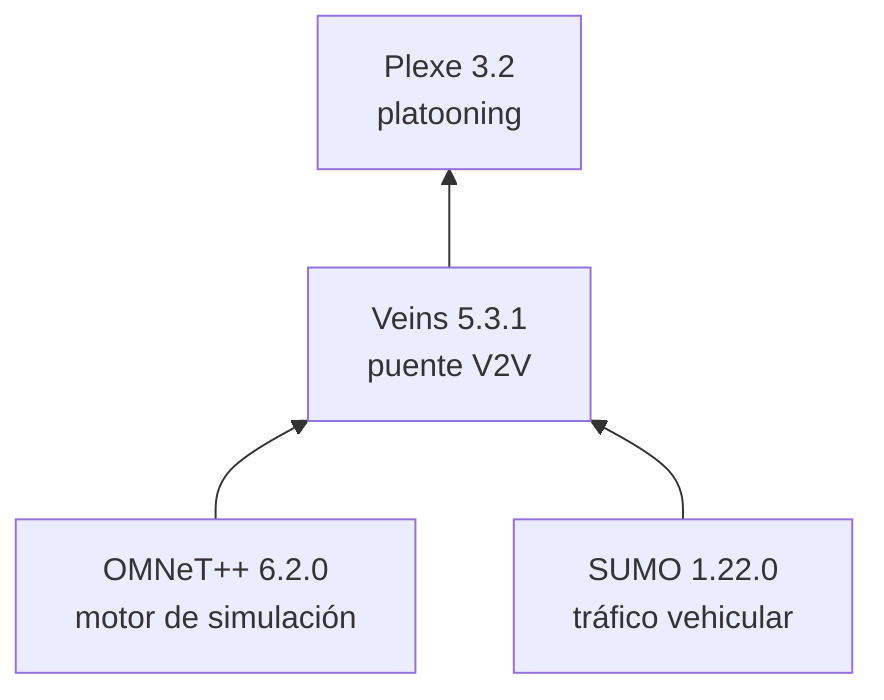
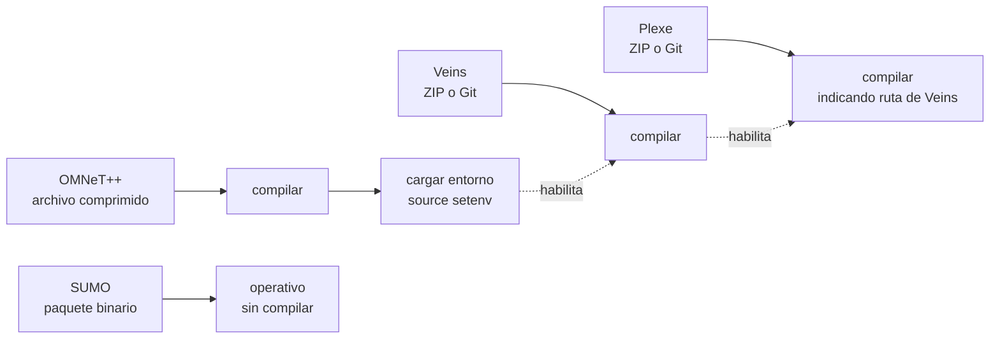

# Instalación

Esta sección reúne todo lo necesario para dejar Plexe operativo desde cero: qué componentes intervienen y qué hace cada uno, cómo se relacionan entre sí, el procedimiento completo de descarga y compilación en Ubuntu 24.04 (incluido el caso de Ubuntu en Windows mediante WSL), cómo verificar que la instalación quedó correcta, y qué hacer cuando algo falla.

!!! info "Última actualización: agosto de 2026"
    Este manual documenta las versiones vigentes a esa fecha. Plexe evoluciona, y con él las versiones compatibles de OMNeT++, SUMO y Veins. Antes de instalar, revisa la [página oficial de Plexe](https://plexe.car2x.org/) y confirma que las versiones indicadas aquí siguen siendo las recomendadas. Si cambiaron, la referencia válida es la página oficial, no este manual.

---

## 1 · Qué vas a instalar

Plexe no es un programa que se instala solo. Es la capa más alta de una estructura de cuatro componentes, y cada uno necesita que el anterior esté construido antes de poder compilarse.

| # | Componente | Versión | Qué hace |
|:-:|------------|---------|----------|
| 1 | **OMNeT++** | 6.2.0 | Motor de simulación de eventos discretos. La base sobre la que corre todo lo demás. |
| 2 | **SUMO** | 1.22.0 | Simulador de tráfico microscópico. Genera y mueve los vehículos. |
| 3 | **Veins** | 5.3.1 | Puente que sincroniza OMNeT++ con SUMO y aporta la comunicación vehicular (V2V). |
| 4 | **Plexe** | 3.2 | Capa de *platooning*: controladores longitudinales, protocolos cooperativos y maniobras. |

### Por qué el orden importa

El orden no es una recomendación de estilo, es una dependencia técnica:

- **OMNeT++** va primero y sin excepción. Es la base, y tanto Veins como Plexe se compilan enlazándose contra él.
- **SUMO** es el único que no bloquea la compilación de nada, porque Veins lo controla en tiempo de ejecución a través de una interfaz de red, no en tiempo de compilación. Aun así conviene instalarlo **temprano, justo después de OMNeT++**: se instala ya compilado y toma pocos minutos, y es el punto donde más fácil es equivocarse de versión. Dejarlo para el final significa arriesgarse a descubrir un error de versión recién al intentar la primera simulación, con todo lo demás ya construido.
- **Veins** no compila si OMNeT++ no está construido y su entorno cargado en la terminal.
- **Plexe** no compila si no le indicas dónde está la carpeta de Veins ya construida.

Saltarse el orden no produce un error claro. Produce mensajes de compilación confusos que cuesta mucho diagnosticar.

!!! note "Lo único obligatorio respecto de SUMO"
    SUMO **no** hace falta para compilar Veins ni Plexe: ambos compilan perfectamente sin que SUMO esté instalado. Lo que sí es obligatorio es tenerlo antes de la verificación del paso 7, porque sin SUMO no hay simulación que correr. La recomendación de instalarlo temprano es de prudencia, no de dependencia técnica.

### Por qué las versiones son exactas

Las versiones de la tabla no son "mínimas recomendadas". Son una **combinación probada**, y mezclar versiones es la causa más frecuente de instalaciones que fallan.

!!! warning "No superes SUMO 1.22.0"
    Las versiones de SUMO posteriores a la **1.22.0** cambiaron la API de TraCI, y Veins 5.3.1 no es compatible con esa API nueva. La instalación va a parecer correcta y el error aparecerá recién al intentar correr una simulación.

---

## 2 · Descargar y compilar: dos cosas distintas

Aquí se concentra la mayor parte de la confusión al instalar Plexe, así que vale la pena separarlo con claridad. Son **dos operaciones independientes**:

**Descargar el código.** Traer los archivos fuente a tu disco. No depende del sistema operativo, porque el código es idéntico para Linux, macOS o Windows. Hay dos formas (bajar un archivo ZIP o clonar el repositorio Git) y elegir una u otra no cambia absolutamente nada de lo que viene después.

**Compilar.** Traducir ese código fuente a programas ejecutables. Esto **sí** depende del sistema operativo, porque cambian el compilador, las librerías y las rutas.

### Cómo se descarga cada componente

No todos los componentes ofrecen las mismas opciones:

| Componente | Cómo se descarga | ¿Se compila? |
|------------|------------------|:------------:|
| **OMNeT++** | Archivo comprimido desde omnetpp.org | Sí |
| **SUMO** | Paquete **binario** desde sumo.dlr.de | **No** |
| **Veins** | ZIP **o** clonar repositorio | Sí |
| **Plexe** | ZIP **o** clonar repositorio | Sí |

Dos observaciones importantes:

- Solo **Veins y Plexe** tienen la doble opción ZIP/Git. La documentación oficial de Plexe recomienda clonar el repositorio y desaconseja el ZIP.
- **SUMO es la excepción a toda la lógica anterior: no se compila.** Desde su versión 1.2.0, los modelos que Plexe necesita vienen incluidos en la distribución oficial, así que basta instalar el paquete ya construido. La excepción a esta excepción está en el paso 3.

!!! note "Si consultas la documentación oficial"
    El sitio de Plexe separa estas dos operaciones en dos páginas distintas: **Download** y **Building**. Es útil saber que la página *Download* cubre **únicamente Plexe**, porque tanto el ZIP como el repositorio contienen Plexe y nada más. OMNeT++, SUMO y Veins se descargan cada uno de su propio sitio, y esas indicaciones están en la página *Building*, no en *Download*. La única excepción es **Instant Plexe**, que está en esa misma página y sí trae los cuatro componentes ya instalados.

### Cómo se compila en cada sistema operativo

De los cuatro componentes, **tres se compilan** (OMNeT++, Veins y Plexe) y SUMO llega ya construido. Los tres siguen exactamente el mismo patrón de dos etapas: primero se configura, es decir se detecta qué hay instalado en tu máquina, y después se construye.

Lo que cambia entre sistemas operativos **no es qué se compila ni con qué comandos**, sino de dónde salen las dependencias y cuánta fricción hay en el camino:

| Sistema operativo | Dependencias se instalan con | Particularidades | Recomendación |
|-------------------|------------------------------|------------------|---------------|
| **Linux** (Ubuntu 24.04) | `apt` | Ninguna. Camino directo. | El camino de este manual |
| **Ubuntu en Windows** (WSL) | `apt`, idéntico a Linux | Instalar WSL 2 antes que nada | Sigues en Windows, con Linux adentro |
| **macOS** | MacPorts | Puede requerir Xcode, y en equipos con procesador Apple hay ajustes extra | Funciona bien |
| **Windows** (nativo) | A mano, con MinGW | Librerías externas que hay que bajar una por una, y documentación oficial incompleta | Evitar, usar WSL |

Este manual se escribió y se verificó sobre **Ubuntu 24.04 en WSL 2, bajo Windows 11**, que es el entorno de trabajo del laboratorio.

!!! quote "Lo que recomiendan los autores de Plexe"
    Usar WSL es una recomendación de este manual, no de los autores, que no lo mencionan en ningún momento. Permite seguir trabajando en Windows y tener Ubuntu funcionando dentro, en la misma máquina: se obtiene el entorno Linux que los autores recomiendan sin abandonar Windows ni instalar un segundo sistema.

    En cuanto a los tres sistemas que sí documentan, su orden de preferencia es claro. **Linux** es el entorno más eficiente y ahí compilar resulta casi automático. **macOS** funciona muy parecido a Linux, con la molestia de necesitar Xcode. **Windows** no lo recomiendan: exige bajar librerías externas a mano, lo califican de muy ineficiente, y sugieren recurrir a Instant Plexe si da problemas.

!!! tip "Los comandos de compilación son los mismos en todos los sistemas"
    Configurar y construir se hace igual en Linux, en WSL y en macOS. La diferencia está en el trabajo previo de dejar las dependencias instaladas, y ahí es donde Windows nativo se vuelve costoso.

---

## 3 · Cómo encaja todo

### Las capas

Cada componente se apoya en el anterior. Leído de abajo hacia arriba, este diagrama es también el orden de instalación:



### El recorrido de cada componente

Cada pieza sigue su propio camino desde la descarga hasta quedar operativa. Las flechas punteadas marcan las dependencias reales de compilación:



Este diagrama deja ver las dos cosas que más se malinterpretan: que **SUMO no pasa por compilación**, y que **cargar el entorno de OMNeT++ es lo que habilita todo lo demás**.

### Cómo queda tu disco

Todo vive dentro de una sola carpeta, `~/src/`. Al terminar la instalación debería verse así:

```text
~/src/
├── omnetpp-6.2.0/     ← motor de simulación
├── veins/             ← puente V2V
├── plexe/             ← platooning
└── sumo-1.22.0/       ← solo aparece si compilas SUMO desde el código fuente
```

!!! tip "Mantén el código en ~/src, no en /mnt/c"
    Si trabajas con WSL, es tentador dejar el código en una carpeta de Windows accesible desde `/mnt/c/...`. **No lo hagas.** El acceso a disco entre los dos sistemas es muy lento y la compilación puede tardar varias veces más. `~/src/` vive en el disco de Linux, que es donde debe estar.

---

## 4 · El camino de este manual

A partir de aquí el manual documenta **un solo camino**: Ubuntu 24.04, sea instalado directamente o corriendo dentro de Windows mediante WSL. Es el entorno del laboratorio y el único verificado.

| Tu situación | Qué hacer |
|--------------|-----------|
| **Windows** | Sección 5, empezando por el paso 0, que instala Ubuntu dentro de Windows. |
| **Ubuntu o cualquier Linux** | Sección 5, saltándote el paso 0. |
| **macOS o Windows nativo** | Sección 6. |
| **Solo quieres probar Plexe** | Sección 7, Instant Plexe. |

**Instant Plexe** es una máquina virtual con los cuatro componentes ya instalados y compilados: sirve para tener Plexe corriendo en minutos sin compilar nada, pero trae la versión 3.0 y no la 3.2 que documenta este manual. Se describe en la [sección 7](#7-alternativa-instant-plexe).

---

## 5 · Instalación paso a paso (Ubuntu 24.04 / WSL)

A partir de aquí empieza el procedimiento. Cada paso incluye descargar el componente y dejarlo construido antes de pasar al siguiente.

!!! note "La numeración no coincide con la del sitio oficial"
    Este manual reordena dos cosas respecto de la [guía oficial](https://plexe.car2x.org/building/): adelanta SUMO antes de Veins, y separa en dos pasos lo que allí es uno solo (*Install Plexe and Veins*). El resultado es el mismo; el motivo está en la sección 1.

### Paso 0: WSL (solo si vienes de Windows)

Si tu computador tiene Windows, este es tu verdadero primer paso y no aparece en la documentación oficial de Plexe.

**WSL no es un emulador.** Corre un núcleo Linux real en paralelo a Windows, así que el Ubuntu que instalas aquí es Ubuntu de verdad: mismo `apt`, mismo compilador, mismos binarios. Plexe no distingue entre este Ubuntu y uno instalado directamente en el disco, y por eso **todas las instrucciones de esta página se aplican sin ninguna modificación**.

Lo que necesitas dejar listo:

- WSL 2 instalado y con Ubuntu 24.04 como distribución.
- Comprobar que la versión de Ubuntu es la correcta.
- Verificar que las aplicaciones con ventana gráfica se abren, porque el IDE de OMNeT++ y `sumo-gui` la necesitan. En Windows 11 esto funciona sin configuración adicional gracias a WSLg.

```bash
# PENDIENTE: comandos para instalar WSL 2 con Ubuntu 24.04 y verificar la versión
```

!!! info "Dos mundos, un computador"
    Con WSL tienes dos entornos separados en la misma máquina: Windows (PowerShell, `C:\Users\...`) y Linux (terminal de Ubuntu, `/home/usuario/...`). La regla práctica es simple: **si la terminal de Ubuntu está abierta, estás en Linux**, y ahí se ejecuta todo lo de esta página.

!!! warning "La sección 'Building for Windows' no es para ti"
    La documentación oficial tiene un apartado de compilación para Windows nativo, con MinGW y sin Linux de por medio. **No es tu caso y no debes seguirlo.** Además está desactualizado: el propio autor lo desaconseja y contiene instrucciones sin terminar. Con WSL usas la ruta de Linux, que es la mantenida.

---

### Paso 1: Dependencias del sistema

Antes de compilar cualquier componente hay que instalar el compilador, las herramientas de construcción y las librerías de las que dependen OMNeT++ y Veins. Es una sola instrucción larga que incluye compilador, herramientas de construcción, Python, librerías XML y de compresión, generación de documentación, las librerías gráficas Qt6 que necesita el IDE, y R.

```bash
# PENDIENTE: instalación de dependencias del sistema con apt
```

Este paso se ejecuta una única vez por máquina.

---

### Paso 2: OMNeT++ 6.2.0

OMNeT++ es el motor de simulación. Todo lo demás corre encima, así que va primero.

#### 2.1 Descargar

Se baja como archivo comprimido desde el sitio oficial y se descomprime dentro de `~/src/`. La carpeta resultante conserva el número de versión completo.

```bash
# PENDIENTE: descarga y descompresión de OMNeT++ en ~/src/
```

#### 2.2 Cargar el entorno

Antes de compilar hay que cargar las variables de entorno de OMNeT++ en la terminal actual.

```bash
# PENDIENTE: cargar el entorno de OMNeT++ (source setenv)
```

!!! danger "Esto se repite en cada terminal nueva"
    Cargar el entorno **no es permanente**: afecta solo a la terminal donde lo ejecutas. Si cierras la terminal o abres otra, hay que volver a hacerlo. Olvidarlo es, por lejos, la causa más frecuente de errores durante la instalación y de comandos que "no existen" cuando en realidad sí están instalados. Para no depender de la memoria, se puede añadir a la configuración del intérprete de comandos y quedará automático.

#### 2.3 Compilar

La compilación se hace en dos etapas: primero se detecta la configuración de tu sistema, después se construye. Es la compilación más larga de todo el proceso, del orden de varios minutos, y conviene aprovechar todos los núcleos del procesador.

```bash
# PENDIENTE: configurar y compilar OMNeT++ usando todos los núcleos
```

!!! note "Si la configuración falla"
    Si la detección de configuración se detiene por una librería ausente, hay dos salidas habituales: instalar un entorno virtual de Python con las librerías que pida, o desactivar componentes opcionales que no necesitas (como OpenSceneGraph, usado solo para visualización 3D) editando el archivo de configuración del usuario antes de reintentar.

#### 2.4 Verificar

Antes de seguir, comprueba que OMNeT++ quedó bien construido abriendo su entorno gráfico. Si la ventana se abre, este paso está terminado.

```bash
# PENDIENTE: abrir el IDE de OMNeT++ para verificar la instalación
```

---

### Paso 3: SUMO 1.22.0

SUMO genera y mueve los vehículos. Veins lo controla durante la simulación a través de una interfaz de red, no en tiempo de compilación.

En el caso general **este componente no se compila**. Desde la versión 1.2.0 de SUMO los modelos que Plexe necesita vienen incluidos en la distribución oficial, así que basta con instalar el paquete binario.

```bash
# PENDIENTE: instalación del paquete binario de SUMO 1.22.0
```

Después de instalar, comprueba la versión. Es el único punto donde una versión equivocada arruina la instalación completa.

```bash
# PENDIENTE: verificar la versión instalada de SUMO
```

!!! note "Compilar SUMO desde el código fuente"
    Hace falta si vas a modificar el modelo de seguimiento vehicular que Plexe usa dentro de SUMO, que es donde viven las leyes de control longitudinal. Cambiar los parámetros de un controlador existente no requiere compilar nada, pero escribir un controlador nuevo o alterar el comportamiento de uno existente sí obliga a recompilar SUMO desde fuentes.

---

### Paso 4: Veins 5.3.1

Veins es el puente: sincroniza el reloj de la simulación de red (OMNeT++) con el de la simulación de tráfico (SUMO), y añade la capa de comunicación vehicular sobre la que Plexe construye sus protocolos.

#### 4.1 Descargar

Se puede clonar el repositorio o bajar el ZIP y descomprimirlo en `~/src/`. La documentación oficial recomienda clonar.

```bash
# PENDIENTE: descarga de Veins 5.3.1 (clonar repositorio o bajar ZIP)
```

#### 4.2 Compilar

Mismo esquema que OMNeT++: configurar y luego construir.

```bash
# PENDIENTE: configurar y compilar Veins
```

!!! warning "Requiere el entorno de OMNeT++ cargado"
    Este paso **falla** si en la terminal actual no cargaste antes el entorno de OMNeT++ (paso 2.2). Si abriste una terminal nueva desde entonces, vuelve a cargarlo.

---

### Paso 5: Plexe 3.2

Plexe es la capa que agrega el *platooning*: los controladores longitudinales cooperativos, los protocolos de coordinación y las maniobras.

#### 5.1 Descargar

Igual que Veins: clonar el repositorio o bajar el ZIP en `~/src/`. El repositorio es único y las versiones se distinguen mediante etiquetas, así que hay que apuntar a la etiqueta de la versión 3.2.

```bash
# PENDIENTE: descarga de Plexe 3.2 (clonar en la etiqueta plexe-3.2 o bajar ZIP)
```

#### 5.2 Compilar

Aquí aparece la única particularidad del proceso: al configurar Plexe hay que **indicarle explícitamente dónde está la carpeta de Veins** que acabas de construir. Es una ruta relativa desde la carpeta de Plexe.

```bash
# PENDIENTE: configurar Plexe indicando la ruta de Veins, y compilar
```

!!! warning "La causa más común de fallo en este paso"
    Si la ruta de Veins que le pasas no existe o apunta a una carpeta que no está compilada, la configuración falla. Verifica el nombre real de tu carpeta de Veins antes de ejecutar el comando: debe coincidir exactamente con lo que escribes.

---

### Paso 6: R y Python

Estas herramientas no participan en la simulación. Sirven para **extraer y graficar los resultados** que la simulación produce. Puedes correr Plexe sin ellas, pero no podrás analizar nada de lo que genere.

OMNeT++ 6 eliminó su complemento de R, así que la extracción de datos hoy funciona con una combinación de scripts de R y de Python.

#### 6.1 Librerías de R

Se instalan desde la consola de R.

```r
# PENDIENTE: instalación de las librerías de R para gráficos y manejo de datos
```

#### 6.2 Paquete de lectura de resultados de OMNeT++

Este es un paso que suele pasarse por alto, y sin él los scripts de extracción no funcionan: hay que instalar un paquete específico que permite a R leer los archivos de resultados que genera OMNeT++. Se baja como archivo comprimido, **sin descomprimirlo**, y se instala desde la consola de R apuntando al archivo local.

```r
# PENDIENTE: instalación del paquete de lectura de resultados de OMNeT++ en R
```

!!! note "Error de compilación con compiladores modernos"
    Al instalar este paquete puede aparecer un error de compilación relacionado con una función eliminada de la biblioteca estándar de C++. Se resuelve indicando a R que compile con un estándar de C++ anterior, mediante una línea en el archivo de configuración de compilación de R.

#### 6.3 Librerías de Python

```bash
# PENDIENTE: instalación de las librerías de Python para análisis de datos
```

---

### Paso 7: Verificación

Compilar sin errores no garantiza que la instalación esté correcta. Falta comprobar que las cuatro piezas se comunican entre sí, y la forma de saberlo es correr uno de los escenarios de ejemplo que trae Plexe y observar el pelotón en movimiento.

Qué deberías ver si todo está bien:

- La ventana de SUMO abriéndose con vehículos circulando en formación.
- Un pelotón que mantiene distancias regulares y estables entre vehículos.
- Ningún mensaje de error en la terminal, y archivos de resultados generados al terminar.

```bash
# PENDIENTE: correr un escenario de ejemplo de Plexe y verificar la salida
```

Si esto funciona, la instalación está terminada. Los escenarios de ejemplo se describen en detalle en la sección [Ejemplos](ejemplos.md).

---

## 6 · Otros sistemas

Este manual documenta Ubuntu 24.04 porque es el entorno del laboratorio. Para referencia, así se sitúan los demás casos:

!!! warning "Ninguno de estos caminos fue verificado"
    Lo que sigue es orientación general, no un procedimiento probado. Si vas por alguno de ellos, la referencia válida es la [guía oficial de compilación](https://plexe.car2x.org/building/), no este manual.

**macOS.** El procedimiento es prácticamente el mismo que en Linux. Las diferencias se concentran al principio: hay que instalar el gestor de paquetes MacPorts, que a su vez puede requerir Xcode, y en equipos con procesador Apple hay que ajustar un par de configuraciones para que OMNeT++ encuentre las librerías gráficas. Hecho eso, los pasos 2 a 7 de esta página se aplican tal cual.

**Windows (nativo).** Es posible compilar en Windows sin Linux, usando MinGW, pero **no es recomendable**: requiere pasos manuales, la documentación oficial está desactualizada y su propio autor lo desaconseja. Si tu equipo es Windows, la vía correcta es WSL, como se explica en el paso 0.

**Ubuntu, Linux y WSL son lo mismo para efectos de esta guía.** Ubuntu es una distribución de Linux, y WSL corre Ubuntu real. No son tres caminos distintos: son un solo camino, el de esta página.

---

## 7 · Alternativa: Instant Plexe

**Instant Plexe** es una máquina virtual con todos los componentes ya instalados y compilados. Se descarga como un archivo de virtualización y se importa en VirtualBox o similar, lo que permite tener Plexe funcionando en minutos y sin compilar nada, en cualquier sistema operativo.

Sirve para probar Plexe rápidamente o para una clase de demostración. **No es el entorno de trabajo del laboratorio**, por dos razones:

- La versión disponible es la **3.0**, con OMNeT++ 5.6.2, Veins 5.1 y SUMO 1.7.0. No existe una imagen para Plexe 3.2, que es la versión que documenta este manual, y las diferencias entre 3.0 y 3.2 son sustanciales.
- Al correr dentro de una máquina virtual el rendimiento es menor, y el desarrollo de código propio resulta más incómodo.

Si tu objetivo es trabajar sobre Plexe, es decir modificar controladores, escribir protocolos o correr experimentos, la instalación de la sección 5 es el camino.

---

## 8 · Problemas frecuentes

**Un comando no se encuentra, o la compilación falla sin razón aparente.**
Casi siempre es el entorno de OMNeT++ sin cargar en esa terminal. Vuelve al paso 2.2. Ocurre especialmente al abrir una terminal nueva o al reiniciar el computador.

**La configuración de Plexe no encuentra Veins.**
La ruta que pasaste no coincide con el nombre real de tu carpeta de Veins. Verifica el nombre exacto de la carpeta y corrige la ruta relativa.

**La simulación falla al arrancar aunque todo compiló bien.**
Revisa la versión de SUMO. Si es posterior a la 1.22.0, la API de TraCI es incompatible con Veins 5.3.1 y el error aparece solo en tiempo de ejecución, no al compilar.

**La compilación de OMNeT++ se detiene por una librería ausente.**
Instala la librería que pide, o desactiva el componente opcional correspondiente en el archivo de configuración del usuario antes de reintentar.

**Error al instalar el paquete de resultados en R.**
Es la incompatibilidad con compiladores modernos de C++ descrita en el paso 6.2. Se resuelve forzando un estándar de C++ anterior en la configuración de compilación de R.

**La compilación es extremadamente lenta en WSL.**
El código está en una carpeta de Windows accesible desde `/mnt/c/`. Muévelo a `~/src/`, en el disco de Linux.

**El IDE de OMNeT++ o SUMO no abren ninguna ventana en WSL.**
Falta el soporte gráfico. En Windows 11 viene incluido con WSLg, así que asegúrate de tener WSL 2 actualizado.

**Error de tipo de generador de números aleatorios al correr una simulación.**
Es un problema conocido y documentado en las preguntas frecuentes del sitio oficial de Plexe.

---

## Referencias oficiales

- [Página de descargas de Plexe](https://plexe.car2x.org/download/): descarga del código e Instant Plexe
- [Guía de compilación de Plexe](https://plexe.car2x.org/building/): instrucciones por sistema operativo
- [OMNeT++](https://omnetpp.org/): descarga y manual de instalación
- [Veins](https://veins.car2x.org/): documentación del puente V2V
- [SUMO](https://sumo.dlr.de/docs/Installing/index.html): guía de instalación
