# Instalación

Esta sección reúne todo lo necesario para dejar Plexe operativo desde cero: qué componentes intervienen y qué hace cada uno, cómo se relacionan entre sí, el procedimiento completo de descarga y compilación en Ubuntu 24.04 (incluido el caso de Ubuntu en Windows mediante WSL), cómo verificar que la instalación quedó correcta, y qué hacer cuando algo falla.

!!! info "Última actualización: agosto de 2026"
    Este manual documenta las versiones vigentes a esa fecha. Plexe evoluciona, y con él las versiones compatibles de OMNeT++, SUMO y Veins. Antes de instalar, revisa la [página oficial de Plexe](https://plexe.car2x.org/) y confirma que las versiones indicadas aquí siguen siendo las recomendadas. Si cambiaron, la referencia válida es la página oficial, no este manual.

---

## 1 · Qué vas a instalar

Plexe no es un programa que se instala solo. Es la capa más alta de una estructura de cuatro componentes, y cada uno necesita que el anterior esté construido antes de poder compilarse.

| # | Componente | Versión | Qué hace |
|:-:|------------|---------|----------|
| 1 | **OMNeT++** | 6.2.0 | Motor de simulación de eventos discretos. La base sobre la que corre todo lo demás. |
| 2 | **SUMO** | 1.22.0 | Simulador de tráfico microscópico. Genera y mueve los vehículos. |
| 3 | **Veins** | 5.3.1 | Puente que sincroniza OMNeT++ con SUMO y aporta la comunicación vehicular (V2V). |
| 4 | **Plexe** | 3.2 | Capa de *platooning*: controladores longitudinales, protocolos cooperativos y maniobras. |

### Por qué el orden importa

El orden no es una recomendación de estilo, es una dependencia técnica:

- **OMNeT++** va primero y sin excepción. Es la base, y tanto Veins como Plexe se compilan enlazándose contra él.
- **SUMO** es el único que no bloquea la compilación de nada, porque Veins lo controla en tiempo de ejecución a través de una interfaz de red, no en tiempo de compilación. Aun así conviene instalarlo **temprano, justo después de OMNeT++**: es el punto donde más fácil es equivocarse de versión. Dejarlo para el final significa arriesgarse a descubrir un error de versión recién al intentar la primera simulación, con todo lo demás ya construido.
- **Veins** no compila si OMNeT++ no está construido y su entorno cargado en la terminal.
- **Plexe** no compila si no le indicas dónde está la carpeta de Veins ya construida.

Saltarse el orden no produce un error claro. Produce mensajes de compilación confusos que cuesta mucho diagnosticar.

!!! note "Lo único obligatorio respecto de SUMO"
    SUMO **no** hace falta para compilar Veins ni Plexe: ambos compilan perfectamente sin que SUMO esté instalado. Lo que sí es obligatorio es tenerlo antes de la verificación del paso 7, porque sin SUMO no hay simulación que correr. La recomendación de instalarlo temprano es de prudencia, no de dependencia técnica.

### Por qué las versiones son exactas

Las versiones de la tabla no son "mínimas recomendadas". Son una **combinación probada**, y mezclar versiones es la causa más frecuente de instalaciones que fallan.

!!! warning "No superes SUMO 1.22.0"
    Las versiones de SUMO posteriores a la **1.22.0** cambiaron la API de TraCI, y Veins 5.3.1 no es compatible con esa API nueva. La instalación va a parecer correcta y el error aparecerá recién al intentar correr una simulación.

    **Fuente:** guía oficial de Plexe, [*Step 3: Install SUMO*](https://plexe.car2x.org/building/#step-3-install-sumo), que advierte no pasar de SUMO 1.22.0 porque Veins 5.3.1 todavía no soporta la nueva versión de la API.

---

## 2 · Descargar y compilar: dos cosas distintas

Aquí se concentra la mayor parte de la confusión al instalar Plexe, así que vale la pena separarlo con claridad. Son **dos operaciones independientes**:

**Descargar el código.** Traer los archivos fuente a tu disco. No depende del sistema operativo, porque el código es idéntico para Linux, macOS o Windows. Hay dos formas (bajar un archivo ZIP o clonar el repositorio Git) y elegir una u otra no cambia absolutamente nada de lo que viene después.

**Compilar.** Traducir ese código fuente a programas ejecutables. Esto **sí** depende del sistema operativo, porque cambian el compilador, las librerías y las rutas.

### Cómo se descarga cada componente

No todos los componentes ofrecen las mismas opciones:

| Componente | Cómo se descarga | ¿Se compila? |
|------------|------------------|:------------:|
| **OMNeT++** | Archivo comprimido desde omnetpp.org | Sí |
| **SUMO** | Archivo comprimido con el código fuente desde sumo.dlr.de | Sí |
| **Veins** | ZIP **o** clonar repositorio | Sí |
| **Plexe** | ZIP **o** clonar repositorio | Sí |

Dos observaciones importantes:

- Solo **Veins y Plexe** tienen la doble opción ZIP/Git. La documentación oficial de Plexe recomienda clonar el repositorio y desaconseja el ZIP.
- **SUMO no tiene una versión aparte para Plexe.** Desde su versión 1.2.0, los modelos que Plexe necesita vienen incluidos en la versión oficial de SUMO, así que se baja y se compila esa versión oficial, como se explica en el paso 3.

!!! note "Si consultas la documentación oficial"
    El sitio de Plexe separa estas dos operaciones en dos páginas distintas: **Download** y **Building**. Es útil saber que la página *Download* cubre **únicamente Plexe**, porque tanto el ZIP como el repositorio contienen Plexe y nada más. OMNeT++, SUMO y Veins se descargan cada uno de su propio sitio, y esas indicaciones están en la página *Building*, no en *Download*. La única excepción es **Instant Plexe**, que está en esa misma página y sí trae los cuatro componentes ya instalados.

### Cómo se compila en cada sistema operativo

En este manual **los cuatro componentes se compilan**, y todos siguen el mismo patrón de dos etapas: primero se configura, es decir se detecta qué hay instalado en tu máquina, y después se construye. En OMNeT++, Veins y Plexe esas etapas son `./configure` y `make`; en SUMO, `cmake -B build .` y `cmake --build build`.

Lo que cambia entre sistemas operativos **no es qué se compila ni con qué comandos**, sino de dónde salen las dependencias y cuánta fricción hay en el camino:

| Sistema operativo | Dependencias se instalan con | Particularidades | Recomendación |
|-------------------|------------------------------|------------------|---------------|
| **Linux** (Ubuntu 24.04) | `apt` | Ninguna. Camino directo. | El camino de este manual |
| **Ubuntu en Windows** (WSL) | `apt`, idéntico a Linux | Instalar WSL 2 antes que nada | Sigues en Windows, con Linux adentro |
| **macOS** | MacPorts | Puede requerir Xcode, y en equipos con procesador Apple hay ajustes extra | Funciona bien |
| **Windows** (nativo) | A mano, con MinGW | Librerías externas que hay que bajar una por una, y documentación oficial incompleta | Evitar, usar WSL |

Este manual se escribió y se verificó sobre **Ubuntu 24.04 en WSL 2, bajo Windows 11**, que es el entorno de trabajo del laboratorio.

!!! quote "Lo que recomiendan los autores de Plexe"
    Usar WSL es una recomendación de este manual, no de los autores, que no lo mencionan en ningún momento. Permite seguir trabajando en Windows y tener Ubuntu funcionando dentro, en la misma máquina: se obtiene el entorno Linux que los autores recomiendan sin abandonar Windows ni instalar un segundo sistema.

    En cuanto a los tres sistemas que sí documentan, su orden de preferencia es claro. **Linux** es el entorno más eficiente y ahí compilar resulta casi automático. **macOS** funciona muy parecido a Linux, con la molestia de necesitar Xcode. **Windows** no lo recomiendan: exige bajar librerías externas a mano, lo califican de muy ineficiente, y sugieren recurrir a Instant Plexe si da problemas.

!!! tip "Los comandos de compilación son los mismos en todos los sistemas"
    Configurar y construir se hace igual en Linux, en WSL y en macOS. La diferencia está en el trabajo previo de dejar las dependencias instaladas, y ahí es donde Windows nativo se vuelve costoso.

---

## 3 · Cómo encaja todo

### Las capas

Cada componente se apoya en el anterior. Leído de abajo hacia arriba, este diagrama es también el orden de instalación:

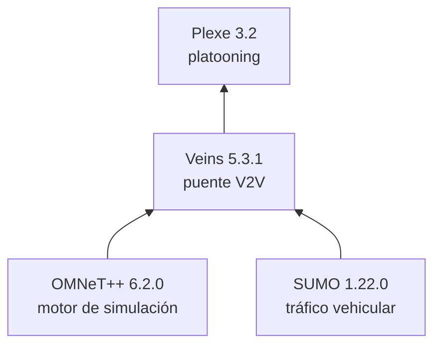
```mermaid
flowchart BT
    O["OMNeT++ 6.2.0<br/>motor de simulación"]
    S["SUMO 1.22.0<br/>tráfico vehicular"]
    V["Veins 5.3.1<br/>puente V2V"]
    P["Plexe 3.2<br/>platooning"]
    O --> V
    S --> V
    V --> P
```

### El recorrido de cada componente

Cada pieza sigue su propio camino desde la descarga hasta quedar operativa. Las flechas punteadas marcan las dependencias reales de compilación:

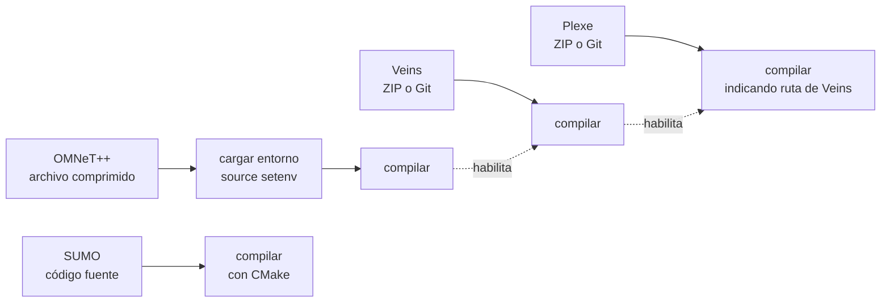
```mermaid
flowchart LR
    A1["OMNeT++<br/>archivo comprimido"] --> A2["cargar entorno<br/>source setenv"] --> A3["compilar"]
    B1["Veins<br/>ZIP o Git"] --> B2["compilar"]
    C1["Plexe<br/>ZIP o Git"] --> C2["compilar<br/>indicando ruta de Veins"]
    D1["SUMO<br/>código fuente"] --> D2["compilar<br/>con CMake"]
    A3 -.->|"habilita"| B2
    B2 -.->|"habilita"| C2
```

Este diagrama deja ver las dos cosas que más se malinterpretan: que **SUMO se compila por su cuenta**, sin depender de los demás, y que **el entorno de OMNeT++ se carga antes de compilar**, incluso el propio OMNeT++.

### Cómo queda tu disco

Todo vive dentro de una sola carpeta, `~/src/`. Al terminar la instalación debería verse así:

```text
~/src/
├── omnetpp-6.2.0/     ← motor de simulación
├── veins/             ← puente V2V
├── plexe/             ← platooning
└── sumo-1.22.0/       ← tráfico vehicular
```

!!! tip "Mantén el código en ~/src, no en /mnt/c"
    Si trabajas con WSL, es tentador dejar el código en una carpeta de Windows accesible desde `/mnt/c/...`. **No lo hagas.** El acceso a disco entre los dos sistemas es muy lento y la compilación puede tardar varias veces más. `~/src/` vive en el disco de Linux, que es donde debe estar.

---

## 4 · El camino de este manual

A partir de aquí el manual documenta **un solo camino**: Ubuntu 24.04, sea instalado directamente o corriendo dentro de Windows mediante WSL. Es el entorno del laboratorio y el único verificado.

| Tu situación | Qué hacer |
|--------------|-----------|
| **Windows** | Sección 5, empezando por el paso 0, que instala Ubuntu dentro de Windows. |
| **Ubuntu o cualquier Linux** | Sección 5, saltándote el paso 0. |
| **macOS o Windows nativo** | Sección 6. |
| **Solo quieres probar Plexe** | Sección 7, Instant Plexe. |

**Instant Plexe** es una máquina virtual con los cuatro componentes ya instalados y compilados: sirve para tener Plexe corriendo en minutos sin compilar nada, pero trae la versión 3.0 y no la 3.2 que documenta este manual. Se describe en la [sección 7](#7-alternativa-instant-plexe).

---

## 5 · Instalación paso a paso (Ubuntu 24.04 / WSL)

A partir de aquí empieza el procedimiento. Cada paso incluye descargar el componente y dejarlo construido antes de pasar al siguiente.

!!! note "La numeración no coincide con la del sitio oficial"
    Este manual reordena dos cosas respecto de la [guía oficial](https://plexe.car2x.org/building/): adelanta SUMO antes de Veins, y separa en dos pasos lo que allí es uno solo (*Install Plexe and Veins*). El resultado es el mismo; el motivo está en la sección 1.

### Paso 0: WSL (solo si vienes de Windows)

Si tu computador tiene Windows, este es tu verdadero primer paso y no aparece en la documentación oficial de Plexe.

**WSL no es un emulador.** Corre un núcleo Linux real en paralelo a Windows, así que el Ubuntu que instalas aquí es Ubuntu de verdad: mismo `apt`, mismo compilador, mismos binarios. Plexe no distingue entre este Ubuntu y uno instalado directamente en el disco, y por eso **todas las instrucciones de esta página se aplican sin ninguna modificación**.

#### 0.1 Comprobar los requisitos

Antes de instalar, confirma tres cosas:

- **Permisos de administrador en Windows.** El paso 0.2 los pide.
- **Conexión a internet.** El paso 0.2 descarga WSL y Ubuntu.
- **Virtualización activada.** Abre el Administrador de tareas (`Ctrl + Shift + Esc`) → **Rendimiento** → **CPU**, y revisa que diga **Virtualización: Habilitado**. Si dice «Deshabilitado», hay que activarla en la BIOS del equipo antes de seguir; eso depende de cada fabricante y no se cubre aquí.

!!! note "Equipo de referencia"
    Las salidas de terminal de esta página son las que se obtuvieron en este equipo: Windows 11 Pro 25H2 (compilación 26200), Intel Core i7-14700 (20 núcleos, 28 hilos) y 32 GB de RAM.

#### 0.2 Instalar WSL y Ubuntu 24.04

Abre PowerShell **como administrador** (clic derecho sobre PowerShell en el menú Inicio → **Ejecutar como administrador**) y ejecuta:

```powershell
wsl --install -d Ubuntu-24.04
```

**Fuente:** documentación oficial de Microsoft, [Instalación de WSL](https://learn.microsoft.com/es-es/windows/wsl/install). La guía de Plexe no menciona WSL.

El comando hace dos instalaciones seguidas: primero WSL y después Ubuntu 24.04. Al terminar, Ubuntu arranca por primera vez en la misma ventana.

**Así debería verse tu terminal:**

```text
PS C:\WINDOWS\system32> wsl --install -d Ubuntu-24.04
Descargando: Subsistema de Windows para Linux 2.7.14
Instalando: Subsistema de Windows para Linux 2.7.14
Se ha instalado Subsistema de Windows para Linux 2.7.14.
La operación se completó correctamente.
Descargando: Ubuntu 24.04 LTS
Instalando: Ubuntu 24.04 LTS
Distribución instalada correctamente. Se puede iniciar a través de "wsl.exe -d Ubuntu-24.04"
Iniciando Ubuntu-24.04...
Provisioning the new WSL instance Ubuntu-24.04
This might take a while...
Create a default Unix user account:
```

- La versión de WSL (aquí **2.7.14**) depende de la fecha en que instales; puede ser más nueva.
- Los mensajes de WSL salen en el idioma de tu Windows; los de Ubuntu, en inglés.
- También se abre sola una ventana **«Te damos la bienvenida a WSL»**. Es informativa y puedes cerrarla.

!!! note "¿Pide reiniciar?"
    En el equipo de referencia no hizo falta, porque la *Plataforma de máquina virtual* de Windows ya estaba activa. Si en tu equipo aparece un mensaje pidiendo reiniciar, reinicia antes de seguir.

#### 0.3 Crear tu usuario de Linux

En su primer arranque, Ubuntu pide crear una cuenta. Es una cuenta de Linux, independiente de tu usuario de Windows.

1. **Nombre de usuario.** Debe empezar con una letra minúscula o un guion bajo, y solo puede tener minúsculas, números, guiones bajos y guiones. Sin mayúsculas ni espacios.
2. **Contraseña, dos veces.** Es la contraseña que te pedirá `sudo`, así que anótala. **Mientras la escribes no aparece nada en pantalla**: lee el aviso de abajo antes de empezar.

!!! warning "La contraseña no se ve mientras la escribes"
    Al escribir la contraseña, la terminal **no muestra nada: ni letras, ni puntos, ni asteriscos**, y el cursor no avanza. Parece que el teclado no responde, pero sí está registrando lo que escribes. Es el comportamiento normal de Linux. Escríbela completa y presiona Enter. Si las dos veces no coinciden, Ubuntu te deja intentarlo de nuevo (ver «Si te equivocas», más abajo).

**Así debería verse tu terminal:**

```text
Create a default Unix user account: victorjaque
New password:
Retype new password:
passwd: password updated successfully
To run a command as administrator (user "root"), use "sudo <command>".
See "man sudo_root" for details.

victorjaque@DESKTOP-6VI5783:/mnt/c/WINDOWS/system32$
```

La última línea indica que ya estás dentro de Ubuntu, con la forma `usuario@nombre-del-equipo:carpeta$`. Verás tu propio usuario y el nombre de tu PC.

!!! warning "Si te equivocas"
    Un nombre con mayúsculas o espacios se rechaza, y Ubuntu lo vuelve a pedir:

    ```text
    Create a default Unix user account: Victor Jaque
    Invalid username. A valid username must start with a lowercase letter or underscore, and can contain lowercase letters, digits, underscores, and dashes.
    ```

    Si las dos contraseñas no coinciden, responde `y` para intentarlo de nuevo:

    ```text
    Sorry, passwords do not match.
    passwd: Authentication token manipulation error
    passwd: password unchanged
    Try again? [y/N] y
    ```

!!! tip "Quedaste en una carpeta de Windows"
    Como Ubuntu arrancó desde PowerShell, la terminal quedó en `/mnt/c/WINDOWS/system32`, que es `C:\WINDOWS\system32` visto desde Linux. No trabajes ahí (ver el consejo sobre `/mnt/c` en la [sección 3](#como-queda-tu-disco)).

**Ejemplo real: así se vio la instalación en el equipo de referencia**

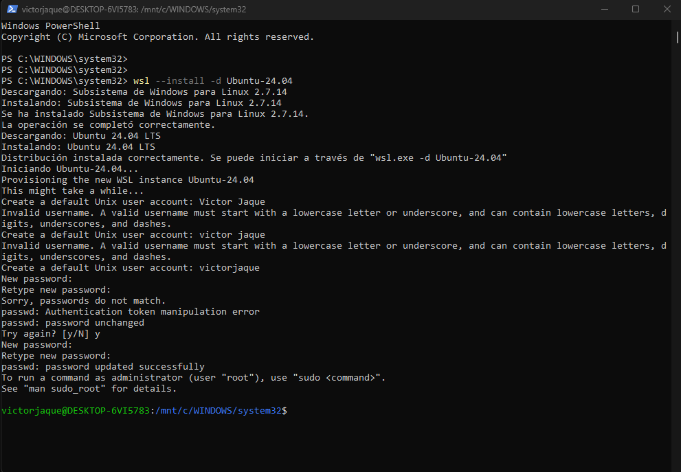

La captura muestra los pasos 0.2 y 0.3 tal como ocurrieron, incluidos los dos errores del recuadro «Si te equivocas»: el nombre de usuario rechazado dos veces y las contraseñas que no coincidieron en el primer intento.

#### 0.4 Abrir la terminal de Ubuntu

Desde ahora, cada vez que trabajes con Plexe empezarás abriendo la terminal de Ubuntu. Hay dos formas.

**Forma 1: desde el menú Inicio**

1. Presiona la tecla **Windows**.
2. Escribe `Ubuntu`.
3. Presiona **Enter**, o haz clic en **Ubuntu-24.04**.

Se abre la terminal de Ubuntu.

**Forma 2: anclada a la barra de tareas, a un clic**

1. Presiona la tecla **Windows** y escribe `Ubuntu`.
2. Haz clic derecho sobre **Ubuntu-24.04**.
3. Elige **Anclar a la barra de tareas**.

El ícono de Ubuntu queda en la barra de tareas, abajo en la pantalla. Desde entonces, un clic sobre ese ícono abre la terminal.

**Ejemplo real: anclar Ubuntu a la barra de tareas en el equipo de referencia**

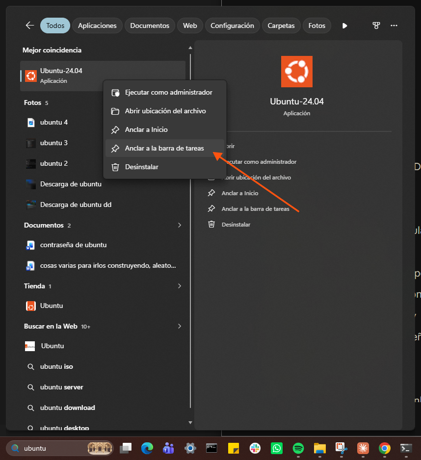

Con cualquiera de las dos formas, la terminal se abre en tu carpeta de Linux: la línea termina en `:~$` (en el equipo de referencia, `victorjaque@DESKTOP-6VI5783:~$`). Ya no quedas en una carpeta de Windows, como pasó en el paso 0.3.

#### 0.5 Actualizar Ubuntu

```bash
# PENDIENTE: actualizar la lista de paquetes y el sistema
```

#### 0.6 Verificar la instalación

```bash
# PENDIENTE: verificar que es WSL 2 y la versión de Ubuntu
```

#### 0.7 Probar las ventanas gráficas (WSLg)

```bash
# PENDIENTE: probar que se abren ventanas gráficas
```

!!! info "Dos mundos, un computador"
    Con WSL tienes dos entornos separados en la misma máquina: Windows (PowerShell, `C:\Users\...`) y Linux (terminal de Ubuntu, `/home/usuario/...`). La regla práctica es simple: **si la terminal de Ubuntu está abierta, estás en Linux**, y ahí se ejecuta todo lo de esta página.

!!! warning "La sección 'Building for Windows' no es para ti"
    La documentación oficial tiene un apartado de compilación para Windows nativo, con MinGW y sin Linux de por medio. **No es tu caso y no debes seguirlo.** Además está desactualizado: el propio autor lo desaconseja y contiene instrucciones sin terminar. Con WSL usas la ruta de Linux, que es la mantenida.

---

### Paso 1: Dependencias del sistema

Antes de compilar cualquier componente hay que instalar el compilador, las herramientas de construcción y las librerías de las que dependen OMNeT++, Veins y Plexe. Todo se instala con `apt`, el instalador de paquetes de Ubuntu, en dos comandos. La lista de paquetes es exactamente la de la [guía oficial](https://plexe.car2x.org/building/) (*Install required libraries and tools*): compilador, herramientas de construcción, Python, librerías XML y de compresión, generación de documentación, las librerías Qt6 de Qtenv (la ventana gráfica donde corre la simulación) y R.

Este paso se ejecuta una única vez por máquina.

!!! warning "sudo pide tu contraseña de Ubuntu"
    Los dos comandos empiezan con `sudo`, así que la terminal pedirá la contraseña que creaste en el paso 0.3 (`[sudo] password for ...`). Igual que entonces, **no se ve nada mientras la escribes**. `sudo` la recuerda unos 15 minutos y solo en esa ventana: si pasa más tiempo, o abres otra ventana, la vuelve a pedir.

#### 1.1 Actualizar la lista de paquetes

Descarga la lista actualizada de paquetes disponibles. No instala nada.

En una terminal de Ubuntu, nueva o la que ya tengas abierta, ejecuta el siguiente comando:

```bash
sudo apt update
```

**Fuente:** [guía de instalación de OMNeT++](https://doc.omnetpp.org/omnetpp/InstallGuide.pdf), capítulo *Ubuntu* (versión 6.2.0: [ch-ubuntu.rst](https://github.com/omnetpp/omnetpp/blob/omnetpp-6.2.0/doc/src/installguide/ch-ubuntu.rst)), que lo recomienda antes de instalar paquetes. La guía de Plexe no lo incluye.

**Así debería verse tu terminal** (abreviado):

```text
victorjaque@DESKTOP-6VI5783:~$ sudo apt update
[sudo] password for victorjaque:
Get:1 http://security.ubuntu.com/ubuntu noble-security InRelease [126 kB]
Hit:2 http://archive.ubuntu.com/ubuntu noble InRelease
Get:3 http://archive.ubuntu.com/ubuntu noble-updates InRelease [126 kB]
...
Get:52 http://archive.ubuntu.com/ubuntu noble-backports/multiverse amd64 c-n-f Metadata [116 B]
Fetched 37.3 MB in 6s (5995 kB/s)
Reading package lists... Done
Building dependency tree... Done
Reading state information... Done
43 packages can be upgraded. Run 'apt list --upgradable' to see them.
```

El aviso final (*43 packages can be upgraded*) es normal y no impide seguir: esas actualizaciones corresponden al paso 0.5.

**Ejemplo real: así se vio `sudo apt update` en el equipo de referencia**

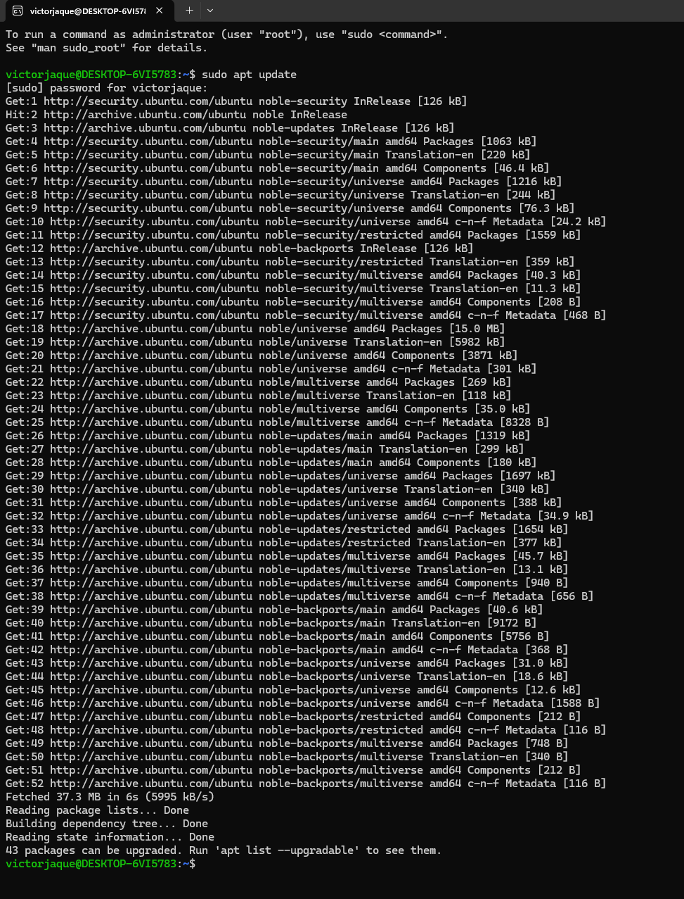

#### 1.2 Instalar las dependencias

En la misma terminal, ejecuta el siguiente comando:

```bash
sudo apt install -y make diffutils pkg-config ccache clang lld gdb lldb \
    bison flex perl sed gawk python3 python3-pip python3-venv python3-dev \
    libxml2-dev zlib1g-dev doxygen graphviz xdg-utils libdw-dev \
    qt6-base-dev qt6-base-dev-tools qmake6 libqt6svg6 qt6-wayland libwebkit2gtk-4.1-0 \
    r-base
```

**Fuente:** guía oficial de Plexe, [*Install required libraries and tools*](https://plexe.car2x.org/building/#install-required-libraries-and-tools), en la sección *Building for Linux*. El comando es idéntico al de la guía; aquí solo se reparte en varias líneas para que se lea mejor.

La opción `-y` responde «sí» sola a la confirmación de instalar, así que el comando corre de principio a fin sin preguntar nada.

**Así debería verse tu terminal** (inicio, abreviado):

```text
victorjaque@DESKTOP-6VI5783:~$ sudo apt install -y make diffutils pkg-config ccache clang lld gdb lldb bison flex perl sed gawk python3 python3-pip python3-venv python3-dev libxml2-dev zlib1g-dev doxygen graphviz xdg-utils libdw-dev qt6-base-dev qt6-base-dev-tools qmake6 libqt6svg6 qt6-wayland libwebkit2gtk-4.1-0 r-base
[sudo] password for victorjaque:
Reading package lists... Done
Building dependency tree... Done
Reading state information... Done
diffutils is already the newest version (1:3.10-1ubuntu0.1).
sed is already the newest version (4.9-2ubuntu0.24.04.1).
sed set to manually installed.
gawk is already the newest version (1:5.2.1-2ubuntu0.1).
gawk set to manually installed.
python3 is already the newest version (3.12.3-0ubuntu2.1).
python3 set to manually installed.
The following additional packages will be installed:
  alsa-topology-conf alsa-ucm-conf aspell aspell-en bubblewrap build-essential bzip2 ...
```

Cómo leer esa salida:

- **«is already the newest version»**: ese paquete ya venía con Ubuntu. No es un error.
- **«The following additional packages will be installed»**: son dependencias que `apt` agrega por su cuenta. Entre ellas llegan `build-essential`, `g++` y `r-base-dev`, que otras guías piden por separado.
- En el equipo de referencia se instalaron **385 paquetes nuevos** y se actualizaron **14**.

El paso terminó bien cuando vuelve a aparecer la línea `victorjaque@...:~$` y no hay ningún mensaje que empiece con `E:`.

#### 1.3 Verificar

Comprueba que las herramientas principales quedaron instaladas. En la misma terminal, ejecuta los siguientes comandos:

```bash
clang --version | head -1
qmake6 --version | tail -1
python3 --version
R --version | head -1
```

**Fuente:** agregado en este manual.

**Así debería verse tu terminal:**

```text
victorjaque@DESKTOP-6VI5783:~$ clang --version | head -1
Ubuntu clang version 18.1.3 (1ubuntu1)
victorjaque@DESKTOP-6VI5783:~$ qmake6 --version | tail -1
Using Qt version 6.4.2 in /usr/lib/x86_64-linux-gnu
victorjaque@DESKTOP-6VI5783:~$ python3 --version
Python 3.12.3
victorjaque@DESKTOP-6VI5783:~$ R --version | head -1
R version 4.3.3 (2024-02-29) -- "Angel Food Cake"
```

Después de este paso, el disco de Ubuntu ocupa en total unos 3,2 GB en el equipo de referencia.

---

### Paso 2: OMNeT++ 6.2.0

OMNeT++ es el motor de simulación. Todo lo demás corre encima, así que va primero.

#### 2.1 Descargar

Se baja como archivo comprimido (unos 400 MB) desde el sitio oficial de OMNeT++ y se descomprime dentro de `~/src/`, la carpeta que indica la guía de Plexe. La carpeta resultante conserva el número de versión completo.

En una terminal de Ubuntu, nueva o la que ya tengas abierta, ejecuta los siguientes comandos:

```bash
mkdir -p ~/src
cd ~/src
```

**Fuente:** la carpeta `~/src` la indica la guía oficial de Plexe ([*Step 1: Install OMNeT++*](https://plexe.car2x.org/building/#step-1-install-omnet)). El `mkdir` lo agrega este manual, porque la guía da por hecho que esa carpeta ya existe.

En la misma terminal, dentro de `~/src`, ejecuta el siguiente comando:

```bash
wget https://github.com/omnetpp/omnetpp/releases/download/omnetpp-6.2.0/omnetpp-6.2.0-linux-x86_64.tgz
```

**Fuente:** archivo oficial de OMNeT++ 6.2.0 para Linux, publicado en su [GitHub](https://github.com/omnetpp/omnetpp/releases/tag/omnetpp-6.2.0). La guía de Plexe solo enlaza a la [página de descargas de OMNeT++](https://omnetpp.org/download/); descargarlo con `wget` lo agrega este manual, para hacerlo desde la terminal.

**Ejemplo real: así empieza la descarga en el equipo de referencia**

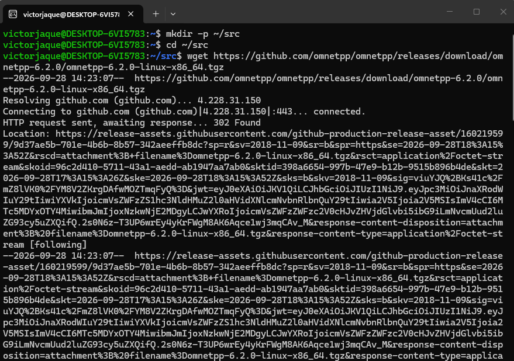

La dirección larga que aparece después de *302 Found* es normal: GitHub redirige la descarga a su servidor de archivos mediante un enlace temporal.

Cuando termine la descarga, en la misma terminal, dentro de `~/src`, ejecuta los siguientes comandos:

```bash
tar xzf omnetpp-6.2.0-linux-x86_64.tgz
ls ~/src
```

**Fuente:** [guía de instalación de OMNeT++](https://doc.omnetpp.org/omnetpp/InstallGuide.pdf), capítulo *Linux*, sección *Downloading and Unpacking* (versión 6.2.0: [ch-supported-linux.rst](https://github.com/omnetpp/omnetpp/blob/omnetpp-6.2.0/doc/src/installguide/ch-supported-linux.rst)). El comando oficial es `tar xvfz omnetpp-6.2.0-linux-x86_64.tgz`; aquí se quita la `v` para que no liste en pantalla los miles de archivos que descomprime, y el resultado es el mismo. El `ls` lo agrega este manual, para comprobar el resultado.

**Así debería verse tu terminal:**

```text
victorjaque@DESKTOP-6VI5783:~/src$ tar xzf omnetpp-6.2.0-linux-x86_64.tgz
victorjaque@DESKTOP-6VI5783:~/src$ ls ~/src
omnetpp-6.2.0  omnetpp-6.2.0-linux-x86_64.tgz
```

`tar` no muestra nada mientras descomprime. `ls` confirma que apareció la carpeta `omnetpp-6.2.0`; el archivo `.tgz` queda al lado y ya no se necesita.

**Ejemplo real: así terminan la descarga y la descompresión en el equipo de referencia**

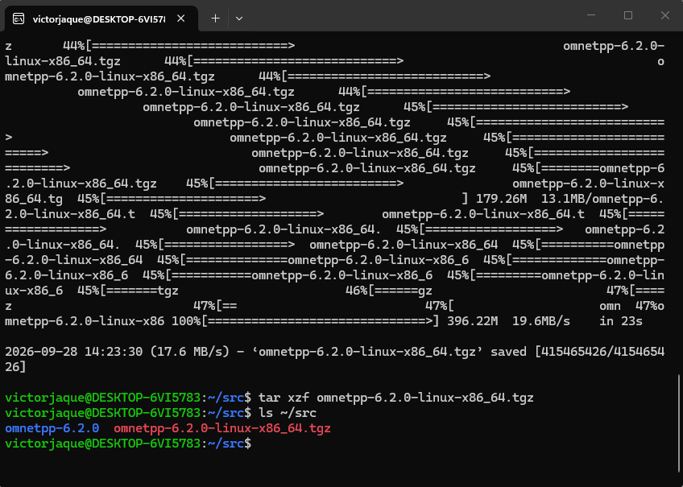

Las líneas amontonadas de la barra de progreso son solo un efecto visual: la barra se redibuja muchas veces y, si la ventana es angosta, se desordena. Lo que importa es la línea `saved [415465426/415465426]`: cuando los dos números son iguales, la descarga está completa.

#### 2.2 Cargar el entorno

Antes de compilar hay que preparar la terminal en dos partes: un entorno de Python propio de OMNeT++, que se crea una sola vez, y las variables de entorno de OMNeT++, que se cargan en cada terminal nueva.

En una terminal de Ubuntu, nueva o la que ya tengas abierta, ejecuta el siguiente comando:

```bash
cd ~/src/omnetpp-6.2.0
```

**Fuente:** guía oficial de Plexe ([*Step 1: Install OMNeT++*](https://plexe.car2x.org/building/#step-1-install-omnet)).

**Solo la primera vez: el entorno de Python de OMNeT++**

En la misma terminal, dentro de `~/src/omnetpp-6.2.0`, ejecuta los siguientes comandos:

```bash
python3 -m venv .venv --upgrade-deps --clear --prompt "omnetpp/.venv"
source .venv/bin/activate
python3 -m pip install -r python/requirements.txt
```

**Fuente:** [guía de instalación de OMNeT++](https://doc.omnetpp.org/omnetpp/InstallGuide.pdf), capítulo *Ubuntu* (versión 6.2.0: [ch-ubuntu.rst](https://github.com/omnetpp/omnetpp/blob/omnetpp-6.2.0/doc/src/installguide/ch-ubuntu.rst)). La guía de Plexe solo avisa que puede hacer falta un entorno virtual de Python.

- `python3 -m venv ...` crea el entorno en la carpeta `.venv`, dentro de la carpeta de OMNeT++.
- `source .venv/bin/activate` lo activa: desde ese momento la línea empieza con `(omnetpp/.venv)`.
- `pip install` instala en ese entorno las librerías de Python que pide OMNeT++: matplotlib, numpy, pandas, scipy e ipython.

**Ejemplo real: creación del entorno de Python en el equipo de referencia**

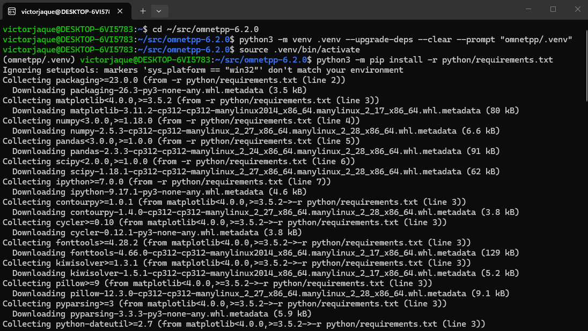

La primera línea del `pip install`, *Ignoring setuptools*, es normal: ese paquete solo se usa en Windows.

**En cada terminal nueva: las variables de OMNeT++**

En la misma terminal, dentro de `~/src/omnetpp-6.2.0`, ejecuta el siguiente comando:

```bash
source setenv
```

**Fuente:** guía oficial de Plexe ([*Step 1: Install OMNeT++*](https://plexe.car2x.org/building/#step-1-install-omnet)) y [guía de instalación de OMNeT++](https://doc.omnetpp.org/omnetpp/InstallGuide.pdf), capítulo *Linux*, sección *Environment Variables*.

**Así debería verse tu terminal:**

```text
(omnetpp/.venv) victorjaque@DESKTOP-6VI5783:~/src/omnetpp-6.2.0$ source setenv
Activating python virtual environment in '/home/victorjaque/src/omnetpp-6.2.0/.venv'
Environment for 'omnetpp-6.2.0' in directory '/home/victorjaque/src/omnetpp-6.2.0' is ready.

Type "./configure" and "make" to build the simulation libraries.
When done, type "omnetpp" to start the IDE.
```

- *Environment for 'omnetpp-6.2.0' … is ready* indica que el entorno quedó cargado.
- `setenv` también activa solo el entorno de Python (*Activating python virtual environment*). Por eso, en una terminal nueva basta con `cd ~/src/omnetpp-6.2.0` y `source setenv`: no hace falta repetir `source .venv/bin/activate`.

**Ejemplo real: final del `pip install` y `source setenv` en el equipo de referencia**

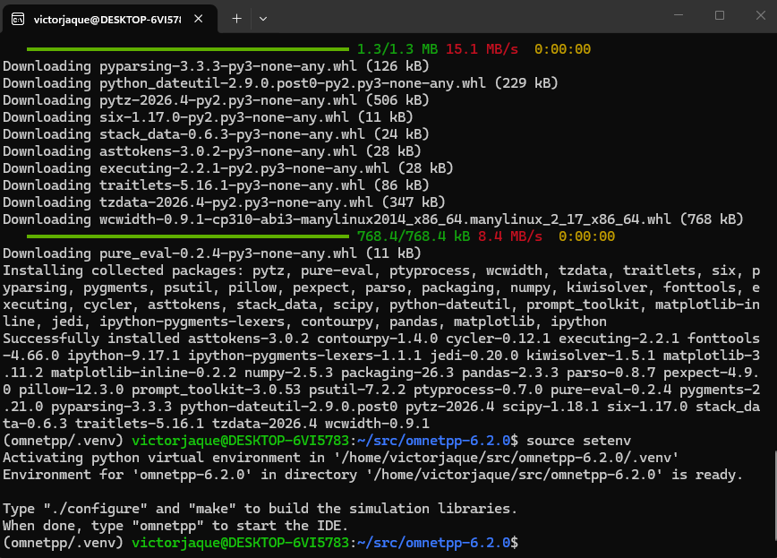

El `pip install` terminó bien cuando aparece *Successfully installed*, seguido de la lista de librerías instaladas.

!!! danger "Esto se repite en cada terminal nueva"
    Cargar el entorno **no es permanente**: afecta solo a la terminal donde lo ejecutas. Si cierras la terminal o abres otra, hay que volver a hacerlo. Olvidarlo es, por lejos, la causa más frecuente de errores durante la instalación y de comandos que "no existen" cuando en realidad sí están instalados. Para no depender de la memoria, se puede añadir a la configuración del intérprete de comandos y quedará automático.

#### 2.3 Compilar

La compilación se hace en dos etapas: primero `./configure` detecta qué hay instalado en tu sistema, y después `make` construye OMNeT++. Las dos se ejecutan dentro de `~/src/omnetpp-6.2.0`, en la misma terminal donde cargaste el entorno en el paso 2.2.

Si abriste una terminal nueva, ejecuta en ella los siguientes comandos:

```bash
cd ~/src/omnetpp-6.2.0
source setenv
```

**Fuente:** guía oficial de Plexe ([*Step 1: Install OMNeT++*](https://plexe.car2x.org/building/#step-1-install-omnet)), igual que en el paso 2.2.

La salida es la misma del paso 2.2.

**2.3.1 Configurar**

En la terminal donde cargaste el entorno en el paso 2.2, dentro de `~/src/omnetpp-6.2.0`, ejecuta el siguiente comando:

```bash
./configure
```

**Fuente:** guía oficial de Plexe ([*Step 1: Install OMNeT++*](https://plexe.car2x.org/building/#step-1-install-omnet)) y [guía de instalación de OMNeT++](https://doc.omnetpp.org/omnetpp/InstallGuide.pdf), capítulo *Linux*, sección *Configuring and Building OMNeT++*.

!!! failure "Error: Cannot find OpenSceneGraph 3.2 or later"
    **Cuándo aparece:** la primera vez que se ejecuta `./configure`, si en el paso 1 se instalaron solo los paquetes de la guía de Plexe.

    **Qué significa:** OpenSceneGraph es la librería de la vista 3D de Qtenv. OMNeT++ 6.2.0 viene con esa vista activada (`WITH_OSG=yes` en el archivo `configure.user`), pero la lista de paquetes de la guía de Plexe no instala OpenSceneGraph, así que `./configure` se detiene. Plexe no necesita la vista 3D.

    ```text
    checking for OpenSceneGraph with CFLAGS=... no
    configure: error: Cannot find OpenSceneGraph 3.2 or later - 3D view in Qtenv will not be available. Set WITH_OSG=no in configure.user to disable this feature or install the development package for OpenSceneGraph.
    ```

    **Ejemplo real: así apareció el error en el equipo de referencia**

    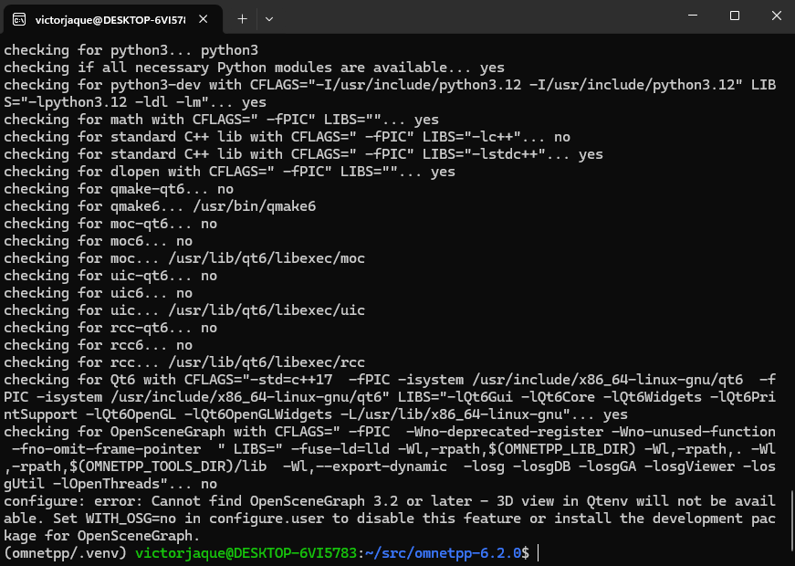

**Solución: desactivar la vista 3D**

Hay dos salidas oficiales: desactivar la vista 3D o instalar OpenSceneGraph (`libopenscenegraph-dev`, un paquete opcional de la guía de OMNeT++). Este manual desactiva la vista 3D, que es lo que sugiere la guía de Plexe y lo que pide el propio mensaje de error.

En la misma terminal, dentro de `~/src/omnetpp-6.2.0`, ejecuta los siguientes comandos:

```bash
sed -i 's/^WITH_OSG=yes/WITH_OSG=no/' configure.user
grep ^WITH_OSG configure.user
```

**Fuente:** qué hacer lo indican la guía de Plexe (nota del [*Step 1*](https://plexe.car2x.org/building/#step-1-install-omnet): editar `configure.user` para desactivar OpenSceneGraph), la [guía de instalación de OMNeT++](https://doc.omnetpp.org/omnetpp/InstallGuide.pdf), capítulo *Build Options*, que incluye la opción `WITH_OSG=no` (versión 6.2.0: [ch-build-options.rst](https://github.com/omnetpp/omnetpp/blob/omnetpp-6.2.0/doc/src/installguide/ch-build-options.rst)), y el propio mensaje de error. Cómo hacerlo desde la terminal lo agrega este manual: `sed` cambia la línea `WITH_OSG=yes` por `WITH_OSG=no`, y `grep` la muestra para comprobar el cambio.

**Así debería verse tu terminal:**

```text
(omnetpp/.venv) victorjaque@DESKTOP-6VI5783:~/src/omnetpp-6.2.0$ sed -i 's/^WITH_OSG=yes/WITH_OSG=no/' configure.user
(omnetpp/.venv) victorjaque@DESKTOP-6VI5783:~/src/omnetpp-6.2.0$ grep ^WITH_OSG configure.user
WITH_OSG=no
WITH_OSGEARTH=no
```

`sed` no muestra nada. El `grep` muestra dos líneas porque también encuentra `WITH_OSGEARTH`, otra opción de la vista 3D que ya venía desactivada. Si alguna vez quieres volver a la configuración original, `configure.user.dist` es una copia intacta del archivo que trae OMNeT++.

Después de cambiar `configure.user` hay que volver a configurar. En la misma terminal, dentro de `~/src/omnetpp-6.2.0`, ejecuta el siguiente comando:

```bash
./configure
```

**Fuente:** [guía de instalación de OMNeT++](https://doc.omnetpp.org/omnetpp/InstallGuide.pdf), capítulo *Build Options*: después de cambiar `configure.user` siempre hay que volver a ejecutar `./configure`.

**Así debería verse tu terminal** (inicio y final, abreviado):

```text
(omnetpp/.venv) victorjaque@DESKTOP-6VI5783:~/src/omnetpp-6.2.0$ ./configure
configure: Environment variables (PATH and PYTHONPATH) are correctly set.
configure: Reading configure.user for your custom settings.
configure: Creating a backup of 'Makefile.inc'.
mv: cannot stat './Makefile.inc': No such file or directory
checking build system type... x86_64-pc-linux-gnu
...
checking for ccache... ccache
configure: creating ./config.status
config.status: creating Makefile.inc
config.status: creating include/omnetpp/platdep/config.h

Configuration phase finished. Use 'make' to build OMNeT++.
```

- *Configuration phase finished* indica que la configuración terminó bien.
- La línea `mv: cannot stat './Makefile.inc'` no es un error: `configure` intenta respaldar un archivo que todavía no existe, porque el primer intento se detuvo antes de crearlo.
- Varias líneas terminan en `no` o `unsupported` (por ejemplo, la de OpenMP): son opciones que `configure` revisa pero que OMNeT++ no necesita. Lo que importa es la línea final.

**Ejemplo real: la corrección y el inicio del segundo `./configure` en el equipo de referencia**

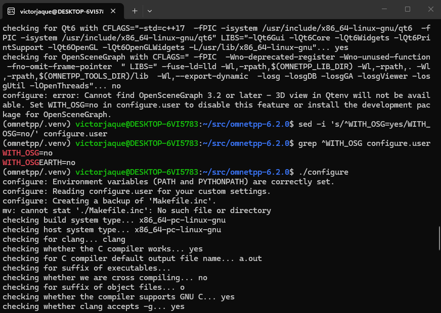

**Ejemplo real: así termina el segundo `./configure` en el equipo de referencia**

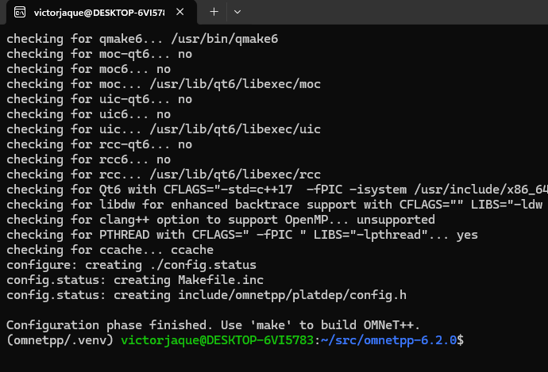

**2.3.2 Construir**

Si abriste una terminal nueva, ejecuta en ella los siguientes comandos:

```bash
cd ~/src/omnetpp-6.2.0
source setenv
```

**Fuente:** guía oficial de Plexe ([*Step 1: Install OMNeT++*](https://plexe.car2x.org/building/#step-1-install-omnet)), igual que en el paso 2.2.

**Así debería verse tu terminal:**

```text
victorjaque@DESKTOP-6VI5783:~$ cd ~/src/omnetpp-6.2.0
victorjaque@DESKTOP-6VI5783:~/src/omnetpp-6.2.0$ source setenv
Activating python virtual environment in '/home/victorjaque/src/omnetpp-6.2.0/.venv'
Environment for 'omnetpp-6.2.0' in directory '/home/victorjaque/src/omnetpp-6.2.0' is ready.
(omnetpp/.venv) victorjaque@DESKTOP-6VI5783:~/src/omnetpp-6.2.0$
```

La línea que ahora empieza con `(omnetpp/.venv)` indica que el entorno quedó cargado. A diferencia del paso 2.2, ya no aparece *Type "./configure" and "make"…*: `setenv` solo lo muestra mientras OMNeT++ no está configurado.

En la misma terminal, dentro de `~/src/omnetpp-6.2.0`, ejecuta el siguiente comando:

```bash
make -j$(nproc)
```

**Fuente:** guía oficial de Plexe ([*Step 1: Install OMNeT++*](https://plexe.car2x.org/building/#step-1-install-omnet)), que indica `make -j <number of cores of your PC>`, y [guía de instalación de OMNeT++](https://doc.omnetpp.org/omnetpp/InstallGuide.pdf), capítulo *Linux*, sección *Configuring and Building OMNeT++*. El `$(nproc)` lo agrega este manual: escribe solo la cantidad de núcleos disponibles (28 en el equipo de referencia).

**Así debería verse tu terminal** (inicio y final, abreviado):

```text
(omnetpp/.venv) victorjaque@DESKTOP-6VI5783:~/src/omnetpp-6.2.0$ make -j$(nproc)

Building release and debug mode executables. Type 'make help' for further options.

***** Configuration: MODE=release, TOOLCHAIN_NAME=clang, SHARED_LIBS=yes, LIB_SUFFIX=.so ****
===== Checking environment =====
===== Compiling utils ====
===== Compiling common ====
...
Creating executable: out/clang-debug//tictoc_dbg
Creating shared library: out/clang-debug//libqueueinglibext_dbg.so

Now you can type 'omnetpp' to start the IDE.
```

- *Now you can type 'omnetpp' to start the IDE* indica que la compilación terminó bien.
- Compila todo **dos veces**: primero en modo *release* y después en modo *debug* (los archivos terminados en `_dbg`). Es normal; la guía de OMNeT++ lo advierte.
- También compila los ejemplos de la carpeta `samples/`.
- En el equipo de referencia tardó unos 2 minutos.

**Ejemplo real: así empieza `make` en el equipo de referencia**

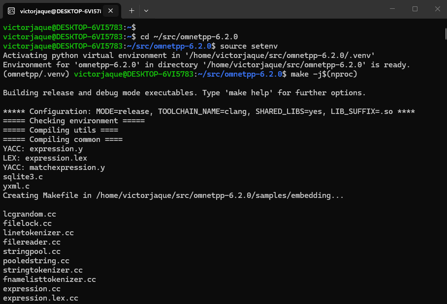

La captura parte de una terminal nueva: por eso repite `cd ~/src/omnetpp-6.2.0` y `source setenv` antes del `make`.

**Ejemplo real: así termina `make` en el equipo de referencia**

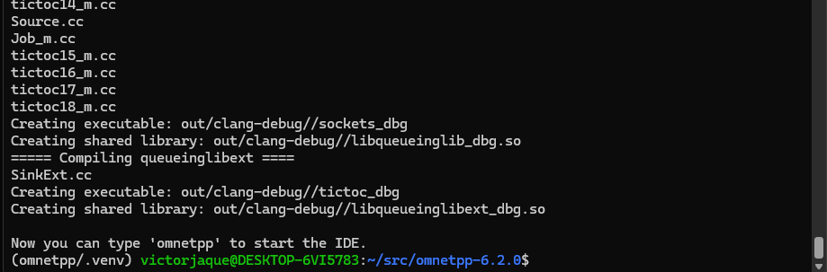

#### 2.4 Verificar

Antes de seguir, comprueba que OMNeT++ quedó bien construido: primero por terminal y después abriendo sus ventanas gráficas. Se hace en la misma terminal del paso 2.3.

Si abriste una terminal nueva, ejecuta en ella los siguientes comandos:

```bash
cd ~/src/omnetpp-6.2.0
source setenv
```

**Fuente:** guía oficial de Plexe ([*Step 1: Install OMNeT++*](https://plexe.car2x.org/building/#step-1-install-omnet)), igual que en el paso 2.2.

La salida es la misma del paso 2.3.2.

En la misma terminal, ejecuta el siguiente comando:

```bash
opp_run -v
```

**Fuente:** agregado en este manual: muestra la versión de OMNeT++ y las opciones con que se compiló.

**Así debería verse tu terminal:**

```text
(omnetpp/.venv) victorjaque@DESKTOP-6VI5783:~/src/omnetpp-6.2.0$ opp_run -v
OMNeT++ Discrete Event Simulation  (C) 1992-2025 Andras Varga, OpenSim Ltd.
Version: 6.2.0, build: 250714-83e173e93a, edition: Academic Public License -- NOT FOR COMMERCIAL USE
See the license for distribution terms and warranty disclaimer

Setting up Qtenv...

Build: omnetpp-6.2.0 250714-83e173e93a
Compiler: CLANG 18.1.3 (1ubuntu1)
Options: 64-bit ARCH_X86_64 RELEASE WITH_NETBUILDER WITH_QTENV

End.
```

- *Version: 6.2.0* confirma la versión instalada.
- En *Options* aparece `WITH_QTENV`, la ventana gráfica. No aparece `WITH_OSG` porque la vista 3D se desactivó en el paso 2.3.1.

En la misma terminal, dentro de `~/src/omnetpp-6.2.0`, ejecuta los siguientes comandos:

```bash
cd samples/aloha
./aloha
```

**Fuente:** [guía de instalación de OMNeT++](https://doc.omnetpp.org/omnetpp/InstallGuide.pdf), capítulo *Linux*, sección *Verifying the Installation*.

**Así debería verse tu terminal** (abreviado):

```text
(omnetpp/.venv) victorjaque@DESKTOP-6VI5783:~/src/omnetpp-6.2.0$ cd samples/aloha
(omnetpp/.venv) victorjaque@DESKTOP-6VI5783:~/src/omnetpp-6.2.0/samples/aloha$ ./aloha
OMNeT++ Discrete Event Simulation  (C) 1992-2025 Andras Varga, OpenSim Ltd.
...
Setting up Qtenv...

Loading NED files from .:  4
...
libEGL warning: failed to get driver name for fd -1
...
MESA: error: ZINK: failed to choose pdev
libEGL warning: egl: failed to create dri2 screen

End.
```

- Las líneas `libEGL warning` y `MESA: error` son avisos del sistema gráfico de WSL. En el equipo de referencia aparecieron y la ventana funcionó bien: no son un error.
- *End.* aparece cuando cierras la ventana de aloha.

Se abre la ventana de Qtenv con el diálogo *Set Up Inifile Configuration*. Deja la configuración que aparece (*PureAloha1*) y presiona **OK**.

**Ejemplo real: el diálogo de configuración en el equipo de referencia**

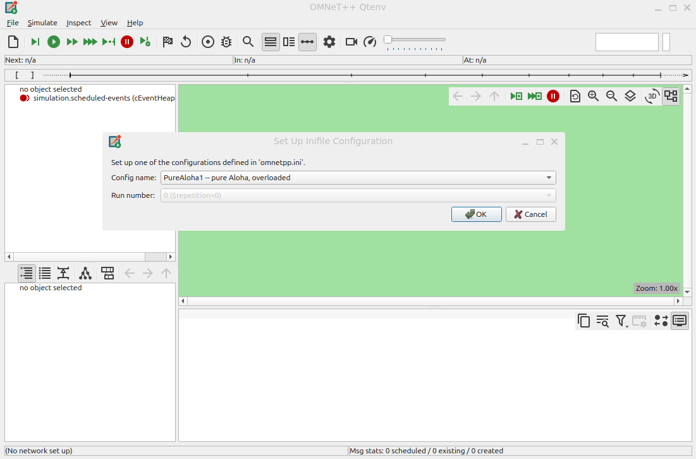

Aparece la red del ejemplo: varios *hosts* sobre un mapa. Si la ves, Qtenv funciona. Cierra la ventana con la **X**.

**Ejemplo real: la red de aloha en el equipo de referencia**

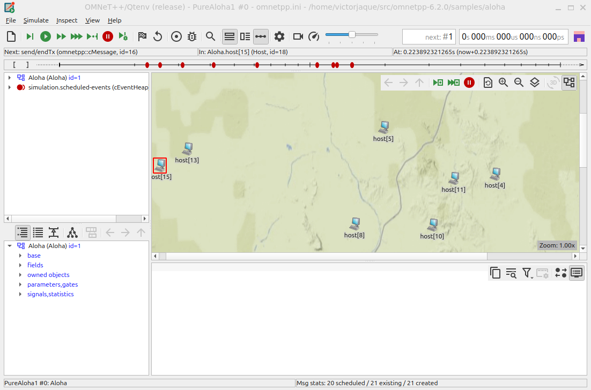

Después de cerrar la ventana de aloha, en la misma terminal, ejecuta el siguiente comando:

```bash
omnetpp
```

**Fuente:** [guía de instalación de OMNeT++](https://doc.omnetpp.org/omnetpp/InstallGuide.pdf), capítulo *Linux*, sección *Starting the IDE*.

**Así debería verse tu terminal:**

```text
(omnetpp/.venv) victorjaque@DESKTOP-6VI5783:~/src/omnetpp-6.2.0/samples/aloha$ omnetpp
Starting the OMNeT++ IDE...
(omnetpp/.venv) victorjaque@DESKTOP-6VI5783:~/src/omnetpp-6.2.0/samples/aloha$ CompileCommand: exclude org/eclipse/jdt/internal/core/dom/rewrite/ASTRewriteAnalyzer.getExtendedRange bool exclude = true
```

El IDE se abre en una ventana aparte y la terminal queda libre. La línea `CompileCommand: ...` la escribe el IDE al arrancar; no es un error.

Primero aparece *OMNeT++ IDE Launcher*, que pide la carpeta de trabajo (*workspace*). Deja la que propone, la carpeta `samples` de OMNeT++ (`~/src/omnetpp-6.2.0/samples`), y presiona **Launch**. Es la misma carpeta que usa el [tutorial oficial de Veins](https://veins.car2x.org/tutorial/#step2).

**Ejemplo real: la elección de la carpeta de trabajo en el equipo de referencia**

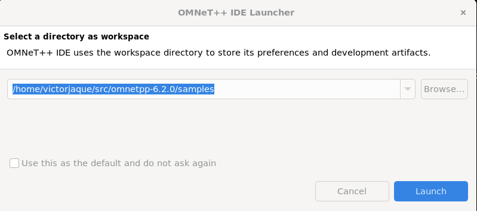

Se abre el IDE con la pestaña *Welcome*. Con eso la verificación está completa y puedes cerrarlo.

**Ejemplo real: el IDE de OMNeT++ en el equipo de referencia**

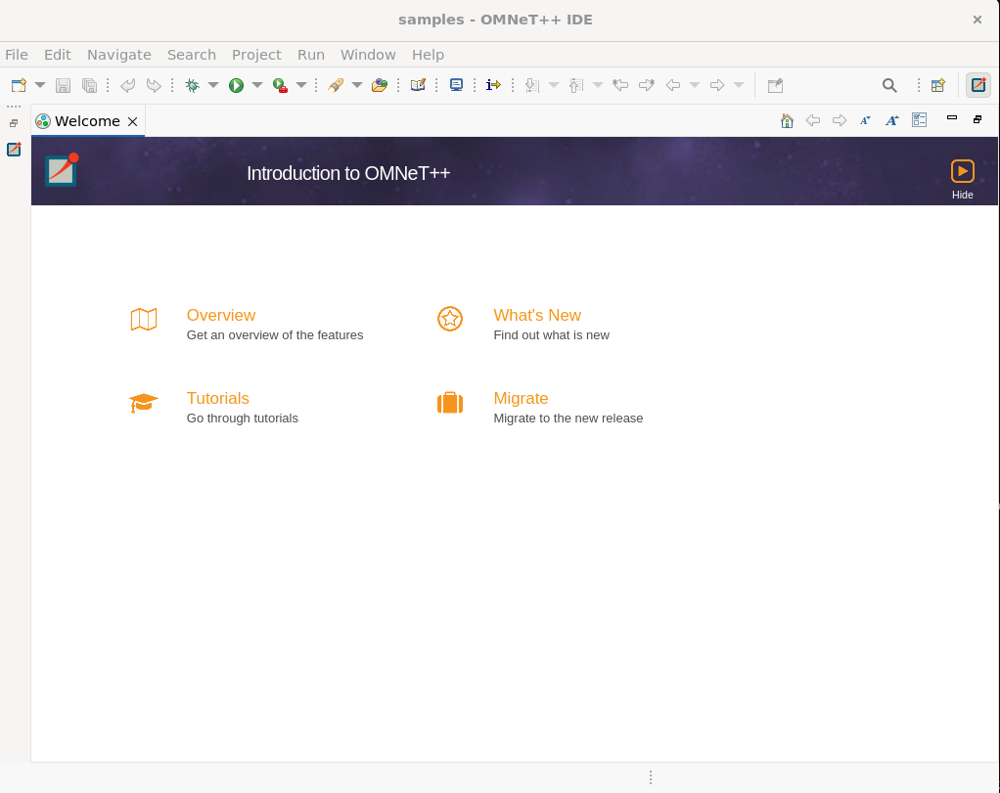

**Ejemplo real: la terminal durante la verificación en el equipo de referencia**

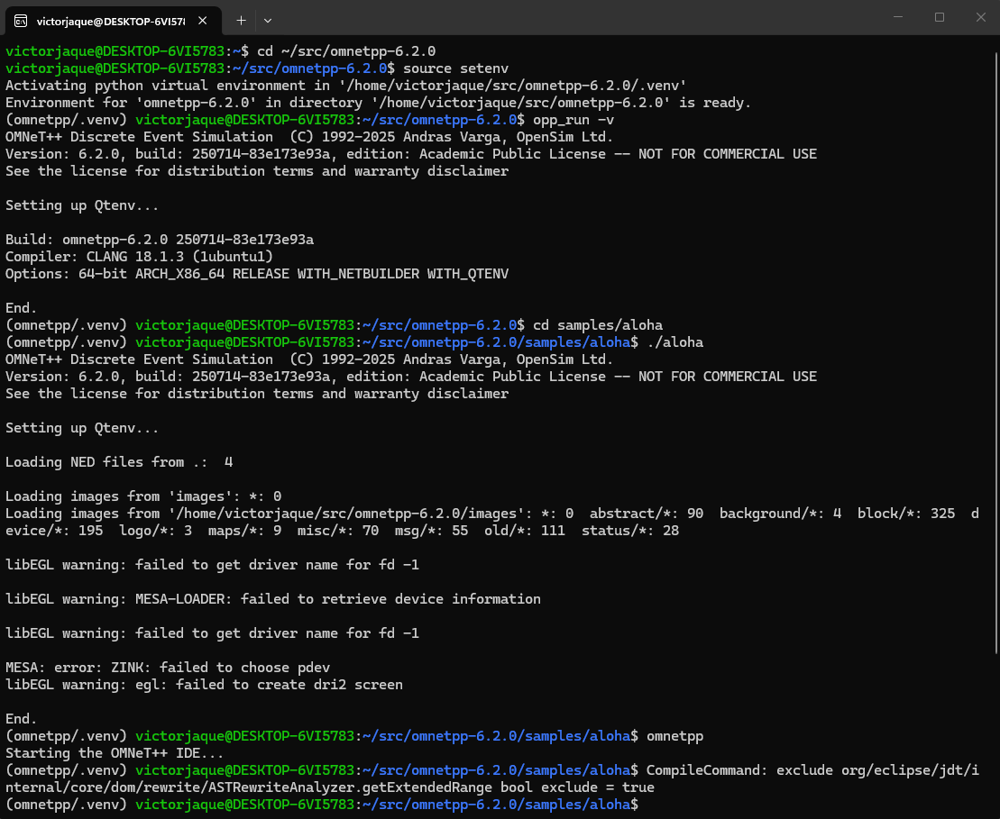

La captura parte de una terminal nueva: por eso empieza con `cd ~/src/omnetpp-6.2.0` y `source setenv`.

Si las tres pruebas funcionan, OMNeT++ está instalado y puedes pasar al paso 3.

---

### Paso 3: SUMO 1.22.0

SUMO genera y mueve los vehículos de la simulación.

En este manual SUMO **se compila desde el código fuente**, porque en este trabajo se modifica SUMO (por ejemplo, para implementar controladores nuevos). Para eso, la guía de Plexe indica bajar el código fuente de SUMO 1.22.0 y compilarlo.

**Fuente:** guía oficial de Plexe, [*Step 3: Install SUMO*](https://plexe.car2x.org/building/#step-3-install-sumo), que remite a la guía oficial de SUMO. Los pasos 3.1 a 3.5 y el 3.7 siguen la [guía de compilación de SUMO 1.22.0 para Linux](https://github.com/eclipse-sumo/sumo/blob/v1_22_0/docs/web/docs/Installing/Linux_Build.md).

#### 3.1 Instalar las dependencias

Las dependencias son las herramientas y librerías que SUMO necesita para compilarse (por ejemplo CMake, el compilador de C++ y la librería de la ventana `sumo-gui`). No vienen en el paso 1, así que se instalan aquí con `apt`. `sudo` te pide tu contraseña de Ubuntu, como en el paso 1.

Antes de instalarlas, actualiza la lista de paquetes de Ubuntu. Esa lista dice qué versiones hay en el servidor de Ubuntu. La del paso 1 ya está vieja, y con una lista vieja `apt` intenta bajar versiones que ya no existen y la instalación falla.

En una terminal de Ubuntu, nueva o la que ya tengas abierta, ejecuta el siguiente comando:

```bash
sudo apt update
```

**Fuente:** agregado en este manual; la guía de SUMO no lo incluye. Es el mismo comando del paso 1.1.

**Así debería verse tu terminal** (abreviado):

```text
victorjaque@DESKTOP-6VI5783:~$ sudo apt update
[sudo] password for victorjaque:
Hit:1 http://archive.ubuntu.com/ubuntu noble InRelease
Get:2 http://archive.ubuntu.com/ubuntu noble-updates InRelease [126 kB]
Get:3 http://archive.ubuntu.com/ubuntu noble-backports InRelease [126 kB]
Get:4 http://security.ubuntu.com/ubuntu noble-security InRelease [126 kB]
...
Get:22 http://security.ubuntu.com/ubuntu noble-security/restricted Translation-en [361 kB]
Fetched 11.3 MB in 4s (2813 kB/s)
Reading package lists... Done
Building dependency tree... Done
Reading state information... Done
32 packages can be upgraded. Run 'apt list --upgradable' to see them.
```

El aviso final (*32 packages can be upgraded*) es normal y no impide seguir: esas actualizaciones corresponden al paso 0.5.

**Ejemplo real: así se vio `sudo apt update` en el equipo de referencia**

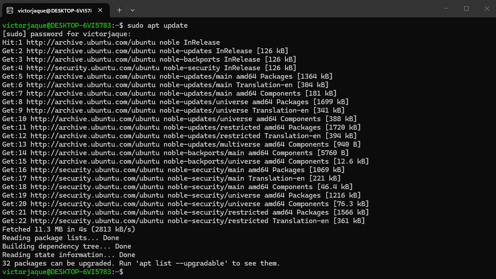

Ahora instala las dependencias. `apt` muestra un resumen y pregunta `Do you want to continue? [Y/n]`: escribe `Y` y presiona Enter.

En la misma terminal, ejecuta el siguiente comando:

```bash
sudo apt-get install git cmake python3 g++ libxerces-c-dev libfox-1.6-dev libgdal-dev libproj-dev libgl2ps-dev python3-dev swig default-jdk maven libeigen3-dev
```

**Fuente:** [guía de compilación de SUMO 1.22.0 para Linux](https://github.com/eclipse-sumo/sumo/blob/v1_22_0/docs/web/docs/Installing/Linux_Build.md), primera línea del bloque *For ubuntu this boils down to*. De ese bloque solo se usa esta línea; el código de SUMO se baja en el paso 3.2.

**Así debería verse tu terminal** antes de confirmar (abreviado):

```text
victorjaque@DESKTOP-6VI5783:~$ sudo apt-get install git cmake python3 g++ libxerces-c-dev libfox-1.6-dev libgdal-dev libproj-dev libgl2ps-dev python3-dev swig default-jdk maven libeigen3-dev
...
The following packages will be upgraded:
  libegl-mesa0 libgbm1 libgl1-mesa-dri libglx-mesa0 libheif-plugin-aomdec libheif-plugin-aomenc libheif1 libssl3t64
  mesa-libgallium mesa-vulkan-drivers openssl
11 upgraded, 207 newly installed, 0 to remove and 21 not upgraded.
Need to get 270 MB of archives.
After this operation, 869 MB of additional disk space will be used.
Do you want to continue? [Y/n]
```

También actualiza 11 paquetes que ya estaban instalados; es normal. En el equipo de referencia fueron **207 paquetes nuevos** y **11 actualizados**: 270 MB de descarga y 869 MB de disco.

**Ejemplo real: el resumen antes de confirmar, en el equipo de referencia**

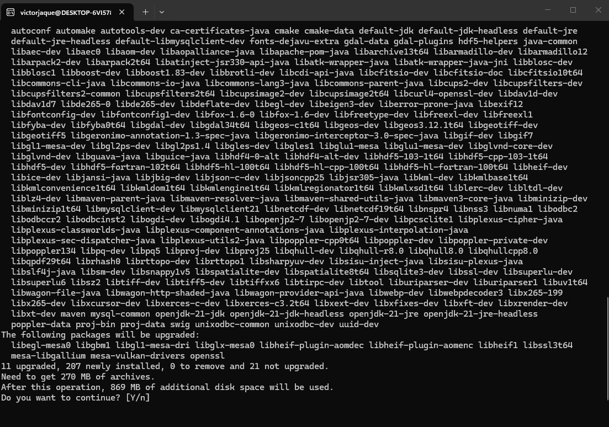

**Así debería verse tu terminal** al terminar (abreviado):

```text
...
Setting up default-jre-headless (2:1.21-75+exp1) ...
Setting up default-jre (2:1.21-75+exp1) ...
Setting up openjdk-21-jdk:amd64 (21.0.12.1+1-1~24.04.4) ...
update-alternatives: using /usr/lib/jvm/java-21-openjdk-amd64/bin/jconsole to provide /usr/bin/jconsole (jconsole) in auto mode
Setting up default-jdk-headless (2:1.21-75+exp1) ...
Setting up default-jdk (2:1.21-75+exp1) ...
victorjaque@DESKTOP-6VI5783:~$
```

Terminó bien cuando vuelve a aparecer `victorjaque@...:~$` sin mensajes que empiecen con `E:`. En el equipo de referencia tardó unos dos minutos.

**Ejemplo real: el final de la instalación en el equipo de referencia**

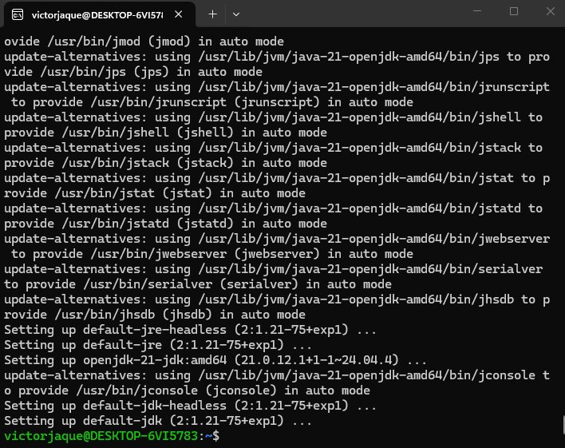

#### 3.2 Descargar

Ahora tienes que descargar el código fuente de SUMO 1.22.0, un archivo de 77 MB que está en el sitio oficial de SUMO, y descomprimirlo dentro de `~/src/`, donde ya está OMNeT++.

Para eso, en una terminal de Ubuntu, nueva o la que ya tengas abierta, ejecuta los siguientes comandos:

```bash
cd ~/src
wget https://sumo.dlr.de/releases/1.22.0/sumo-src-1.22.0.tar.gz
```

**Fuente:** el archivo `sumo-src-1.22.0.tar.gz` es el que indica la [guía de compilación de SUMO 1.22.0 para Linux](https://github.com/eclipse-sumo/sumo/blob/v1_22_0/docs/web/docs/Installing/Linux_Build.md#release-version-or-nightly-tarball) (sección *release version or nightly tarball*) cuando se necesita una versión específica. Si revisas la guía de Plexe ([*Step 3*](https://plexe.car2x.org/building/#step-3-install-sumo)), verás que enlaza otro archivo: el ZIP de SUMO 1.22.0 en GitHub (`v1_22_0.zip`). Aquí se usa `sumo-src-1.22.0.tar.gz`, porque es el archivo que indica la guía de SUMO para compilar una versión específica. La carpeta `~/src` y el uso de `wget` los agrega este manual: la guía no indica una carpeta y solo da el enlace de descarga.

**Así debería verse tu terminal** (barra de progreso acortada):

```text
victorjaque@DESKTOP-6VI5783:~$ cd ~/src
victorjaque@DESKTOP-6VI5783:~/src$ wget https://sumo.dlr.de/releases/1.22.0/sumo-src-1.22.0.tar.gz
--2026-10-02 15:10:33--  https://sumo.dlr.de/releases/1.22.0/sumo-src-1.22.0.tar.gz
Resolving sumo.dlr.de (sumo.dlr.de)... 129.247.254.27
Connecting to sumo.dlr.de (sumo.dlr.de)|129.247.254.27|:443... connected.
HTTP request sent, awaiting response... 200 OK
Length: 80686453 (77M) [application/x-gzip]
Saving to: ‘sumo-src-1.22.0.tar.gz’

sumo-src-1.22.0.tar.gz      100%[=====================>]  76.95M  2.46MB/s    in 26s

2026-10-02 15:11:00 (2.96 MB/s) - ‘sumo-src-1.22.0.tar.gz’ saved [80686453/80686453]
```

La descarga está completa cuando los dos números de `saved [80686453/80686453]` son iguales.

Cuando termine la descarga, en la misma terminal, dentro de `~/src`, ejecuta los siguientes comandos:

```bash
tar xzf sumo-src-1.22.0.tar.gz
cd sumo-1.22.0/
pwd
```

**Fuente:** [guía de compilación de SUMO 1.22.0 para Linux](https://github.com/eclipse-sumo/sumo/blob/v1_22_0/docs/web/docs/Installing/Linux_Build.md#release-version-or-nightly-tarball), sección *release version or nightly tarball*. Son los tres comandos de la guía, con la versión `1.22.0`. La guía usa `pwd` para conocer la ruta de la carpeta de SUMO, que va en `SUMO_HOME` (paso 3.3).

**Así debería verse tu terminal:**

```text
victorjaque@DESKTOP-6VI5783:~/src$ tar xzf sumo-src-1.22.0.tar.gz
victorjaque@DESKTOP-6VI5783:~/src$ cd sumo-1.22.0/
victorjaque@DESKTOP-6VI5783:~/src/sumo-1.22.0$ pwd
/home/victorjaque/src/sumo-1.22.0
```

`tar` no muestra nada mientras descomprime. `pwd` muestra la ruta de la carpeta de SUMO: anótala, la usarás en el paso 3.3.

**Ejemplo real: la descarga y la descompresión de SUMO en el equipo de referencia**

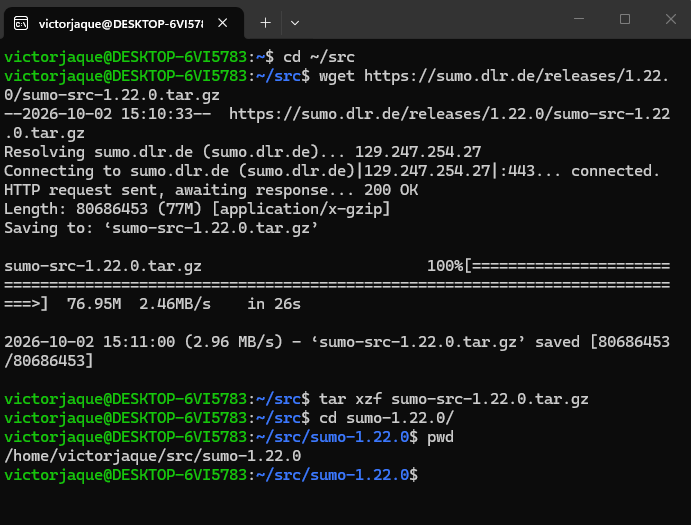

#### 3.3 Definir SUMO_HOME

Ahora tienes que definir `SUMO_HOME`, una variable que indica dónde está la carpeta de SUMO. La guía de SUMO pide definirla antes de compilar. También vas a agregar la carpeta `bin` de SUMO al PATH, para que la terminal encuentre el programa `sumo` desde cualquier carpeta: Veins arranca SUMO por su nombre, `sumo`.

Las dos líneas se guardan al final de `~/.profile`, un archivo que Ubuntu lee cada vez que abres una terminal. Así quedan definidas en todas tus terminales, no solo en la actual.

Para eso, en la misma terminal, dentro de `~/src/sumo-1.22.0`, ejecuta los siguientes comandos:

```bash
echo 'export SUMO_HOME="$HOME/src/sumo-1.22.0"' >> ~/.profile
echo 'export PATH="$SUMO_HOME/bin:$PATH"' >> ~/.profile
tail -n 2 ~/.profile
```

**Fuente:**

- [Guía de compilación de SUMO 1.22.0 para Linux](https://github.com/eclipse-sumo/sumo/blob/v1_22_0/docs/web/docs/Installing/Linux_Build.md#definition-of-sumo_home), sección *Definition of SUMO_HOME*: la línea `export SUMO_HOME=...`, y guardarla al final de `~/.profile` para que quede definida en todas las sesiones. La guía escribe la ruta como `/home/<user>/sumo-<version>`; aquí va `$HOME/src/sumo-1.22.0`, la ruta que mostró `pwd` en el paso 3.2.
- Agregado en este manual:
    - Escribir las líneas con `echo … >>`, en vez de abrir `~/.profile` con un editor. El resultado es el mismo: la línea queda al final del archivo.
    - La línea del PATH. La guía solo dice que SUMO se ejecuta desde su carpeta `bin`; el PATH hace falta porque Veins arranca SUMO con el comando `sumo` ([`veins_launchd` de Veins 5.3.1](https://github.com/sommer/veins/blob/veins-5.3.1/bin/veins_launchd#L652), opción `--command`, que por defecto es `sumo`).
    - `tail -n 2 ~/.profile`, para ver las dos líneas agregadas.

**Así debería verse tu terminal:**

```text
victorjaque@DESKTOP-6VI5783:~/src/sumo-1.22.0$ echo 'export SUMO_HOME="$HOME/src/sumo-1.22.0"' >> ~/.profile
victorjaque@DESKTOP-6VI5783:~/src/sumo-1.22.0$ echo 'export PATH="$SUMO_HOME/bin:$PATH"' >> ~/.profile
victorjaque@DESKTOP-6VI5783:~/src/sumo-1.22.0$ tail -n 2 ~/.profile
export SUMO_HOME="$HOME/src/sumo-1.22.0"
export PATH="$SUMO_HOME/bin:$PATH"
```

Los dos `echo` no muestran nada. `tail` muestra las dos últimas líneas de `~/.profile`: deben ser las dos que agregaste.

**Ejemplo real: las dos líneas agregadas a `~/.profile` en el equipo de referencia**

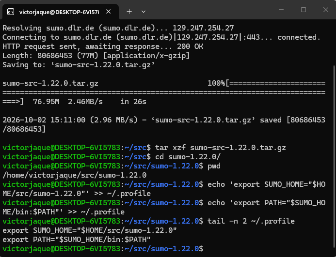

Ahora cierra la terminal y abre una nueva, para que Ubuntu lea `~/.profile` con las líneas nuevas. En la terminal nueva, ejecuta el siguiente comando:

```bash
echo $SUMO_HOME
```

**Fuente:** [guía de compilación de SUMO 1.22.0 para Linux](https://github.com/eclipse-sumo/sumo/blob/v1_22_0/docs/web/docs/Installing/Linux_Build.md#definition-of-sumo_home), sección *Definition of SUMO_HOME*: después de editar `~/.profile` hay que reiniciar la sesión, y se comprueba con `echo $SUMO_HOME`.

**Así debería verse tu terminal:**

```text
victorjaque@DESKTOP-6VI5783:~$ echo $SUMO_HOME
/home/victorjaque/src/sumo-1.22.0
```

Si muestra la ruta de la carpeta de SUMO, `SUMO_HOME` quedó definido.

**Ejemplo real: `SUMO_HOME` en una terminal nueva del equipo de referencia**

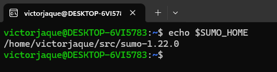

#### 3.4 Instalar los paquetes de Python

Ahora tienes que instalar los paquetes de Python que pide la guía de SUMO. Son para las herramientas de Python de SUMO (la carpeta `tools/`), que netedit abre desde su menú; según la guía, la compilación los usa para preparar esas herramientas.

La guía da dos comandos: primero uno con `apt` y después uno con `pip`. En Ubuntu 24.04 solo funciona el de `apt`, como se explica más abajo.

Primero instala los paquetes con `apt`. `sudo` te pide tu contraseña y después `apt` pregunta `Do you want to continue? [Y/n]`: escribe `Y` y presiona Enter.

Para eso, en una terminal de Ubuntu, nueva o la que ya tengas abierta, ejecuta el siguiente comando:

```bash
sudo apt-get install python3-pyproj python3-rtree python3-pandas flake8 python3-autopep8 python3-pulp python3-ezdxf
```

**Fuente:** [guía de compilación de SUMO 1.22.0 para Linux](https://github.com/eclipse-sumo/sumo/blob/v1_22_0/docs/web/docs/Installing/Linux_Build.md#installing-python-packages-for-the-tools), sección *Installing Python packages for the tools*.

**Así debería verse tu terminal** (inicio y final, abreviado):

```text
victorjaque@DESKTOP-6VI5783:~$ sudo apt-get install python3-pyproj python3-rtree python3-pandas flake8 python3-autopep8 python3-pulp python3-ezdxf
[sudo] password for victorjaque:
Reading package lists... Done
Building dependency tree... Done
Reading state information... Done
The following additional packages will be installed:
  blt coinor-cbc coinor-libcbc3.1 coinor-libcgl1 coinor-libclp1 coinor-libcoinutils3v5 coinor-libosi1v5 fonts-lyx isympy-common isympy3 ...
...
Setting up python3-ezdxf (1.1.3-1) ...
Setting up python3-matplotlib (3.6.3-1ubuntu5) ...
Processing triggers for libc-bin (2.39-0ubuntu8.9) ...
Processing triggers for man-db (2.12.0-4build2) ...
Processing triggers for fontconfig (2.15.0-1.1ubuntu2) ...
victorjaque@DESKTOP-6VI5783:~$
```

En el equipo de referencia instaló 77 paquetes y terminó sin ningún mensaje que empiece con `E:`.

**Ejemplo real: el inicio de la instalación en el equipo de referencia**

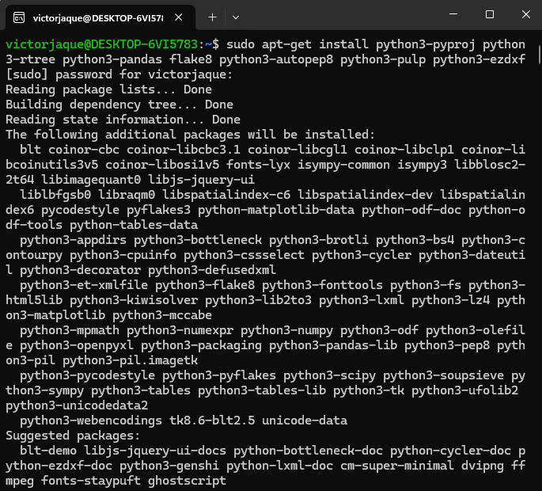

Después, la guía de SUMO pide instalar el resto de los paquetes con `pip`, desde dos listas que vienen en la carpeta de SUMO (`tools/requirements.txt` y `tools/req_dev.txt`). En Ubuntu 24.04 ese comando falla y no instala nada.

**Los comandos que siguen no son necesarios para instalar SUMO: puedes saltarlos e ir directo al paso 3.5.** Se dejan en el manual solo para mostrar que la guía pide este paso pero que en Ubuntu 24.04 no se puede hacer. En el equipo de referencia se ejecutaron para documentar el error, que es inofensivo.

Si quieres comprobarlo, en la misma terminal ejecuta los siguientes comandos:

```bash
cd ~/src/sumo-1.22.0
python3 -m pip install -r tools/requirements.txt -r tools/req_dev.txt
```

**Fuente:** [guía de compilación de SUMO 1.22.0 para Linux](https://github.com/eclipse-sumo/sumo/blob/v1_22_0/docs/web/docs/Installing/Linux_Build.md#installing-python-packages-for-the-tools), sección *Installing Python packages for the tools*. El `cd` lo agrega este manual, porque las dos listas están dentro de la carpeta de SUMO. **Estos comandos son solo para comprobar el error: no instalan ni cambian nada.**

!!! failure "Error: externally-managed-environment"
    **Cuándo aparece:** al ejecutar el `pip` de la guía de SUMO en Ubuntu 24.04.

    **Qué significa:** Ubuntu 24.04 no deja instalar paquetes con `pip` en el Python del sistema. El propio mensaje propone usar `apt`; el comando anterior ya instaló con `apt` los paquetes que indica la guía. `pip` no instala nada.

    ```text
    victorjaque@DESKTOP-6VI5783:~/src/sumo-1.22.0$ python3 -m pip install -r tools/requirements.txt -r tools/req_dev.txt
    error: externally-managed-environment

    × This environment is externally managed
    ╰─> To install Python packages system-wide, try apt install
        python3-xyz, where xyz is the package you are trying to
        install.
    ...
    ```

    **Ejemplo real: el final del `apt-get` y el error de `pip` en el equipo de referencia**

    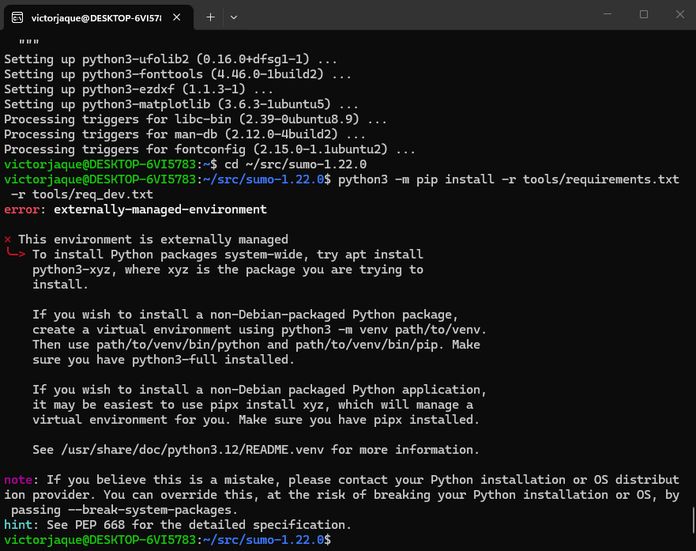

**Qué hacer: nada más, sigue con el paso 3.5**

Con los paquetes de `apt` basta para este trabajo:

- SUMO compila sin los paquetes de `pip`. Así lo hace el propio equipo de SUMO: en sus pruebas automáticas de la versión 1.22.0, sobre Ubuntu 24.04, compila SUMO antes de instalar esos paquetes ([`linux.yml`](https://github.com/eclipse-sumo/sumo/blob/v1_22_0/.github/workflows/linux.yml)).
- Veins no los necesita para arrancar SUMO: el programa con el que lo arranca ([`veins_launchd`](https://github.com/sommer/veins/blob/veins-5.3.1/bin/veins_launchd)) solo usa módulos que vienen con Python.
- Lo único que se pierde son las herramientas de Python de SUMO que necesitan algún paquete que no quedó instalado. Tres de esos paquetes no existen en Ubuntu: `fmpy`, `ortools` y `pandas_read_xml`.

!!! note "¿Puede dar problemas más adelante?"
    En principio no: SUMO compila y Veins lo arranca sin estos paquetes.

    Solo fallaría una herramienta de Python de SUMO que use uno de los paquetes que faltan, por ejemplo las de `tools/drt/`, que usan `ortools`. En ese caso aparece el error `No module named …`. La solución es instalar ese paquete en un entorno virtual de Python, como propone el mensaje de error de `pip`.

#### 3.5 Compilar

Ahora tienes que compilar SUMO. Igual que OMNeT++, se hace en dos etapas: primero `cmake -B build .` configura, es decir revisa qué hay instalado y prepara la carpeta `build`, y después `cmake --build` construye los programas de SUMO.

Hazlo en una terminal nueva, sin cargar el entorno de OMNeT++ (la línea no debe empezar con `(omnetpp/.venv)`): si está cargado, CMake usa el Python de OMNeT++, que no ve los paquetes que instalaste en el paso 3.4.

Para eso, abre una terminal de Ubuntu nueva y ejecuta los siguientes comandos:

```bash
cd ~/src/sumo-1.22.0
cmake -B build .
```

**Fuente:** [guía de compilación de SUMO 1.22.0 para Linux](https://github.com/eclipse-sumo/sumo/blob/v1_22_0/docs/web/docs/Installing/Linux_Build.md#building-the-sumo-binaries-with-cmake), sección *Building the SUMO binaries with cmake*, que indica ejecutar `cmake -B build .` en la carpeta de SUMO. La terminal nueva la agrega este manual: según la [documentación de CMake](https://cmake.org/cmake/help/v3.28/module/FindPython.html), si hay un entorno virtual de Python activo, CMake usa primero ese Python.

**Así debería verse tu terminal** (inicio y final, abreviado):

```text
victorjaque@DESKTOP-6VI5783:~$ cd ~/src/sumo-1.22.0
victorjaque@DESKTOP-6VI5783:~/src/sumo-1.22.0$ cmake -B build .
-- Setting build type to 'Release' as none was specified.
-- The CXX compiler identification is GNU 13.3.0
-- The C compiler identification is GNU 13.3.0
...
-- Found ccache: /usr/bin/ccache
...
-- Found Python: /usr/bin/python3 (found version "3.12.3") found components: ...
...
-- Found Git: /usr/bin/git (found version "2.43.0")
-- Enabled features: Linux-6.18.33.2-microsoft-standard-WSL2 x86_64 GNU 13.3.0 Release FMI Proj GUI Intl SWIG Eigen GDAL GL2PS
-- Configuring done (7.5s)
-- Generating done (0.1s)
-- Build files have been written to: /home/victorjaque/src/sumo-1.22.0/build
```

- *Build files have been written to* indica que la configuración terminó bien. En el equipo de referencia tardó unos 8 segundos.
- `Found Python: /usr/bin/python3` confirma que CMake usa el Python de Ubuntu.

**Ejemplo real: así empieza `cmake -B build .` en el equipo de referencia**

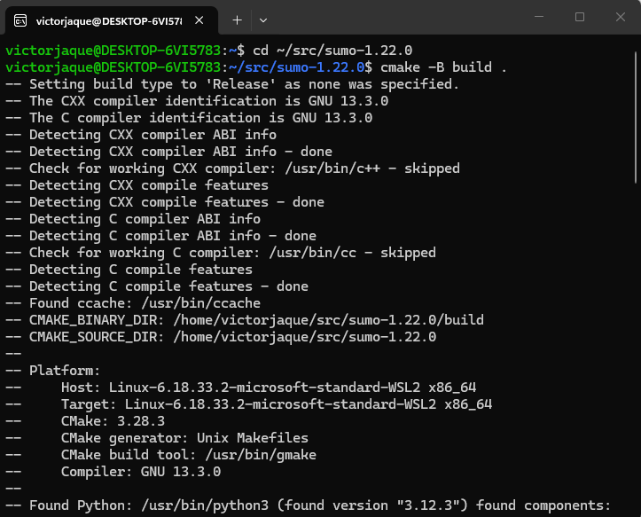

Cuando termine, en la misma terminal, dentro de `~/src/sumo-1.22.0`, ejecuta el siguiente comando:

```bash
cmake --build build -j $(nproc)
```

**Fuente:** [guía de compilación de SUMO 1.22.0 para Linux](https://github.com/eclipse-sumo/sumo/blob/v1_22_0/docs/web/docs/Installing/Linux_Build.md#building-the-sumo-binaries-with-cmake), sección *Building the SUMO binaries with cmake*. El `$(nproc)` también es de la guía: escribe la cantidad de núcleos (28 en el equipo de referencia), para compilar en paralelo.

**Así debería verse tu terminal** (inicio y final, abreviado):

```text
victorjaque@DESKTOP-6VI5783:~/src/sumo-1.22.0$ cmake --build build -j $(nproc)
[  0%] Building CXX object src/utils/xml/CMakeFiles/utils_xml.dir/CommonXMLStructure.cpp.o
[  0%] Building CXX object src/microsim/engine/CMakeFiles/microsim_engine.dir/EngineParameters.cpp.o
[  0%] Generating version.h
...
[ 99%] Linking CXX executable /home/victorjaque/src/sumo-1.22.0/bin/netedit
[ 99%] Built target netedit
...
[100%] Linking CXX shared module /home/victorjaque/src/sumo-1.22.0/tools/libsumo/_libsumo.so
[100%] Built target libsumo
victorjaque@DESKTOP-6VI5783:~/src/sumo-1.22.0$
```

- Terminó bien cuando aparece `[100%] Built target …` y vuelve la línea `victorjaque@...:~/src/sumo-1.22.0$`.
- Los programas de SUMO quedan en `~/src/sumo-1.22.0/bin`, por ejemplo `sumo`, `sumo-gui` y `netedit`. En el equipo de referencia tardó unos 3 minutos y medio.

**Ejemplo real: así termina `cmake -B build .` y empieza `cmake --build` en el equipo de referencia**

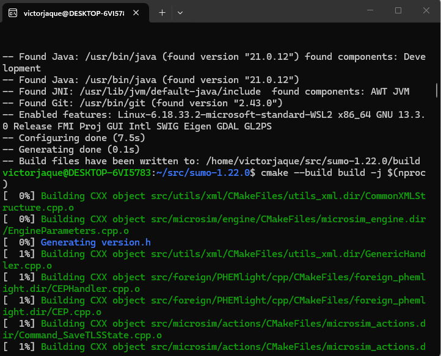

**Ejemplo real: así termina `cmake --build` en el equipo de referencia**

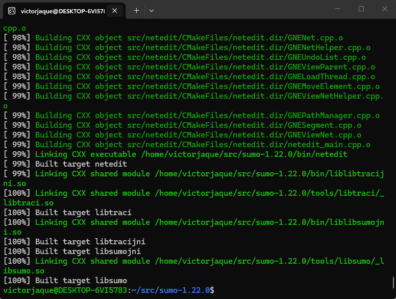

La guía de SUMO sigue con [*Installing the SUMO binaries*](https://github.com/eclipse-sumo/sumo/blob/v1_22_0/docs/web/docs/Installing/Linux_Build.md#installing-the-sumo-binaries), un paso opcional que copia los programas a otra carpeta. Aquí no se hace: SUMO se usa desde `bin`, que agregaste al PATH en el paso 3.3.

#### 3.6 Verificar

Ahora comprueba que el comando `sumo`, con el que Veins arranca SUMO (paso 3.3), es el que compilaste y que su versión es 1.22.0.

En una terminal de Ubuntu, nueva o la que ya tengas abierta, ejecuta los siguientes comandos:

```bash
which sumo
sumo --version
```

**Fuente:** `which sumo` lo usa el [FAQ de Plexe](https://plexe.car2x.org/faq/) para comprobar qué SUMO se ejecuta. La opción `--version` está en la [documentación de SUMO 1.22.0](https://github.com/eclipse-sumo/sumo/blob/v1_22_0/docs/web/docs/sumo.md#report), página *sumo*, sección *Report*. Usarlos para verificar la instalación lo agrega este manual: ni la guía de Plexe ni la de SUMO traen este paso.

**Así debería verse tu terminal** (abreviado):

```text
victorjaque@DESKTOP-6VI5783:~$ which sumo
/home/victorjaque/src/sumo-1.22.0/bin/sumo
victorjaque@DESKTOP-6VI5783:~$ sumo --version
Eclipse SUMO sumo Version 1.22.0
 Build features: Linux-6.18.33.2-microsoft-standard-WSL2 x86_64 GNU 13.3.0 Release FMI Proj GUI Intl SWIG Eigen GDAL GL2PS
 Copyright (C) 2001-2025 German Aerospace Center (DLR) and others; https://sumo.dlr.de

Eclipse SUMO sumo Version 1.22.0 is part of SUMO.
...
```

- `which sumo` muestra que la terminal usa el SUMO que compilaste, en `~/src/sumo-1.22.0/bin`.
- `sumo --version` confirma la versión **1.22.0**. El resto de la salida es el texto de la licencia de SUMO.

**Ejemplo real: `which sumo` y `sumo --version` en el equipo de referencia**

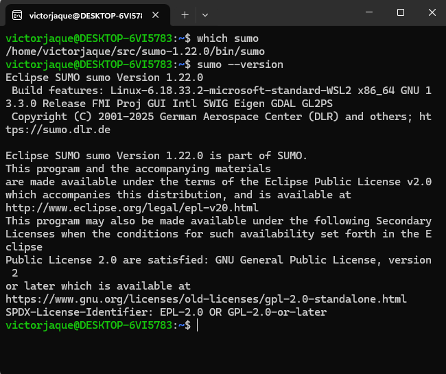

#### 3.7 Recompilar después de modificar SUMO

Cuando modificas el código de SUMO, por ejemplo un controlador, los programas que ya compilaste (`sumo`, `sumo-gui` y los demás) no cambian solos. Hay que volver a compilar para que incluyan tu cambio.

No hace falta compilar SUMO entero otra vez. Basta con ejecutar `make` dentro de la carpeta `build`. `make` revisa qué archivos cambiaron desde la última compilación, recompila solo esos y los que dependen de ellos, y vuelve a armar los programas que los usan. Si cambiaste un archivo `.cpp`, recompila solo ese. Si cambiaste un `.h`, recompila todos los archivos que lo incluyen.

En una terminal de Ubuntu, nueva o la que ya tengas abierta, ejecuta los siguientes comandos:

```bash
cd ~/src/sumo-1.22.0/build
make -j $(nproc)
```

**Fuente:** [guía de compilación de SUMO 1.22.0 para Linux](https://github.com/eclipse-sumo/sumo/blob/v1_22_0/docs/web/docs/Installing/Linux_Build.md#frequent-rebuilds), sección *(Frequent) Rebuilds*: entrar a la carpeta `build` y volver a ejecutar `make -j $(nproc)`. La explicación de cómo `make` recompila solo lo que cambió la agrega este manual; las guías no la incluyen.

**Así debería verse tu terminal** (inicio y final, abreviado):

```text
victorjaque@DESKTOP-6VI5783:~$ cd ~/src/sumo-1.22.0/build
victorjaque@DESKTOP-6VI5783:~/src/sumo-1.22.0/build$ make -j $(nproc)
[  0%] Built target install_dll
[  0%] Built target generate-version-h
[  1%] Built target foreign_tcpip
...
[ 96%] Built target sumo
[ 96%] Built target sumo-gui
...
[100%] Built target libsumofmi2
[100%] Built target prepfmi
[100%] Built target fmi
victorjaque@DESKTOP-6VI5783:~/src/sumo-1.22.0/build$
```

- Terminó bien cuando aparece `[100%] Built target …` y vuelve la línea `victorjaque@...:~/src/sumo-1.22.0/build$`.
- Como no se cambió el código, no compila ningún archivo: solo aparecen líneas *Built target*, sin *Building CXX object*.

**Ejemplo real: así empieza `make` en el equipo de referencia**

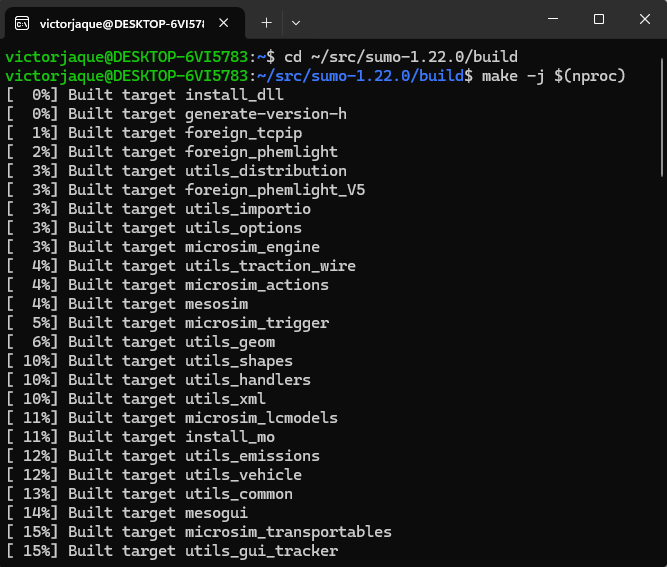

**Ejemplo real: así termina `make` en el equipo de referencia**

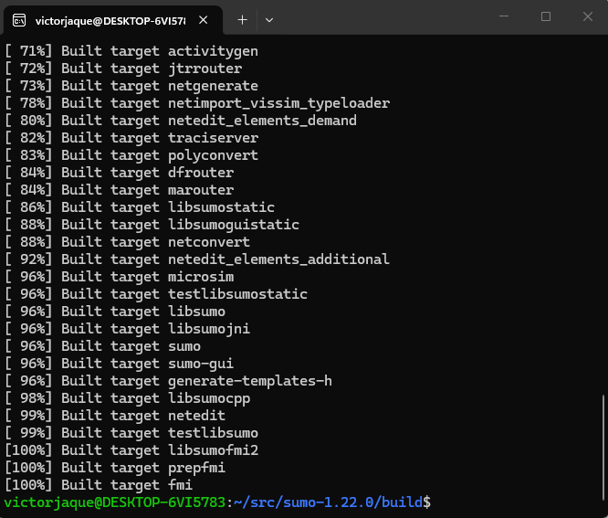

!!! tip "Si la recompilación da problemas"
    Si actualizaste librerías de Ubuntu o la compilación falla, la guía de SUMO aconseja compilar desde cero: borra la carpeta `build` y repite el paso 3.5. Así CMake vuelve a buscar las librerías en vez de usar las que guardó.

    **Fuente:** [guía de compilación de SUMO 1.22.0 para Linux](https://github.com/eclipse-sumo/sumo/blob/v1_22_0/docs/web/docs/Installing/Linux_Build.md#frequent-rebuilds), sección *(Frequent) Rebuilds*.

Con esto, SUMO está instalado y puedes pasar al paso 4.

---

### Paso 4: Veins 5.3.1

Veins es el puente: sincroniza el reloj de la simulación de red (OMNeT++) con el de la simulación de tráfico (SUMO), y añade la capa de comunicación vehicular sobre la que Plexe construye sus protocolos.

#### 4.1 Descargar

Se puede clonar el repositorio o bajar el ZIP y descomprimirlo en `~/src/`. La documentación oficial recomienda clonar.

```bash
# PENDIENTE: descarga de Veins 5.3.1 (clonar repositorio o bajar ZIP)
```

#### 4.2 Compilar

Mismo esquema que OMNeT++: configurar y luego construir.

```bash
# PENDIENTE: configurar y compilar Veins
```

!!! warning "Requiere el entorno de OMNeT++ cargado"
    Este paso **falla** si en la terminal actual no cargaste antes el entorno de OMNeT++ (paso 2.2). Si abriste una terminal nueva desde entonces, vuelve a cargarlo.

---

### Paso 5: Plexe 3.2

Plexe es la capa que agrega el *platooning*: los controladores longitudinales cooperativos, los protocolos de coordinación y las maniobras.

#### 5.1 Descargar

Igual que Veins: clonar el repositorio o bajar el ZIP en `~/src/`. El repositorio es único y las versiones se distinguen mediante etiquetas, así que hay que apuntar a la etiqueta de la versión 3.2.

```bash
# PENDIENTE: descarga de Plexe 3.2 (clonar en la etiqueta plexe-3.2 o bajar ZIP)
```

#### 5.2 Compilar

Aquí aparece la única particularidad del proceso: al configurar Plexe hay que **indicarle explícitamente dónde está la carpeta de Veins** que acabas de construir. Es una ruta relativa desde la carpeta de Plexe.

```bash
# PENDIENTE: configurar Plexe indicando la ruta de Veins, y compilar
```

!!! warning "La causa más común de fallo en este paso"
    Si la ruta de Veins que le pasas no existe o apunta a una carpeta que no está compilada, la configuración falla. Verifica el nombre real de tu carpeta de Veins antes de ejecutar el comando: debe coincidir exactamente con lo que escribes.

---

### Paso 6: R y Python

Estas herramientas no participan en la simulación. Sirven para **extraer y graficar los resultados** que la simulación produce. Puedes correr Plexe sin ellas, pero no podrás analizar nada de lo que genere.

OMNeT++ 6 eliminó su complemento de R, así que la extracción de datos hoy funciona con una combinación de scripts de R y de Python.

#### 6.1 Librerías de R

Se instalan desde la consola de R.

```r
# PENDIENTE: instalación de las librerías de R para gráficos y manejo de datos
```

#### 6.2 Paquete de lectura de resultados de OMNeT++

Este es un paso que suele pasarse por alto, y sin él los scripts de extracción no funcionan: hay que instalar un paquete específico que permite a R leer los archivos de resultados que genera OMNeT++. Se baja como archivo comprimido, **sin descomprimirlo**, y se instala desde la consola de R apuntando al archivo local.

```r
# PENDIENTE: instalación del paquete de lectura de resultados de OMNeT++ en R
```

!!! note "Error de compilación con compiladores modernos"
    Al instalar este paquete puede aparecer un error de compilación relacionado con una función eliminada de la biblioteca estándar de C++. Se resuelve indicando a R que compile con un estándar de C++ anterior, mediante una línea en el archivo de configuración de compilación de R.

#### 6.3 Librerías de Python

```bash
# PENDIENTE: instalación de las librerías de Python para análisis de datos
```

---

### Paso 7: Verificación

Compilar sin errores no garantiza que la instalación esté correcta. Falta comprobar que las cuatro piezas se comunican entre sí, y la forma de saberlo es correr uno de los escenarios de ejemplo que trae Plexe y observar el pelotón en movimiento.

Qué deberías ver si todo está bien:

- La ventana de SUMO abriéndose con vehículos circulando en formación.
- Un pelotón que mantiene distancias regulares y estables entre vehículos.
- Ningún mensaje de error en la terminal, y archivos de resultados generados al terminar.

```bash
# PENDIENTE: correr un escenario de ejemplo de Plexe y verificar la salida
```

Si esto funciona, la instalación está terminada. Los escenarios de ejemplo se describen en detalle en la sección [Ejemplos](ejemplos/index.md).

---

## 6 · Otros sistemas

Este manual documenta Ubuntu 24.04 porque es el entorno del laboratorio. Para referencia, así se sitúan los demás casos:

!!! warning "Ninguno de estos caminos fue verificado"
    Lo que sigue es orientación general, no un procedimiento probado. Si vas por alguno de ellos, la referencia válida es la [guía oficial de compilación](https://plexe.car2x.org/building/), no este manual.

**macOS.** El procedimiento es prácticamente el mismo que en Linux. Las diferencias se concentran al principio: hay que instalar el gestor de paquetes MacPorts, que a su vez puede requerir Xcode, y en equipos con procesador Apple hay que ajustar un par de configuraciones para que OMNeT++ encuentre las librerías gráficas. Hecho eso, los pasos 2 a 7 de esta página se aplican tal cual.

**Windows (nativo).** Es posible compilar en Windows sin Linux, usando MinGW, pero **no es recomendable**: requiere pasos manuales, la documentación oficial está desactualizada y su propio autor lo desaconseja. Si tu equipo es Windows, la vía correcta es WSL, como se explica en el paso 0.

**Ubuntu, Linux y WSL son lo mismo para efectos de esta guía.** Ubuntu es una distribución de Linux, y WSL corre Ubuntu real. No son tres caminos distintos: son un solo camino, el de esta página.

---

## 7 · Alternativa: Instant Plexe

**Instant Plexe** es una máquina virtual con todos los componentes ya instalados y compilados. Se descarga como un archivo de virtualización y se importa en VirtualBox o similar, lo que permite tener Plexe funcionando en minutos y sin compilar nada, en cualquier sistema operativo.

Sirve para probar Plexe rápidamente o para una clase de demostración. **No es el entorno de trabajo del laboratorio**, por dos razones:

- La versión disponible es la **3.0**, con OMNeT++ 5.6.2, Veins 5.1 y SUMO 1.7.0. No existe una imagen para Plexe 3.2, que es la versión que documenta este manual, y las diferencias entre 3.0 y 3.2 son sustanciales.
- Al correr dentro de una máquina virtual el rendimiento es menor, y el desarrollo de código propio resulta más incómodo.

Si tu objetivo es trabajar sobre Plexe, es decir modificar controladores, escribir protocolos o correr experimentos, la instalación de la sección 5 es el camino.

---

## 8 · Problemas frecuentes

**Un comando no se encuentra, o la compilación falla sin razón aparente.**
Casi siempre es el entorno de OMNeT++ sin cargar en esa terminal. Vuelve al paso 2.2. Ocurre especialmente al abrir una terminal nueva o al reiniciar el computador.

**La configuración de Plexe no encuentra Veins.**
La ruta que pasaste no coincide con el nombre real de tu carpeta de Veins. Verifica el nombre exacto de la carpeta y corrige la ruta relativa.

**La simulación falla al arrancar aunque todo compiló bien.**
Revisa la versión de SUMO. Si es posterior a la 1.22.0, la API de TraCI es incompatible con Veins 5.3.1 y el error aparece solo en tiempo de ejecución, no al compilar.

**`./configure` de OMNeT++ se detiene con *Cannot find OpenSceneGraph 3.2 or later*.**
Falta la librería de la vista 3D, que la guía de Plexe no instala. Desactívala con `WITH_OSG=no` en `configure.user` y vuelve a ejecutar `./configure`, como se explica en el [paso 2.3](#23-compilar). Si `./configure` se detiene por otra librería ausente, la salida es la misma: instalarla, o desactivar la opción correspondiente en `configure.user`.

**El `pip` de la guía de SUMO se detiene con *error: externally-managed-environment*.**
Ubuntu 24.04 no deja instalar paquetes con `pip` en el Python del sistema. Basta con los paquetes de `apt`, como se explica en el [paso 3.4](#34-instalar-los-paquetes-de-python): SUMO compila sin los de `pip`.

**Error al instalar el paquete de resultados en R.**
Es la incompatibilidad con compiladores modernos de C++ descrita en el paso 6.2. Se resuelve forzando un estándar de C++ anterior en la configuración de compilación de R.

**La compilación es extremadamente lenta en WSL.**
El código está en una carpeta de Windows accesible desde `/mnt/c/`. Muévelo a `~/src/`, en el disco de Linux.

**El IDE de OMNeT++ o SUMO no abren ninguna ventana en WSL.**
Falta el soporte gráfico. En Windows 11 viene incluido con WSLg, así que asegúrate de tener WSL 2 actualizado.

**Error de tipo de generador de números aleatorios al correr una simulación.**
Es un problema conocido y documentado en las preguntas frecuentes del sitio oficial de Plexe.

---

## Referencias oficiales

- [Página de descargas de Plexe](https://plexe.car2x.org/download/): descarga del código e Instant Plexe
- [Guía de compilación de Plexe](https://plexe.car2x.org/building/): instrucciones por sistema operativo
- [OMNeT++](https://omnetpp.org/): descarga y manual de instalación
- [Veins](https://veins.car2x.org/): documentación del puente V2V
- [Guía de compilación de SUMO 1.22.0 para Linux](https://github.com/eclipse-sumo/sumo/blob/v1_22_0/docs/web/docs/Installing/Linux_Build.md): dependencias y compilación de SUMO desde el código fuente
