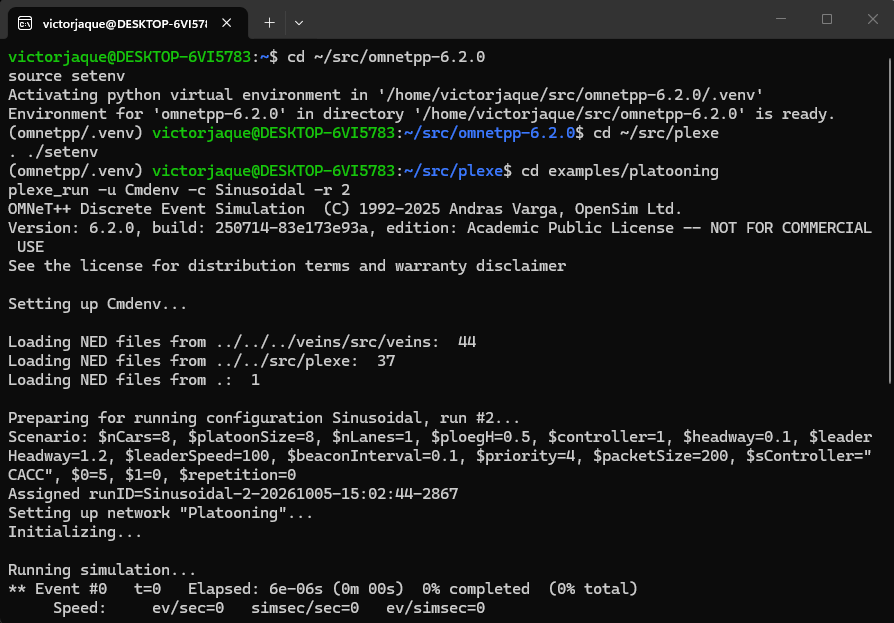
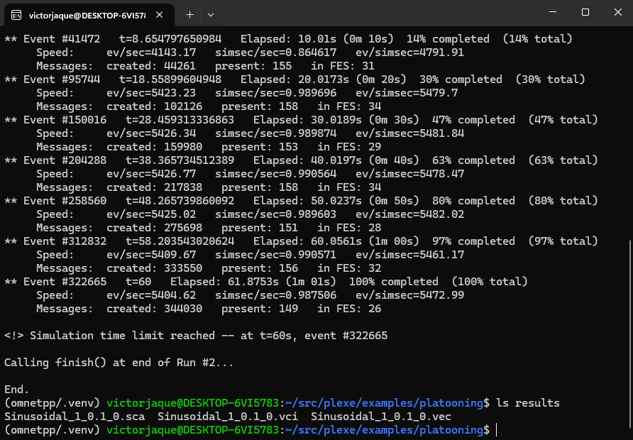
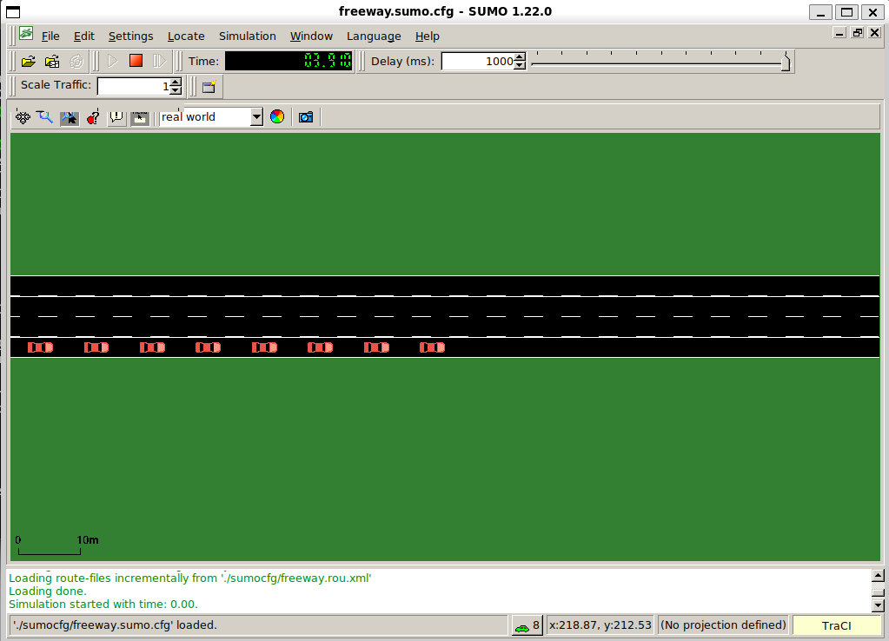

# Primera simulación

Ahora vamos a correr tu primera simulación con Plexe. Primero vamos a preparar la terminal, después vamos a correr el ejemplo `platooning`, que viene con Plexe, y al final vamos a graficar sus resultados.

En esta simulación trabajan juntos los cuatro componentes que instalaste: SUMO mueve los autos, OMNeT++ simula los mensajes que se envían entre ellos, Veins conecta los dos simuladores y Plexe agrega la conducción en pelotón.

Esta página sigue el tutorial oficial [*Example 1 - Running Plexe*](https://plexe.car2x.org/tutorial/).

## 1 · Antes de empezar

Ahora vamos a preparar la terminal. Una terminal nueva de Ubuntu no encuentra los programas de OMNeT++ ni los de Plexe hasta que cargas sus entornos: primero el de OMNeT++ y después el de Plexe.

Para esto necesitas Plexe instalado: los pasos 1 a 5 de [Instalación](instalacion.md). Para graficar, en la sección 6, también necesitas el paso 6.

En una terminal de Ubuntu, nueva o la que ya tengas abierta, ejecuta los siguientes comandos:

```bash
cd ~/src/omnetpp-6.2.0
source setenv
```

**Fuente:** guía oficial de Plexe ([*Step 1: Install OMNeT++*](https://plexe.car2x.org/building/#step-1-install-omnet)). Es lo mismo que en el [paso 2.2 de Instalación](instalacion.md#22-cargar-el-entorno).

Esto carga el entorno de OMNeT++: `plexe_run`, el programa que corre las simulaciones, usa `opp_run` de OMNeT++. Debe aparecer *Environment for 'omnetpp-6.2.0' … is ready*, como en el paso 2.2.

En la misma terminal, ejecuta los siguientes comandos:

```bash
cd ~/src/plexe
. ./setenv
```

**Fuente:** tutorial oficial de Plexe, [*Step 0. Building Plexe*](https://plexe.car2x.org/tutorial/#step-0-building-plexe).

El [`setenv` de Plexe](https://github.com/michele-segata/plexe/blob/plexe-3.2/setenv) agrega `~/src/plexe/bin` al PATH: ahí están `plexe_run` y `genmakefile.py`, que se usan más abajo. Solo funciona dentro de `~/src/plexe`, y si todo está bien no muestra nada.

Los dos entornos se cargan **en cada terminal nueva**. SUMO no necesita nada: el [paso 3.3](instalacion.md#33-definir-sumo_home) lo dejó en el PATH de todas las terminales, y Plexe lo abre por su nombre, `sumo-gui` o `sumo`.

## 2 · El ejemplo

Ahora vamos a ver qué simula el ejemplo `platooning`, antes de correrlo. Está en `~/src/plexe/examples/platooning`.

Según el tutorial, el ejemplo compara el ACC con los controladores cooperativos de Plexe. El ACC solo usa su radar, que mide la distancia y la velocidad del auto de adelante. Los cooperativos además reciben datos de otros autos del pelotón por comunicación inalámbrica (más detalle en [Controladores](controladores.md)). Con ACC y un tiempo de separación de 0.3 s el pelotón es inestable, y con 1.2 s es estable. Los cooperativos se mantienen estables aunque los autos vayan muy cerca, gracias a esa comunicación.

- 8 autos en un solo pelotón, en una pista, a 100 km/h.
- Los autos aparecen en `t = 1 s` y la simulación dura 60 s.
- Hay dos escenarios:
    - **`Sinusoidal`**: desde `t = 5 s` el líder acelera y frena de forma sinusoidal, con amplitud de 10 km/h y frecuencia de 0.2 Hz.
    - **`Braking`**: en `t = 5 s` el líder frena a 8 m/s².

Cada escenario tiene 6 corridas, una por controlador. El número de corrida es el que se pasa con `-r`:

| Corrida (`-r`) | Controlador |
|:-:|---|
| 0 | ACC, tiempo de separación 0.3 s |
| 1 | ACC, tiempo de separación 1.2 s |
| 2 | CACC |
| 3 | PLOEG |
| 4 | CONSENSUS |
| 5 | FLATBED |

**Fuente:** tutorial oficial, [*Description*](https://plexe.car2x.org/tutorial/#description), y el [`omnetpp.ini` del ejemplo](https://github.com/michele-segata/plexe/blob/plexe-3.2/examples/platooning/omnetpp.ini), secciones `[General]`, `[Config Sinusoidal]` y `[Config Braking]`. El tutorial habla de cinco configuraciones por escenario; el `omnetpp.ini` de Plexe 3.2 tiene seis.

## 3 · Correr la simulación

Ahora vamos a correr el ejemplo. Primero vas a correr una sola simulación con la ventana de SUMO, para ver a los autos (paso 3.1). Después vas a correr las demás sin ventanas, para tener los resultados de todos los controladores (paso 3.2).

### 3.1 Con ventanas

Vamos a correr la corrida 2 del escenario `Sinusoidal`, que usa CACC, con la ventana de SUMO abierta.

En la misma terminal, dentro de `~/src/plexe`, ejecuta los siguientes comandos:

```bash
cd examples/platooning
plexe_run -u Cmdenv -c Sinusoidal -r 2
```

**Fuente:** tutorial oficial, [*Running the example*](https://plexe.car2x.org/tutorial/#running-the-example).

- [`plexe_run`](https://github.com/michele-segata/plexe/blob/plexe-3.2/src/scripts/plexe_run.in.py) llama a `opp_run` de OMNeT++ con las librerías de Plexe y de Veins.
- `-u Cmdenv` corre OMNeT++ en la terminal, sin su interfaz gráfica. La ventana que se abre es la de SUMO: `[Config Sinusoidal]` usa `sumo-gui`.
- `-c Sinusoidal` elige la sección `[Config Sinusoidal]` de `omnetpp.ini`.
- `-r 2` elige la corrida 2: CACC.

En la carpeta del ejemplo, [`./run`](https://github.com/michele-segata/plexe/blob/plexe-3.2/examples/platooning/run) hace lo mismo, porque solo llama a `plexe_run`. Los [Casos prácticos](ejemplos/index.md) usan esa forma.

**Así debería verse tu terminal** (inicio, abreviado):

```text
(omnetpp/.venv) victorjaque@DESKTOP-6VI5783:~/src/plexe$ cd examples/platooning
plexe_run -u Cmdenv -c Sinusoidal -r 2
OMNeT++ Discrete Event Simulation  (C) 1992-2025 Andras Varga, OpenSim Ltd.
Version: 6.2.0, build: 250714-83e173e93a, edition: Academic Public License -- NOT FOR COMMERCIAL USE
...
Loading NED files from ../../../veins/src/veins:  44
Loading NED files from ../../src/plexe:  37
Loading NED files from .:  1

Preparing for running configuration Sinusoidal, run #2...
Scenario: $nCars=8, $platoonSize=8, $nLanes=1, $ploegH=0.5, $controller=1, $headway=0.1, $leaderHeadway=1.2, $leaderSpeed=100, $beaconInterval=0.1, $priority=4, $packetSize=200, $sController="CACC", $0=5, $1=0, $repetition=0
...
Running simulation...
** Event #0   t=0   Elapsed: 6e-06s (0m 00s)  0% completed  (0% total)
```

- *Loading NED files* de Veins, de Plexe y del ejemplo indica que OMNeT++ encontró los tres.
- *Scenario* muestra los parámetros de la corrida: 8 autos, controlador `CACC`.

**Ejemplo real: la carga de los entornos y el inicio de la simulación en el equipo de referencia**



**Así debería verse tu terminal** (final, abreviado):

```text
...
** Event #322665   t=60   Elapsed: 61.8753s (1m 01s)  100% completed  (100% total)
     Speed:     ev/sec=5404.62   simsec/sec=0.987506   ev/simsec=5472.99
     Messages:  created: 344030   present: 149   in FES: 26

<!> Simulation time limit reached -- at t=60s, event #322665

Calling finish() at end of Run #2...

End.
```

Terminó bien cuando aparece *Simulation time limit reached -- at t=60s* y después *End.* En el equipo de referencia tardó alrededor de 1 minuto.

Para comprobar que quedaron los resultados, en la misma terminal, dentro de `~/src/plexe/examples/platooning`, ejecuta el siguiente comando:

```bash
ls results
```

**Fuente:** el tutorial oficial indica que los resultados quedan en la carpeta `results` ([*Running the example*](https://plexe.car2x.org/tutorial/#running-the-example)). El comando [`ls`](https://manpages.ubuntu.com/manpages/noble/man1/ls.1.html) lo agrega este manual para listarlos.

**Así debería verse tu terminal:**

```text
(omnetpp/.venv) victorjaque@DESKTOP-6VI5783:~/src/plexe/examples/platooning$ ls results
Sinusoidal_1_0.1_0.sca  Sinusoidal_1_0.1_0.vci  Sinusoidal_1_0.1_0.vec
```

Son los archivos de la corrida 2 de `Sinusoidal` (más detalle en la [sección 5](#5-donde-quedan-los-resultados)).

**Ejemplo real: así termina la simulación en el equipo de referencia**



### 3.2 Sin ventanas

Ahora vamos a correr las 11 corridas que faltan, sin ventanas, para tener los resultados de los 6 controladores en los dos escenarios. Copia y pega el bloque completo: las corridas se ejecutan una tras otra.

Cuando termine la simulación del paso 3.1, en la misma terminal, dentro de `~/src/plexe/examples/platooning`, ejecuta los siguientes comandos:

```bash
plexe_run -u Cmdenv -c SinusoidalNoGui -r 0
plexe_run -u Cmdenv -c SinusoidalNoGui -r 1
plexe_run -u Cmdenv -c SinusoidalNoGui -r 3
plexe_run -u Cmdenv -c SinusoidalNoGui -r 4
plexe_run -u Cmdenv -c SinusoidalNoGui -r 5
plexe_run -u Cmdenv -c BrakingNoGui -r 0
plexe_run -u Cmdenv -c BrakingNoGui -r 1
plexe_run -u Cmdenv -c BrakingNoGui -r 2
plexe_run -u Cmdenv -c BrakingNoGui -r 3
plexe_run -u Cmdenv -c BrakingNoGui -r 4
plexe_run -u Cmdenv -c BrakingNoGui -r 5
```

**Fuente:** tutorial oficial, [*Running the example*](https://plexe.car2x.org/tutorial/#running-the-example).

- `SinusoidalNoGui` y `BrakingNoGui` son las mismas configuraciones, pero abren `sumo` en vez de `sumo-gui`: no hay ventanas.
- La lista no incluye `Sinusoidal -r 2` porque ya la corriste en el paso 3.1. Las configuraciones `NoGui` guardan sus resultados con el mismo nombre que las con ventanas, así que quedan todos juntos.

**Así debería verse tu terminal:**

```text
# PENDIENTE: salida real en el equipo de referencia
```

## 4 · Qué deberías ver

Ahora veamos qué deberías haber visto en la ventana de SUMO durante la corrida del paso 3.1:

- Se abre la ventana de SUMO con una autopista vacía, y la simulación parte sola, sin apretar nada.
- En `t = 1 s` aparece el pelotón de 8 autos.
- Los autos avanzan durante 60 s y la simulación se detiene.

**Fuente:** tutorial oficial, [*Running the example*](https://plexe.car2x.org/tutorial/#running-the-example). Que la simulación parta sola lo indica `<start value="true"/>` en [`sumocfg/freeway.sumo.cfg`](https://github.com/michele-segata/plexe/blob/plexe-3.2/examples/platooning/sumocfg/freeway.sumo.cfg).

**Ejemplo real: la ventana de SUMO en el equipo de referencia**



!!! note "En el escenario Sinusoidal casi no se nota el movimiento"
    En este escenario el líder acelera y frena de forma sinusoidal, con una amplitud de 10 km/h en torno a 100 km/h (ver [sección 2](#2-el-ejemplo)). En el equipo de referencia, en la ventana de SUMO no se notaba bien esa aceleración y ese frenado. En cambio, en el escenario `Braking` (`-c Braking`), donde el líder frena a 8 m/s², sí se ve el frenado del pelotón. Los gráficos de la [sección 6](#6-graficar-los-resultados) muestran el movimiento de los dos escenarios.

## 5 · Dónde quedan los resultados

Ahora vamos a ver dónde quedaron los resultados de las 12 corridas y cómo reconocer cada archivo.

Quedan en `~/src/plexe/examples/platooning/results/`. Cada corrida deja tres archivos, como mostró `ls results` en el paso 3.1: un `.vec` (vectores), con los valores que la simulación registró a lo largo del tiempo, como la velocidad de cada auto; un `.vci`, el índice del `.vec`; y un `.sca` (escalares). Los gráficos de la sección 6 se hacen con los `.vec`.

El nombre de cada archivo es `<escenario>_<controller>_<headway>_<repetición>`:

| Corrida (`-r`) | Archivo de `Sinusoidal` |
|:-:|---|
| 0 | `Sinusoidal_0_0.3_0.vec` |
| 1 | `Sinusoidal_0_1.2_0.vec` |
| 2 | `Sinusoidal_1_0.1_0.vec` |
| 3 | `Sinusoidal_2_0.1_0.vec` |
| 4 | `Sinusoidal_3_0.1_0.vec` |
| 5 | `Sinusoidal_4_0.1_0.vec` |

Los de `Braking` se llaman igual, con `Braking_` al comienzo.

!!! warning "El número del archivo no es el número de corrida"
    El primer número es el valor de `controller` en `omnetpp.ini` (`0, 0, 1, 2, 3, 4`), no la corrida. Por eso las dos corridas de ACC empiezan con `0` y se distinguen por el `headway`: 0.3 y 1.2.

**Fuente:** tutorial oficial, [*Running the example*](https://plexe.car2x.org/tutorial/#running-the-example) (carpeta `results`), y [`omnetpp.ini`](https://github.com/michele-segata/plexe/blob/plexe-3.2/examples/platooning/omnetpp.ini), líneas `output-vector-file`, `output-scalar-file`, `**.numericController` y `**.headway`.

## 6 · Graficar los resultados

Ahora vamos a convertir esos resultados en gráficos. Primero vamos a juntar los `.vec` de cada escenario en un solo archivo, y después vamos a dibujar los gráficos con dos scripts de R. Para esto necesitas R y Python, del [paso 6 de Instalación](instalacion.md#paso-6-r-y-python).

En la misma terminal, dentro de `~/src/plexe/examples/platooning`, ejecuta los siguientes comandos:

```bash
cd analysis
genmakefile.py parse-config > Makefile
make
```

**Fuente:** tutorial oficial, [*Plotting the results*](https://plexe.car2x.org/tutorial/#plotting-the-results).

- `genmakefile.py parse-config > Makefile` genera un `Makefile` a partir de [`parse-config`](https://github.com/michele-segata/plexe/blob/plexe-3.2/examples/platooning/analysis/parse-config), que indica qué escenarios leer: `Sinusoidal` y `Braking`. Qué datos sacar de cada auto lo dice [`map-config`](https://github.com/michele-segata/plexe/blob/plexe-3.2/examples/platooning/analysis/map-config): distancia, velocidad relativa, velocidad, aceleración y aceleración del controlador.
- `make` junta los `.vec` de cada escenario en un solo archivo: `results/Sinusoidal.Rdata` y `results/Braking.Rdata`.

**Así debería verse tu terminal:**

```text
# PENDIENTE: salida real en el equipo de referencia
```

Cuando termine `make`, en la misma terminal, dentro de `~/src/plexe/examples/platooning/analysis`, ejecuta los siguientes comandos:

```bash
Rscript plot-sinusoidal.R
Rscript plot-braking.R
```

**Fuente:** tutorial oficial, [*Plotting the results*](https://plexe.car2x.org/tutorial/#plotting-the-results).

Cada script deja cuatro PDF en `analysis/`:

| Gráfico | `Sinusoidal` | `Braking` |
|---|---|---|
| Velocidad | `sinusoidal-speed.pdf` | `braking-speed.pdf` |
| Distancia | `sinusoidal-distance.pdf` | `braking-distance.pdf` |
| Aceleración | `sinusoidal-acceleration.pdf` | `braking-acceleration.pdf` |
| Aceleración del controlador | `sinusoidal-controller-acceleration.pdf` | `braking-controller-acceleration.pdf` |

Los nombres salen de las líneas `ggsave` de [`plot-sinusoidal.R`](https://github.com/michele-segata/plexe/blob/plexe-3.2/examples/platooning/analysis/plot-sinusoidal.R) y [`plot-braking.R`](https://github.com/michele-segata/plexe/blob/plexe-3.2/examples/platooning/analysis/plot-braking.R).

**Así debería verse tu terminal:**

```text
# PENDIENTE: salida real en el equipo de referencia
```

**Ejemplo real: los gráficos en el equipo de referencia**

```text
# PENDIENTE: captura de los gráficos
```

## 7 · Problemas frecuentes

Si algo falla, busca aquí el mensaje que te apareció y cómo resolverlo.

| Síntoma | Causa | Solución |
|---|---|---|
| `. ./setenv` responde *current working directory does not look like a Plexe root directory* | Lo ejecutaste fuera de `~/src/plexe` | Ejecuta `cd ~/src/plexe` y repite `. ./setenv` |
| `command not found` al usar `plexe_run` o `genmakefile.py` | No cargaste el `setenv` de Plexe en esa terminal | Repite [Antes de empezar](#1-antes-de-empezar) |
| `genmakefile.py` responde *Cannot check for OMNeT++ version. Is opp_run in your PATH?* | No cargaste el entorno de OMNeT++ en esa terminal | Repite [Antes de empezar](#1-antes-de-empezar) |
| `make` se detiene con *This Makefile has been generated for OMNeT++ version …* | El `Makefile` se generó con otra versión de OMNeT++ | Vuelve a generarlo con `genmakefile.py parse-config > Makefile` |

**Fuente:** los mensajes salen de [`setenv`](https://github.com/michele-segata/plexe/blob/plexe-3.2/setenv) y [`bin/genmakefile.py`](https://github.com/michele-segata/plexe/blob/plexe-3.2/bin/genmakefile.py) de Plexe 3.2.

## 8 · Siguiente paso

Ya corriste tu primera simulación. Ahora puedes pasar a los [Casos prácticos](ejemplos/index.md): el [Caso 1](ejemplos/caso-1.md) parte del escenario `Braking` de este ejemplo y cambia un solo parámetro, el tiempo de separación `h` de Ploeg.
